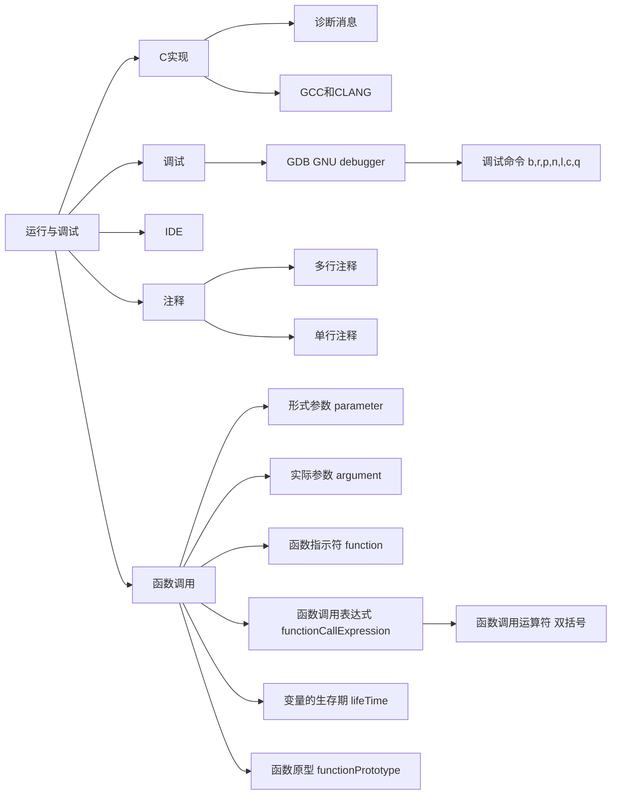

# C语言程序的运行与调试




## 安装对应版本的C Compiler

Linux下安装 GCC

[[https://gcc.gnu.org/install]]

## 编译

`-o` 指定输出文件路径；
`-g` 向翻译后的可执行程序中添加包括源代码、符号表在内的信息，有助于GDB更好地工作；

```bash
gcc source.c -o out/source.out -g
```

## 调试

### 查看源代码和运行

`r` 运行；
```log
(gdb) r
Breakpoint 1, main () at c0408.c:4
4       int main(void){
```

`n` 执行下一行；
`c` 执行直至断点；

`l` 查看源代码，会自动翻页；
```log
(gdb) l
      /* c0408 .c */
      int main(void){
          signed char cx = 1, cy = 2;
          signed long int sl = 0;
          unsigned long int ul = 0;

          sl += cx + cy;
          sl += cx * 3L;
(gdb) l
          ul += sl <= ul;

          unsigned char uc = -1;
          cy = - uc ++;
      }
```
`q` 退出；

### 设置断点

`b` 用于设定断点，参数可以是函数、行号、内存位置

- 函数

```log
(gdb) b main
Breakpoint 1 at 0x1129: file c0408.c, line 4.
```

- 内存地址

```log
(gdb) b * 0x7fffffffdf40
Breakpoint 3 at 0x7fffffffdf40
```

- 行号

```log
(gdb) b 10
Breakpoint 2 at 0x1159: file c0408.c, line 10.
```

### 打印

`p` 用于打印一个 `表达式` 的值，GDB先计算表达式的值，并把它保存在一个存储区中，存储区的名字用“$数字”表示，数字会随着打印次数递增，可以通过`p $数字` 打印它；

- 打印变量

```log
(gdb) p sl
$2 = 140737488347136
```

- 打印多个变量

```log
(gdb) p {sl,ul}
$6 = {140737488347136, 0}
```


```log
(gdb) p &2
Attempt to take address of value not located in memory.
(gdb) p 42
$3 = 42
(gdb) p $2
$4 = 140737488347136
```

## 运行

### 执行环境

处理器兼容：使用`-march` 指令兼容其他处理器；

```bash
gcc -march=pentium4 source.c
```

生成**脱离操作系统**的独立式环境的可执行文件

```bash
gcc -ffreestanding -nostartfiles source.c
```

### 注释

`//` 单行注释
```C
// annotation
```

`/* */` 多行注释

```C
/*
    annotation
*/
```

### 函数调用和函数调用运算符

```C
unsigned long long int cusum(unsigned long long int r){
    unsigned long long int n, sum;

    n = 1;
    sum = 0;

    while(n <= r){
        sum += n;
        n++;
    }

    return sum;
}

int main(void){
    unsigned long long int x, y, z;
    x = cusum(10);
    y = cusum(100);
    z = cusum(1000);
}
```

函数可以从它的调用者那里接收数据以供内部使用，但是，要想接收这些数据，而且能够在函数内部使用，必须依赖于变量。因此，在声明函数时需要声明接收的变量，如：
```C
unsigned long long int r
```

习惯上，我们把`r`称为形式上的参数，是外部传递到函数内部数值的中转容器。传递的内容才是实际的参数。函数是可以反复执行的，每执行一次就会创建圆括号内声明的参数变量：当函数返回时，这些变量被“销毁”。

### 函数原型


在C语言诞生之初，函数的声明并不是这个样子的，用今天的眼光来看，着实十分古
怪。以源文件c0203.c为例，要是用早期的方式来写，会是什么样子呢？经过改写的源文件如下所示，但并不是完全“仿真”的，因为在那个时代，C语言还没有引入`unsigned long long int`类型。

```c
unsigned long long int cusum (); //D1
main (){
    //D2
    unsigned long long int x,y,z;
    x cusum
    (10)；
    y cusum
    (100):
    z cusum
    (1000,1200):
    //s1
    return 0;
}
    unsigned long long int cusum(r)/*D3*/ 
    unsigned long long int r; /*D4*/
{
    unsigned longlong int n,sum;
    n = 1;
    sum = 0;

    while(n <= r){
        sum += n;
        n += 1;
    }

    return sum
}
```

- 没有`void`的`main`函数？

先来看main函数的声明，它从D2处开始。可以看出，函数main的声明中没有返回
类型，这在当时是允许的，如果函数的返回类型是int的话，则它可以省略。另一个显著的特点是函数名右边只是一对圆括号，内容为空。在那个时代，C语言里还没有引入关键字“void”,如果函数没有参数，它只能这样写。事实上，即使函数有参数，不带函数体的函数声明也必须这样写。

- 奇怪的函数参数声明？
从D3处开始的部分是函数cusum的声明，因为带有函数体，这也是它的定义。但是
这种定义方式很奇怪，函数名右边的圆括号内只允许是参数的名字（标识符），对参数的声明(D4)夹在D3和函数体的左花括号“{”之间。

- 函数在调用前声明的形参为空？
和现在一样，函数在调用前必须声明。如果函数的定义位于main函数之后，则它必须有一个不带函数体的声明。在程序中，函数cusum是在函数main之后定义的，为了在函数main内调用它，D1处是它的前置声明。按照以往的惯例，函数名右边的圆括号内应当为空。

- 无法安全地调用，编译器不报错。。
由于D1处的声明并未指定参数信息，对此函数的调用就只能依靠程序员的自律了。
如果他胡来，也没有办法阻止。如语句S1所示，即使我们知道这个函数只接受一个参数，我们也可以为它传递两个甚至多个参数。在翻译期间，翻译器连吭都不吭一声，因为它无法从D1处获得参数的数量和类型信息。

标准化之后的C语言借鉴了其他编程语言的经验，对函数的声明做了改进，其中最主
要的一点是将参数的声明放在函数名后面的圆括号内，而且必须指定参数的类型：如果函数的声明不带函数体，可省略参数的名字，但必须指定其类型。现在，我们把带**有参数类型声明的函数声明称为函数原型**。引入函数原型的原因是便于C实现在程序翻译期间实施类型检查。在调用函数时，如果参数的数量和类型与函数的声明不匹配，则它很容易被检查出来。

与变量一样，函数需要先声明后使用，可以创建不带函数体的的声明；

```C
unsigned long long int cusum(unsigned long long int r);

int main(void){
    unsigned long long int x, y, z;
    x = cusum(10);
    y = cusum(100);
    z = cusum(1000);
}

unsigned long long int cusum(unsigned long long int r){
    unsigned long long int n, sum;

    n = 1;
    sum = 0;

    while(n <= r){
        sum += n;
        n++;
    }

    return sum;
}
```

这两种声明都是可以的

```diff
+ unsigned long long int cusum(unsigned long long int r);
+ unsigned long long int cusum(unsigned long long int);
```

### Checkpoint

是否可以用表达式cusum()和cusum(100,20)来调用函数cusum?为什么？请
上机验证。
> 不可以，因为函数cusum要求1个参数。

在变量的声明中，标识符是变量的名字，在表达式里，它是一个代表变量的(C);
在函数的声明中，标识符是函数的名字，在表达式里，它是一个代表函数的(B);
带函数体的函数声明被称为(A);
(A). 函数定义
(B). 函数指示符
(C). 左值