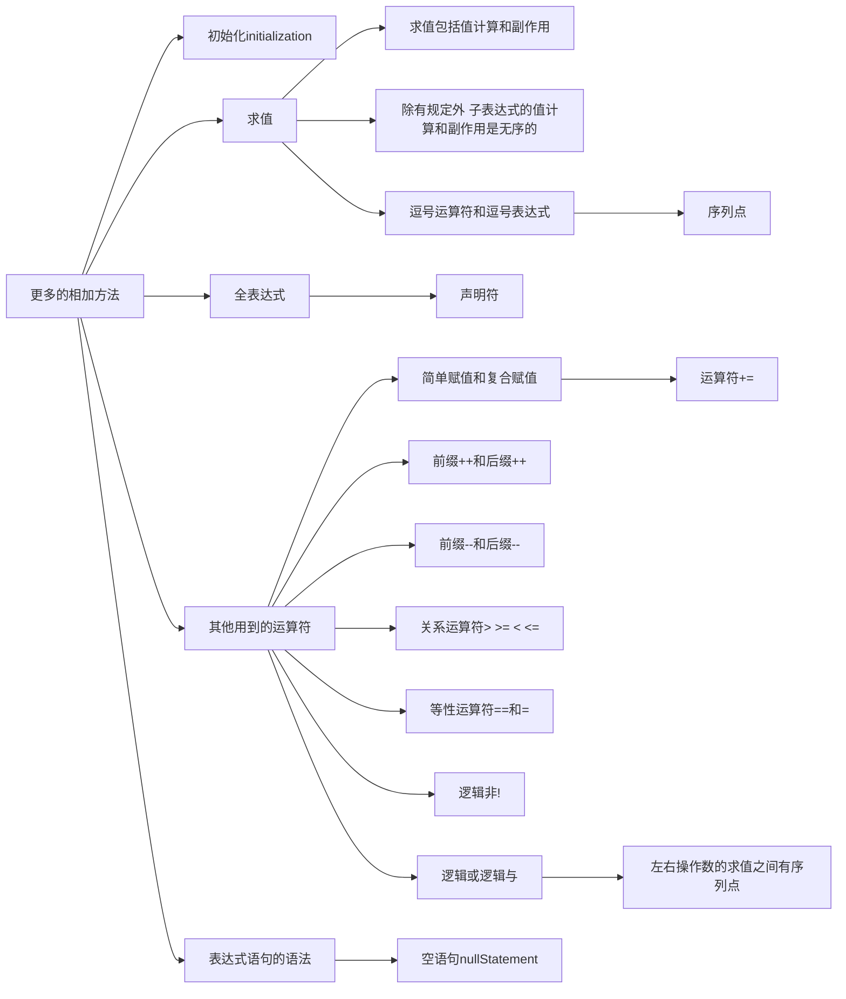

# 复杂表达式

我们之前介绍了表达式的基本含义，现在来些更复杂的表达式

![[cs.lang.c.1-const#表达式,0:#*]]



## 变量初始化

```C
unsigned long long int cusum(unsigned long long int r);
int main(){
    unsigned long long int n = 1, sum = 0;
    unsigned long long int res = cusum(1000);
}
```

在变量`n`和`sum`的声明中，标识符`n`和`sum`分别用`=`连接了一定初始值的成分，这个成分叫作初始化器。
在`main`函数内，变量`res`的声明里也有一个初始化器`cusum(1000)`，这显然是一个函数调用表达式；

>! 我们在讨论声明而不是表达式，符号`=`并不是数学里的等于，也不是赋值表达式里面的赋值运算符，是一种新的用法，含义可理解为“来自”

初始化器的作用是在变量创建时，自动地为它赋予一个初始的值。初始化器可以是表达式，比如这里的0、1和`cusum(1000)`。

>! 注意，并不是所有的变量在声明时都可以有初始化器，**函数参数的声明里不得含有初始化器**，这就是说，参数`r`的声明不允许与用`=`连接一个初始化器，与其他语言不同。

### Checkpoint

实验一下，如果为函数`cusum`的参数`r`添加一个初始化器，会怎么样？

> C语言不支持函数的参数声明带有初始化器，这将导致编译时的错误。

### 复合赋值与递增运算符

```diff c
    while(n <= r){
-        sum = sum + n;
+        sum += n;
-        n = n + 1;
+        n ++;
    }
```

使用复合赋值运算符中的`+=`优化了赋值过程。`+=`中的`+`和`=`必须连写，不能分开。

### 使用复合赋值运算符优势

表达式`sum += n`等价于表达式`sum = sum + n`，但在语义上并不一样：

- `sum += n` 将变量`n`的值加到变量`sum`，对变量值操作一次（只需要一条将变量`n`的值加到变量`sum`的机器指令或汇编指令）

- `sum = sum + n` 是读取`sum`和`n`的值相加后再保存到变量`sum`，对变量`sum`操作两次（需要先读取变量`sum`的值，再保存新值到变量`sum`，这需要两条机器指令或者汇编语言的指令）

### 递增运算符

前缀递增运算符和后缀递增运算符的操作数需要是`左值`，且不执行左值转换，像`++ 5`和`6 ++`都是非法的。

![[cs.lang.c.1-const#左值和左值转换,0:#*]]

**相同点：**副作用都是使得变量`n`加一；

**区别：**在前缀表达式中，表达式的`值`是操作数+1的值，而后缀表达式中则是+1前的原值；

例如：

```C
int main(void){
    int x = 0, y, z;
    y = ++ x; //D1 y = 1
    z = x ++; //D2 z = 1, x = 2;
}
```
Debug过程：

- `D1` y = 1, x = 1

此处的`y`赋值为`++ x`的值（0 + 1）

```log
(gdb) p y
$2 = 1
(gdb) p x
$3 = 1
```

- `D2` z = 1, x = 2;

此处的`y`赋值为`x ++`的值（1）

```log
(gdb) p z
$4 = 1
(gdb) p x
$5 = 2
```

### Checkpoint3.4

1. 以下改动是否合法？

```diff
- sum = sum + n ++;
+ sum = sum + ++ n;
```

编译器角度：合法；

结果角度：不合法，结果已改变，本来值是`sum + n`，现在值是`sum + n + 1`;

2. 更正以下程序的错误

```C
unsigned long long int cusum(unsigned long long int r){
    unsigned long long int n = 0, sum = 0;
    while (n < r){
-        sum = sum + n = n + 1;
+        sum += n ++;
    }
    return sum;
}
```

3. 所有关系运算符的优先级都相同，而且都是从左往右结合的；加性运算符`+`也是从左往右结合的，而且它的优先级高于关系运算符。给定以下函数f:

```c
int f (int a, int b, int c, int d, int e, int f){
    return a + b + c > d > e <= f;
}
```

如果调用它的表达式为`f (1, 2, 3, 7, 8, 9)` ，则：

a. 表达式`c > d > e <= f` 的意思是变量`c`的值大于变量`d`的值，变量`d`的值大于变量`e`的值；变量`e`的值大于变量`f`的值，对吗？为什么？

> 不对。因为单就表达式c > d > e <= f本身而言，它等价于((c > d) > e) <= f。也就是说，c>d的结果（0或者1）再与e的值比较，比较的结果是0或者1，最后再用这个0或者1与f的值比较。

b. 为表达式`a + b + c > d > e <= f` 添加适当的括号，以体现各运算符的操作数都是谁

```C
(((a + b + c) > d) > e) <= f
```

c. 函数`f`的返回值是多少？ 请验证结果。

> 1 程序调试过程如下
```log
(gdb) l
       int f (int a, int b, int c, int d, int e, int f){
           return a + b + c > d > e <= f;
       }
       int main(void){
           int x = f(1,2,3,7,8,9);
           return x;
       }
(gdb) b 7
Breakpoint 1 at 0x11a3: file c0304.c, line 7.
(gdb) r
Starting program: /root/build/c/out/c0304.out
Breakpoint 1, main () at c0304.c:7
           return x;
(gdb) p x
$1 = 1
```

## 求值

```diff
- ++ a + b * c;
+ (++ a) + (b * c);
```

表达式`++ a + b * c`不仅要计算出一个值，它还有副作用，因为它的表达式`++ a`是有副作用的表达式，需要考虑副作用的作用时间。

求值用来涵盖这两个方面。表达式可以指示变量或者函数，也可以计算一个值，还可能发起一个副作用，而“求值一个表达式”则通常包括值计算和发起一个副作用。

> C

## 全表达式
### 逗号表达式

#### 全表达式和序列点

如果一个表达式在形式上是是独立的，不是其他表达式的组成部分，也不是一个声明符的组成部分，那么它就是一个**全表达式**。
> 表达式语句由表达式和分号“;”组成，表达式语句中的表达式是全表达式。也就是说`sum += n ++`是全表达式；
```C
unsigned long long int cusum(unsigned long long int r){
    unsigned long long int n = 1, sum = 0;
    while (n <= r) sum += n ++;
    return sum;
}
```
- 其次，while语句的控制表达式也是全表达式，所以`n <= r`是全表达式。实际上不只是`while`语句，但凡是需要控制表达式的语句，其控制表达式都是全表达式。
- 如果`return`语句是由关键字`return`和表达式组成的，则表达式也是全表达式。所以`return`语句中的表达式`sum`是全表达式。
- 很多初始化器都是全表达式，此外还有很多全表达式……


**声明符**是变量声明或者函数声明的一部分，用来描述被声明的实体。最简单的声明符是上一个标识符，例如在以下声明中，标识符`m`和`n`就是声明符：
```C
unsigned long long int m, n = 0;
```

**序列点**与表达式的求值有关。给定任意两个表达式A和B，如果A的值计算和副作用发生在B的值计算和副作用之前，则我们说在A和B求值之间已经存在一个序列点。显然，序列点是一个求值的界限，前一个表达式的值计算和副作用已经完成，而后一个表达式的值计算和副作用还没有开始。

> C语言规定，在一个全表达式的求值和下一个全表达式的求值之间存在一个序列点，在while语句内有三个全表达式，所以也存在三个序列点。


#### 逗号表达式的序列点

C语言规定，在其左操作数的求值和右操作数的求值之间有个序列点。对表达式`sum += n, n++`求值时，是先求值左表达式`sum += n`当它的值计算和副作用都完成后，才开始求值右操作数`n++`；

逗号运算符的值是其右边操作数的值，左操作数的值被丢弃。所以`sum += n, n++`的值是子表达式`n ++`的值。

设计逗号表达式的目的在于希望运算符的左操作数右副作用，这样，在实际求值的时候，**左操作数的意义体现在它的副作用上，右操作数则提供了整个逗号表达式的值**


### Checkpoint3.7

1,在以下代码片段中，逗号表达式为(`y = z, x = ++y;`),它的值为( 1 )。如果要把该逗号表达式的值赋给变量m,应该怎么修改第二行？（注意，我们说过，在所有运算符里，逗号运算符的优先级最低)。
```c
long int m, x, y, z = 0;
y = z, x = ++y;
```
> 此处注意，初始化器后面跟的不是逗号表达式。第二问中，设计程序使得`x > ++y`的值是1，可以用括号将表达式`y = z, x > ++ y`的值1赋值到`m`上;
```diff
(gdb) l
       int main(void){
           long int m, x, y = 0, z = 0;
-           m = y = z, x > ++ y;
+           m = (y = z, x > ++ y);
           return m;
       }
(gdb) b 5
(gdb) p m
- $1 = 0
+ $1 = 1
```

2,对于逗号运算符，如果左右操作数求值之间不存在序列点，那么，请用不同的求值过程推演一下，看一看每当表达式sum+=n,n+求值完成后，变量sum、n和整个表达式的值是否不受求值顺序的影响。

不存在序列点意味着左右两边求值和副作用的先后顺序改变，**先求左边或者先求右边都行**，则先求值n ++。当它的值和副作用完成后，再求值sum += n。这与先求值sum += n再求值n ++是不同的，结果不同。

## 表达式语句

根据上述的操作，可以把`while`语句改成更独特的形式：

```diff
- while(n <= r) sum += n ++;
+ while(sum += n ++, n <= r);
```

表达式语句是可选的，例如`while`如果没有语句的话，直接留空即可；

### 递减和逻辑求反运算符

#### 介绍

`--`递减运算符
`!`逻辑求反运算符

上述循环可以改写成

```diff
- while(n <= r) sum += n ++;
+ while(r != 0) sum += r --;
```
或者利用非0数字为true的特性
```diff
+ while(r) sum += r --;
```

>! 运算符`!`进行操作时，如果操作数值为0，则运算符!的结果为1，反之为0；例如，表达式!0的值是1；表达式!1的值是0，表达式!23的值是0；

#### 优先级

运算符!的优先级低于等性运算符`!=`和`==`，运算符`==`的操作数是`r`和`0`；运算符`!`的操作数是表达式`r == 0`的值。因此，表达式`! r== 0`等价于`! (r == 0)`

### 参数的有效值检查

因为在计算机的二进制加法中，如果位溢出的话，会导致`0xff` + `0x01` = `0x00`的情况。所以需要进行参数合法性检查。

#### if语句

`if` (**表达式**) **语句** `else` **语句**

`else` 可选

#### 逻辑或运算符

`||` 逻辑或运算符是二元运算符，有一左一右两个操作数，例如`5||6`，这样的表达式称为**逻辑或表达式**。

逻辑或表达式的求值具有短路效应。先求值运算符`||`的左操作数，如果左操作数的值不为0，则不再求值右操作数，因为这样左是多余的。只有在左操作数的值为0时，才会继续求值右操作数。同时，如果运算符`||`的右操作数会被求值，则在其左操作数的求值和右操作数的求值之间存在一个序列点。**在求值右操作数之前，左操作数的值计算和副作用已经全部完成**。


#### 未定义的行为

作为一门编程语言，C语言的规范描述了程序结构、语法元素、表达式、语句，定义了它们的形式和操作，规定了操作数的类型和范围，同时也描述了可预期的运行结果。但
是对于不遵循规范的程序设计，C语言没有，也无法限定和描述程序的运行结果。在这种情况下，程序的行为是无法预料的，计算结果可能碰巧是正确的，也可能是错的，程序可能会崩溃，等等，不一而足，这些无法预料的行为，称为**未定义的行为**。

来看另一个例子，在下面的代码片断中，表达式m=m++的求值就是未定义的行为，求值完成后，变量m的存储值不能确定，取决于不同的翻译器如何安排求值过程。
```C
int m = 0；
m = m++:
```
表达式`m=m++`的求值具有两个副作用，分别是运算符`++`的副作用和运算符`=`的副作用，但都是修改变量m的存储值，这就很特殊了。这两个副作用哪个在前哪个在后，C语言并未规定，要由翻译器自主决定。这就是说，该表达式求值的行为是未定义的。因为这个原因，该表达式求值完成后，变量m的值可能是0，也可能是1。在任何一个用c语言编写的程序中，很多行为是良好定义的，比如C语言规定在全表达式的求值之间有序列点，在运算符1的左操作数和右操作数的求值之间存在序列点。正是有了特殊规定，表达式`n+1|n`的求值不存在未定义的行为。

#### Checkpoint3.9

1. 我们已经讲过，赋值表达式的值是赋值运算符的左操作数被赋值之后的值，赋值运算符的副作用发生在赋值运算符左右操作数的值计算（而不是求值）之后。依据这一规定，请说明表达式`n = n + 1`和`sum = sum + n`不存在未定义行为；

> 表达式`n = n + 1`求值时，要得到运算符`=`的结果，得先读变量n并做加法，此后才写入变量`n`，这个顺序可以保证变量`n`最后的值一定是确定的；同理，表达式`sum = sum + n`求值时，也得先读变量`sum`和`n`并做加法，然后才会写入变量`sum`，这个顺序可以保证变量`sum`最后的值一定是确定的。

2. 若`y`是整数类型的变量，判断表达式`y = (y = 0) + 3`的求值是否存在未定义的行为。

这个表达式针对变量y有两次副作用，但顺序不确定，所以是未定义的行为。


#### if的else子句


C语言规定，一个`else`子句从属于离它最近的那个`if`语句。因此，这个`else`子句实际上是第二个`if`语句的一部分，可以使用复合语句来明确隶属关系：
```C
if (r > 0){
    if (r <= 100000000)
        while(r) sum += r --;
}
else
    sum = 0;
```

### 逻辑与运算符

和逻辑或`||`相对应的是“逻辑与”运算符`&&`，它表达逻辑上的相乘关系，对应于生活中的“并且”。需要一左一右运算符。

#### 优先级

```C
if(r != 0 && r <= 1000000);
```

`<=`的优先级最高，`!=`次之，`&&`最低

#### 短路效应

与`||`一样，会先求值左操作数，左操作数的求值和副作用完成后才会到右操作数；

## 标号语句和`goto`语句

跳转到标号处，两种都可以；

```C
if(1) goto next;

next:;
    /* do something */

next: {
    /* do something */
}
```

