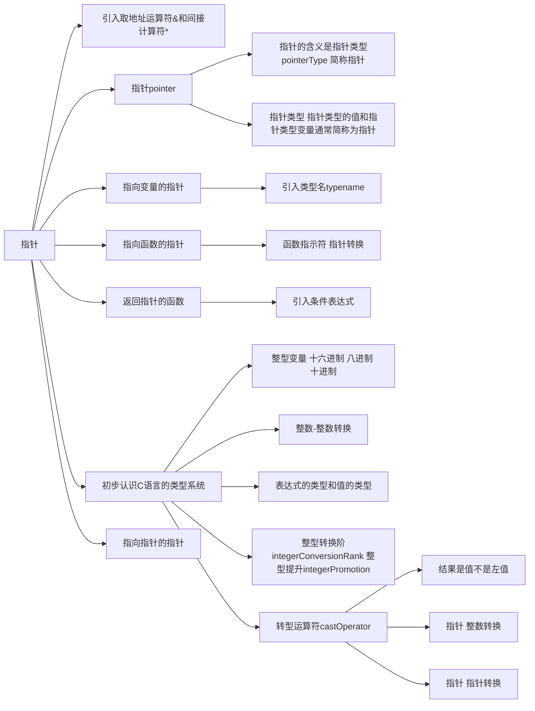
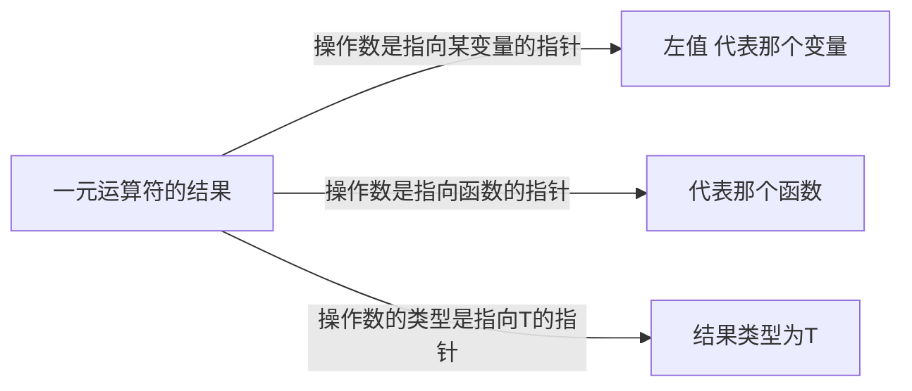
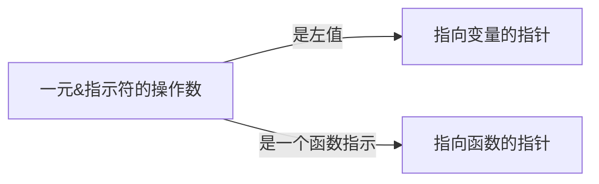
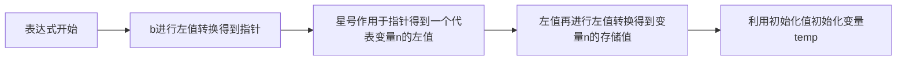

# 指针



## 一元`&`和一元`*`运算符

两个操作符只需要一个右操作数，一元`&`运算符用于取得变量或者函数的地址而一元`*`运算符则根据一个地址得到那个变量或者函数本身。

**优先级**：一元`*`运算符和一元`&`运算符的优先级相同，且高于赋值运算符，但它们是从右往左结合的，所以`* & m = 2` 等价于`(* (& m)) = 2`。表达式 `& m`得到变量`m`的地址，然后，一元`*`运算符则通过地址得到该地址上的那个变量——实际上就说变量`m`。


“变量”不是用于描述表达式的属于，“左值”才是。指示或者说代表变量的表达式称为左值，既然表达式`* & m`代表一个变量，那么它就是一个左值；表达式`* & m = 2`是将2赋给这个左值。又因为这个左值实际上是代表变量`m`的，所以语句`* & m`等价于`m = 2`。


### Checkpoint4.2
判断题：
(1)通过变量的地址可以得到该地址上的变量(√)。
(2)若var是变量，则表达式*&var等价于左值var。(√)

## 指针

**简单地将一元`&`运算符的结果视为地址是有问题的**。仅凭地址是没有类型信息是无法读取内容的。在C语言里，一元`&`运算符的结果（值）并单纯是一个地址，而是一个包含类型的地址。如果变量`m`的类型是int，则表达式`& m`的值是一个**用于访问一个int类型的变量**。


一元`&`运算符称为取地址运算符，它需要一个右操作数，而且必须是左值或者函数指示符。只有内存中的变量和函数才有地址，如果一个左值是一元`&`运算符的操作数，则不执行左值转换。像`int m = 1;`中，`& m`不执行左值转换，不会转换成`& 1`.

人们经常把指针类型的值也叫作“指针”。C语言规定，如果操作数的类型为T，则一元`&`运算符的结果是指向T的指针。这里的“指针”就是“指针类型的值”。

### 一元运算符`*`的结果

反之，要还原指针所指向的变量和函数，需要使用一元`*`运算符。一元`*`操作数必须是一个指针（类型的值）。如果操作数是指向某变量的指针，则一元`*`运算符的结果是个`左值`，代表那个变量；如果操作数是指向函数的指针，则一元`*`运算符的结果是函数指示符，代表那个函数；如果操作数的类型是指向T的指针，则一元`*`运算符的结果类型为T；



## 指针类型的变量

```C
int * p;
```

如何声明：标识符`p`的右边是分号`;`，所以要向左读。左边是一个星号“*”，所以读作“p的类型是指针”或者“p是一个指针”。所以读作：**P是一个指针类型的变量**。


```C
int * p, * q;
```

`*`的位置，它是独立的，意思是“指针”，不和类型指定符int结合，也不和标识符p,q结合。带有星号p和q意味着实体是指针，不带星号则意味着实体不是指针。

```C
int x, * p = & x, * q;
q = & x;
```
变量`p`的声明中带有一个初始化器，即表达式`& x`。因为`x`是一个int类型的左值，所以表达式`& x`的值是指向int的指针，这个指针由变量`x`的地址转化而来。而p的类型也是指向int的指针，类型匹配。

现在，变量`p`的值是一个指针，实际上是指向变量`x`的，但变量`q`没有初始化，它的内容是随机的，不认为是一个有效的指针。语句`q = & x`为变量`q`赋值，完成后，变量`p` `q`都是指向变量`x`的指针；


```C
* p = 1
```

表达式`* p`中的`p`是一个左值，要执行左值转换，转换为变量`p`的存储值，这是一个指针（类型的值）。因为一元`*`运算符的操作数是指针，故表达式`* p`的结果是一个左值，代表一个变量，但因为它是赋值运算符`=`的左操作数，故不再进行左值转换。所以表达式`* p = 1`是把1赋值给左值`* p`，也就是把1保存到左值`* p`所代表的那个变量里。

```C
x = * p + * q;
```
表达式`* p`和`* q`中，`p`和`q`都是左值，需要先进行左值转换，转换为变量`p`和`q`的存储值。左值转换后的值都是指针，所以表达式`* p`和`* q`又都是左值，都要进行左值转换，转换为它们所代表变量的存储值。然后将两个值相加。
> 为了加深理解，换个说法：左值`p`和`q`经左值转换后都是指向变量`x`的指针，所以表达式`* p`和`* q`的结果都是左值，都代表变量`x`。这两个左值经过左值转换，转换为变量`x`的存储值，相加后赋给左值`x`。上述语句等价于
```C
x = x + x;
```

### Checkpoint4.2
1. 给定声明：
```C
int m, * p, f (void);
```
请指出其中的声明符。
> `m *p f(void)`

2. 给定声明：
```C
int * x, p = & x, q;
```
> 不合法。变量p的类型实际上是int，但表达式& x的类型是int *。

## 指向函数的指针

一元`&`运算符的操作数必须是左值或者函数指示符。如果是一个左值，则一元`&`运算符的结果是指向变量的指针；如果是一个函数指示符，则一元`&`运算符的结果是指向函数的指针



```C
void swap_ab(int * a, int * b){
    int temp = * b;

    * b = * a;
    * a = temp;
}

int main(void){
    int m = 10086, n = 10010;
    swap_ab (& m, & n);
    void (* pf) (int *, int *) = swap_ab;
    pf(& m, & n);
}
```
这个程序的意图是用函数`swap_ab`交换两个变量的值，但是用了两种不同的方法


### 函数指示符——指针转换

```C
swap_ab(& m, & n);
```
`swap_ab`是一个函数指示符，除非作为一元`&`运算符的操作数（`& swap_ab`）否则，函数指示符将自动转换为指向函数的指针，这称为“函数指示符——指针转换”；

> 回到函数`swap_ab`，参数`a` `b`在该函数开始执行时被创建为两个变量以接受传递给它们的指针。


#### 使用临时变量交换两个变量

```C
void swap_ab(int * a, int * b){
    int temp = * b;
    * b = * a;
    * a = temp;
}
```

1. `* b`中，`b`先进行左值转换为变量`b`的储存值，是一个指针，然后`*`作用于这个指针，得到一个代表变量n的左值。该左值继续执行左值转换，得到变量`n`的存储值，然后利用这个初始值初始化变量`temp`



表达式`int temp = * b`;用于将变量`temp`的值保存到左值`* a`所代表的变量（实际上是变量m）

#### 深入理解函数指针

```C
    void (* pf) (int *, int *) = swap_ab;
```
我们说过，C语言的一个特点是变量和函数的声明与它们在程序中的使用在形式上一致。因此，声明中的非字母符号
虽然不是运算符，但却继承了它们的优先级规则。如果不是用圆括号将“`* Pf`”括起来，那么，标识符`pf`将优先与它右边的`(int*,int*)`进行语法关联。但是，因为圆括号的存在，标识符f被认为是与它左边的星号`*`进行关联的，因此，是需要先向左读，即，“pf的类型是指针(`*`)”或者“pf是一个指针”。既然是一个指针，那么它必须指向另一个类型。到底指向谁呢？如果(`* P`)的右边没有东西，则它可以继续往左读，但是它右边是`(int*,int*)`,那就意味着该指针指向一个函数。因此，我们进一步往右读做“指向一个函数”。


标识符`pf`的类型已经完全确定。笼统地说 `pf`是一个变量，其类型为**指向函数的指针**；再具体一点，`pf`
是一个变量，其类型为指向`void(int*,int*)`类型的指针；如果要用类型名来描述的话，则`pf`是一个变量，其类型是`void(*)(int*,int*)`;如果还要更具体的话，就是“`pf`是一个变量，其类型为指向函数的指针，被指向的函数有两个参数，其类型都是指向int的指针，函数的返回类型为void。

在变量`pf`的声明里带有一个初始化器`swap_ab`,在这里它是一个函数指示符，必须执行函数指示符一指针转换。因为`swap_ab`的类型是`void(int*,int*)`,自动转换为指向这种函数类型的指针，即`void(*)(int*,int*)`,和变量`pf`的类型一致，可用于初始化操作。

#### 使用函数类型的指针调用函数的两种方式

接下来，语句：
```c
    pf (m,n);
```
又一次发起函数调用，不过这一次属于本色调用，因为函数调用运算符的左操作数本来就是指针。表达式`pf`是一个指针类型的左值，故先进行左值转换，转换为该变量的存储值，这是一个指向函数的指针，实际上指向函数swap ab。因为函数调用需要一个指向函数的指针，相比之下，这是C语言比较喜欢的写法，毕竟不需要做函数指示符一指针转换。
当然，如果你非要这么写也是可以的：
```c
    (* pf)(& m,& n)
```
函数调用运算符`()`的优先级比一元`*`运算符高，故这里必须用括号来形成一个基本表达式以阻止不恰当的结合（防止结合为“函数`pf(&m,&n)`返回值指针的左值”）。因为`pf`是一个指针类型的左值，左值转换后得到一个指针，而一元*运算符作用于这个指针，得到一个函数指示符。然后，函数指示符又反过来继续转换为一个指针函数的指针。显然，这是在转圈圈，既然是这样，下面的写法也没问题
```C
(& * pf) (& a, & b);
(* & * pf) (& a, & b);
(& * & * pf)(& a, & b);
```

#### Checkpoint4.3

1,为什么上面三种函数调用的写法都没问题？请分析它们的工作原理。

> 1.仅以(& * pf)为例，函数指示符pf自动转换为指针，* pf的结果是函数指示符，&*pf的结果又是函数指针。其它两个依此类推。

2.若变量pf的类型是指向函数的指针，被指向的函数有两个char类型的参数，且返回类型是int,请写出pf的声明，以及它的类型名。

```C
int (* pf) (char, char) /*= 被指向的函数*/ ;
```
类型名为`int (*) (char, char)`；

## 返回指针的函数


```C
char * swaprp(char * a, char * b){
    char tmp = * a;
    * a = * b;
    * b = tmp;
    return * a > * b? a : b;
}
```

### 条件表达式

E1 ? E2 : E3;

先求值E1，如果E1的值不为0，则求值E2，且整个表达式的值来自E2，反之来自E3； 

### Checkpoint4.4

1. 在程序中添加一个char类型的变量c,并用函数swaprp的返回值所指向的变量的值初始化它。

```C
char * swaprp(char * a, char * b);
char c = swaprp('a', 'b');
```

2. 以下，函数cusum用于计算从1加到N的和，N是非负整数。参数`sum`用于接受一个指针，累加的结果保存在该指针所指向的变量里；参数`r`也用于接受一个指针，该指针所指向的变量里保存了所要累加的最大值。如果这个值是0或者大于1000000000，则函数返回0，否则返回1。现在请按上述要求将函数体补充完整，并上机验证程序的编写是否正确。

```diff
_Bool cusum (unsigned long long int * sum, unsigned long long int * r)
{
-    if (* r == 0 || * r > 1000000000) return 0;
+    if (* r || * r > 1000000000) return 0;
    * sum = 0;

-    while (* r) (* sum) += (* r) --;
+    while (* sum += temp, temp --);

    return 1;
}
```

3. 以下类型中，属于变量类型的是( a,c,d,e )；属于函数类型的是( b )

(a)char
(b)main函数
(c)Bool
(d)signed int
(e)指针

4. 若`*E`是合法的表达式，则该表达式的结果不可能是( a )

(a)值
(b)左值
(c)代表一个变量
(d)代表E(的值)所指向的那个变量

![[#一元运算符的结果,2:#*]]

5.在表达式`&E`中，E必须是( b )，如果E的类型是int,则&E的结果类型是( c )

(a)值
(b)左值或者函数指示符
(c)指向int的指针
(d)int

## 类型

### 指针的读写离不开类型

```C
int * p;
```

并不能像汇编那样，使用某个符号直接访问对应内存位置就能获得变量；也不能直接给指针类型的变量赋一个非法的值。

如：

- 非法更改`* p`的地址：`p = 2000;`
- 尝试给一个不存在的变量地址赋值：`* 2002 = 23948;

gdb中的调试

```log
(gdb) p & sum
$3 = (unsigned long long *) 0x7fffffffdf38
(gdb) p sum
$5 = 5050
(gdb) p * $3
$7 = 5050
(gdb) p * 0x7fffffffdf38
$8 = 5050
```

### 整型变量

GDB中，`ptype` 指令可以返回表达式的类型信息

```C
(gdb) ptype sum
type = unsigned long long
(gdb) ptype 0x33
type = int
```

### 进制

- 十进制：以非0数字开头；

- 八进制：以数字0开头；

- 十六进制：以 `0x` 开头；

#### ul后缀

后缀 `u` 或者 `U` 是 `unsigned` 的意思，后缀 `l` 或者 `L` 是 `long` 的意思； 后缀 `ll` 或者 `LL` 是 “long long” 的意思。这几种后缀可以单独使用或组合使用，但只能 `ll` or `LL`，不能 `lL`。`ull` `uLL` 都可以。

### 整数——整数转换

> 不同的类型决定了可以表示的数值范围，以及数值哎存储器中如何表示，以什么样的位模式存在。变量是有类型的，从变量中读出的值也是有类型的，这个值的类型和变量的类型一致

往变量中写入一个值，值的类型应该和变量的类型一致。如果值的类型和变量的类型不一致，则必须先转换为变量的类型：

```C
int main(void){
    int m = 3700U; // unsigned int
    unsigned int u = m;
    signed char sc;
    unsigned char uc;
    uc = u;
    sc = u;
    sc = 107LL;
}
```

整型常量`3700U`的确切类型为`unsigned int`，但变量`m`的类型是int，这就要将`3700U`从`unsigned int`转换为int后才能初始化；

整数——整数的类型转换分为三种情况： 目标类型为 `_Bool` 、可以用转换后的新类型表示、不可以用转换后的新类型表示
#### 目标类型为`_Bool`

C99开始，任何整数类型的值转换为 `_Bool` 时，零值转换为 `0` ，非零值转换为 `1` ；

#### 目标类型不是`_Bool`

如果一个整数类型的值转换为除 `_Bool` 以外的整数类型时，如果这个值可以用新类型表示，则转换后的值同原值不变；

如果不可以：
- 目标类型为 `无符号整数` ：会将该值重复 **加上** 或 **减去** 比新类型所能表示最大值大1的数；

- 目标类型为 `有符号的整数`：取决于C实现。

如： 

`unsigned char` 类型所黁给表示的最大值是 `255`， 所以将 `3700` 赋值时会用 `3700` 不断减去 `256` 直到结果小于或者等于 `255` 。

#### Checkpoint4.7

某无符号整数`unsigned`类型可表示的最大值为 `M` ，那么， 把 `-1` 赋给这种类型的变量后， 该变量的值是

得到那种类型的最大值M
> `-1 + (M+1) = M`;

### 表达式的类型

在C语言里，表达式可以计算出一个值，例如表达式`5+3`的值是`8u`。值是有类型的，所以表达式也有类型，表达式的类型与其值的类型一致。不同的运算符需要不同类型的操作数，有些表达式具有固定的类型，而有的表达式的
类型则需要根据运算符和操作数的类型来共同确定，不一而足。对运算符、表达式及其类型的完整介绍位于后面的章节。

```C
int max(int a, int b){
    if(a >= b) return a;
    else return b;
}

int main(void){
    int x = 1, y;
    unsigned char c;
    x += c = 56;
    c += max(x, y);
    y = ++ x;
}
```

#### 赋值表达式的类型

表达式 `x += c = 56;` 等价于 `x += (c = 56)` ，将其按照求值顺序拆分并分析如下：

- `c = 56` 左值`c` 的类型是其所代表的变量`c` 在声明时指定的类型。左值`c`的类型是`unsigned char`，但是常量表达式`56`的类型是`int`，必须执行整数类型——整数类型转换，将`56`从`int`类型转换为`unsigned char`类型后在赋值给左值`c`所代表的变量。
> 在声明里，`c`是变量，在表达式里`c`的左值。

- 赋值表达式的类型是赋值运算符左操作数的类型。
> 因此，表达式`c = 56`的类型是`unsigned char`，这个子表达式计算一个值，这个值是赋值运算符左操作数被赋值之后的存储值`(unsigned char) 56`。

- 子表达式`c = 56`的值被加到`x`。在运算符`+=`的右侧，操作数类型是`unsigned char`；在左侧，操作数`x`的类型是int，这必然要将右侧表达式的结果`56`从它原先的`unsigned char`转换为`int`，再进行赋值操作，最后，表达式`x += c = 56;`的值类型是`int`

> 如果函数的返回值是`void`，则直接在末尾添加`;` 但返回值不能作为操作数 `func();`；

#### 关系表达式的类型

`if`语句的控制表达式是关系表达式`a >= b`，在C语言中，不管关系运算符 `> >= < <=` 的操作数是什么类型，关系表达式的类型始终为`int`。关系成立，关系表达式的结果是`int`类型的值1；否则，关系表达式的结果是`int`类型的值0

验证：
```log
(gdb) ptype c = 56
type = unsigned char
(gdb) ptype x + c = 56
type = int
(gdb) ptype 5 > 3
type = int
```

p108……

### 整型转换阶和整型提升

- **只在原有的类型** 上操作，例如前缀递增运算符和后缀递增运算符，他们不要求改变操作数的类型。再比如赋值运算符，它不要改变左操作数的类型，而是要求右操作数必须转换为左操作数的类型。

- **不在原来的类型** 上操作，例如：

```c
int main(void){
    signed char cx = 1, cy = 2;
    signed long int sl = 0;
    unsigned long int ul = 0;

    sl += cx + cy;
    sl += cx * 3L;
    ul += sl <= ul;

    unsigned char uc = -1;
    cy = - uc ++;
}
```

在表达式 `sl += cx + cy` 中，虽然 `cx` 和 `cy` 的类型为 `signed char` ,但计算时需要进行整型加宽转换成`int`或`unsigned int`再相加。

> `int`和`unsigned int`类型通常等于所用计算机的自然字长32位处理器上是32个比特。

#### 整型转换阶

如果一个操作数相对于`int`类型来说比较窄，但它的值能用`int`类型表示，则将其转换为`int`类型；如果无法表示，则转换为`unsigned int`类型，这个过程叫做**整型提升**。


- 整型提升是一种特殊的整数类型转换，特指从阶较低的整数类型转换（提升）为`int`或者`unsigned int`类型，从`int`类型转换到`long int`类型并不是整型提升；

- 并不是所有运算符的操作数都需要做整型提升，例如递增和递减运算符的操作数就不需要，即时它们是整数类型

> 表达式`cx + cy`，左值`cx`和`cy`的类型都是`signed char`所以它们都必须进行整型提升，提升为`int`类型，故表达式`cx + cy`的类型是`int`

原则上，运算符的操作数在整型提升后应具有一致的类型，如果不一致的，还必须做进一步的转换。总原则是：阶较低的整数类型转换为阶较高的整数类型。

> 表达式`sl += cx * 3L`的字表达式`cx * 3L`，常量表达式`3L`的类型为`signed long int`，而左值`cx`的类型是`signed char`。首先将`cx`的值从`signed char`类型提升为`int`类型。提升后类型仍不一致，故必须将`cx`的值再次从`int`类型转换为`signed long int`类型。`cx * 3L`的类型`signed long int`；

- 如果提升之后两个操作数的类型不同，一个是有符号整型，另一个是无符号整型，且无符号整数类型的阶高于或者等于有符号整型，则将有符号的整数类型操作数转换为那个无符号整数类型。

> 表达式`ul += sl <= ul`的子表达式`sl <= ul`，左值`sl`的类型为`signed long int`，而左值`ul`的类型是`unsigned long int`，这两种整数类型的阶都高于`int`和`unsigned int`，这两种整数类型都高于`int`和`unsigned int`，所以这里不存在整型提升，但它们仍不是同一种类型。需要将`sl`的值从`signed long int`转换为`unsigned long int`类型；

#### Checkpoint4.8

#### 负号运算符

符号运算符需要一个右操作数，如果这个操作数是整数类型，必须先整型提升，负号运算符的结果是提升后的负值，结果类型是提升后的类型；

```C
unsigned char uc = -1;
```
> 这里的负号运算符的操作数1是常量表达式，按要求必须先做整型提升，但其类型已经是int，提升后最终`-1`的类型也是`int`；

表达式`-1`的值用于初始化变量`uc`，变量`uc`的类型为`unsigned char`，这就要把表达式`-1`的值从原来的`int`类型转换为`unsigned char`类型

> 在（64位 gcc version 9.3.0 (Ubuntu 9.3.0-17ubuntu1~20.04)）上：
> `signed char`类型最大值是255，转换的过程是：`256 + (-1) = 255`，这就是说将`-1` 赋值 给`unsigned char`类型的变量，将使该变量的值为`unsigned char`类型所能表示的最大值；

结论：将表达式`-1`赋值给任何一种**无符号整数**类型，其结果是该类型的最大值；

#### Checkpoint4.9

1. 编写程序获取 `unsigned char` `unsigned int` `unsigned long int` `unsigned long long int`的最大值；

```C
int main(){
    unsigned char uc = -1;
    unsigned int ui = -1;
    unsigned long int ul = -1;
    unsigned long long int ull = -1;
}
```

```c
(gdb) p uc
$1 = 255 '\377'
(gdb) p ui
$2 = 4294967295
(gdb) p ul
$3 = 18446744073709551615
(gdb) p ull
$4 = 18446744073709551615
```

2. 表达式`-3u`的结果是多少？ 结果类型是什么？

4294967293 `unsigned int`

```c
int main(){
    unsigned uint = -3u; 
}
/*
(gdb) p uint
$1 = 4294967293
(gdb) ptype uint
type = unsigned int
 */
```

#### 转型运算符

一般情况下，类型转换是自动进行的，也可以手动进行类型转换；
```
(类型名) 表达式
```

转型表达式的作用是将“表达式”的值从它于原先的类型转换为“类型名”指定的那种类型。举个例子来说，在以下声明中，是将整数常量`0x33`从它原先的`int`类型转换为`long long int`类型后，再用于初始化变量`ll`

```C
long long ll = (long long) 0x33;
```

> 注意，被转型的表达式是可能含有别的运算符，如果它们的优先级低于转型运算符，则被转型的表达式应当用圆括号括起来以形成基本表达式，如：
```C
signed char cx, cy;
cx = (signed char) 0x33;
cy = (signed char) (cx + 0x30);
```

以上，转型运算符的优先级高于赋值运算符，表达式`cx = (signed char) 0x33;`是将整型常量`0x33`从它原来的`int`类型转换为`signed char`类型，然后赋值给`cx`。

表达式`cx = (signed char) (cx + 0x30)`里，是将表达式`cx`的值从`signed char`类型提升为`int`类型， 再与`int`类型的`0x30`相加，得到一个`int`类型的结果。这个结果再转型为`signed char`类型，赋给变量`cy`;

> 如果不用括号括住，就变成将`cx`的值转换为`signed char`后经过整型提升后再与`0x30`相加，最终结果的类型是`int`不是`signed char`
```C
cy = (signed char) cx + 0x30;
```


### 指针——整数转换

```c
int main(void){
    int m = 0;
    unsigned long long ull;

    ull = (unsigned long long) & m;
    * (int *) ull = 10086;
}
```

以上，我们先声明了一个`int`类型的变量`m`和一个`unsigned long long`类型的变量`ull`；然后，子表达式`& m`的类型是指向`int`的指针，这是其值的类型。这个指针的类型被转换成`unsigned long long`类型的值后赋值给变量`ull`，因为不知道指针的长度，我们使用一个最长的整数类型`unsigned long long`来保存转换后的结果。

接着，在表达式`* (int *) ull = 10086`里，左值`ull`执行左值转换，转换为`unsigned long long`类型的值。这个自己值被转型运算符转换为指向`int`的指针，然后一元`*`运算符作用于这个指针，得到一个`int`类型的左值，这个左值接受赋值。至此，因为表达式`(int *) ull`的值实际上指向变量`m`，故变量`m`的存储值是10086；

#### Checkpoint4.10

1. 表达式 `(unsigned long long) & m` 和 `(unsigned long long) m` 所执行的转换过程有什么区别？

> 表达式 `(unsigned long long) & m` 是将一个指针（变量m的地址）转换为 `unsigned long long` ；表达式 `(unsigned long long) m` 是将变量 `m` 的值转换为 `unsigned long long` 类型。

2. 编写一个程序完成以下工作：将一个指向函数的指针转换为整数，再将这个整数转换为指向函数的指针，最后，用这个指针调用那个函数。

此题的难点在于如何声明[[函数类型|#函数指示符指针转换]]和[[声明函数指针|#指向函数的指针]]

```C
int func(int n){
    return n;
}
int main(){
    unsigned long long ull = 
        (unsigned long long) & func; //D1
    
    int (* pf) (int) = 
        * (int (*) (int)) ull; // D2

    unsigned res = pf(10);
}

/*
(gdb) p res
$1 = 10
 */
```

`D1` 处进行类型强转，将函数指针转化为地址；

`D2` 处进行类型强转，将ull从 `unsigned long long` 转回函数类型 `(int (*) (int)`；

#### 空指针

除非使用转型表达式，用一个整数来初始化指针的变量或者给指针类型的变量赋值通常是不可行的，但有一个例外，那就是整型常量0，它不需要任何显式的转换：

```C
signed char * ps1 = 0, * ps2;
ps2 = 0;
```

> 在C语言中，值为0的整型常量表达式可以自动转换为任何类型的指针，转换后的结果称为那种类型的空指针。空指针意味着它不指向任何有效的变量或函数

### 指针——指针转换

C语言中允许将一个指向`int`类型的指针转换为指向`char`类型的指针。**一个指向某种函数类型的指针转换为指向另一种函数类型的指针，当它再次转换回原来的类型后，和原先的指针相等**。

```C
int max(int a, int b){
    return a >= b? a : b;
}

int main (void){
    int res1, res2, (* pf) (int, int) = max;
    void (* px) (void) = (void (*) (void)) pf;

    res1 = (int (*) (int, int)) px == pf;
    res2 = ((int (*) (int, int)) px) (1, 2);
}

/**
(gdb) p res1
$1 = 1
(gdb) p res2
$2 = 2
 */
```

- 程序中，将`pf`初始化为类型`int (*) (int,int)`，与函数指针`max`类型一致；

- 将类型`int (*) (int,int)`的`pf`指针强转为`(void (*) (void))`，赋值给`px`。

- 将`px`再次强转回`int (*) (int,int)`，后与`pf`进行比较，结果相等；

- 将`px`再次强转回`int (*) (int,int)`，后能正常进行调用

等性运算符不但适用于整数，还适用于指针类型的操作数，可用于比较两个指针是否相同，即，是否指向同一个变量或函数，或者都是空指针。

#### 必须手动转型的指针类型操作数

> 变量`px`和`pf`都存储了函数`max`的地址，但他们类型不同，按规定，只有指向同一种函数类型的指针才能放在一起比较。如果类型不一致，它不会像对待整型操作数那样能够自动转换，指针类型的操作数必须手动转换一致。否则会引起complier warning

#### Checkpoint4.11

1.在上述程序里，第一次赋值和第二次赋值后，变量工es的值各为多少？请上机验证。

```log
(gdb) p res1
$1 = 1
(gdb) p res2
$2 = 2
```

2.若p和q都是指针类型的左值，则表达式 `p!=q` 和`p==q` 的（结果)类型是 ( int ) ？若 `p` 的类型是指向char的指针而 `g` 的类型是指向int的指针，则程序翻译时会有警告信息吗？请上机实际验证。

```log
c0410.c:6:36: warning: initialization of ‘int *’ from ‘int’ makes pointer from integer without a cast [-Wint-conversion]
    6 |         int res1, res2, res3,* p = 2, (* pf) (int, int) = max;
      |                                    ^
c0410.c:12:20: warning: initialization of ‘char *’ from ‘int’ makes pointer from integer without a cast [-Wint-conversion]
   12 |         char * q = 2;
      |                    ^
```

#### 变量地址对齐

在上述程序中，变量`px`的类型是`void (*) (void)`。尽管它的值实际上指向函数`max`，但不能这样调用：
```c
px (1, 2);
```
只能这样调用：
```C
px ();
```

在程序翻译期间，C实现要做*类型检查*，左值`px`的类型是“指向参数类型阿返回类型都是`void`的函数”，但你却传递了两个参数，不合法。

然而，变量`px`的值实际上指向函数`max`，函数调用表达式`px()`虽然合法，但却与函数`max`的声明不一致。**按照规定，如果一个指向函数的指针同它实际指向的函数类型不一致，则调用这个指针做函数调用时，程序的行为是未定义的。**

相似地，如果将一个指向某种变量类型的指针转换为指向另一种变量类型的指针，用转换后的指针访问变量是，也会出现问题：
```C
char x = 0;
++ * (int *) & x;
```
变量`x`的类型是char，只占用一个字节的存储空间。紧接着第二行，一个指向变量`x`的指针被转换为指向int的指针，然后代表它所指向的变量。

表达式`& x`的类型是指向char的指针；表达式`(int *) & x` 进行类型强转，结果为指向`int`类型的左值；运算符`++`递增这个左值所代表的变量（的存储值）。

##### 超出边界问题

这里的重点在于被递增的变量是`int`类型的，在本机一个int类型占用4个字节的储存空间，实际上有3个字节不属于该变量。在操作时很可能会侵入其他变量，引发未知异常。

##### 地址对齐问题

> 处理器读写内存储器时，要先通过总线发送一个地址到内存储器。内存储器是按字节组织的，字节是最小的可操作单元，但他也可以每次读写2个字节4个字节甚至16个字节的数据。 如下述汇编指令中，有些用于读取双字
```nasm
dd 0xffff
dw 0xff
```

一个地址可用于访问*1*个字节单元，也可以访问*2*个连续的字节单元。受硬件布线限制，要求特定类型（长度）的变量只能位于特定的位置，这称为**对齐**。

对齐用一个整数值来描述，它必须是`2^N`，且`N`是非负数。比如在我的机器上，int类型的变量原则上只能位于0x00000004、0x00000008、0x0000000C等地址上，都是一些能够被4(2^2)整除的地址，故它的对齐是4。
在任何机器上，char类型的变量可位于任何地址上，因为它只有一个字节，而字节是内存储器支持的最小可寻址单元。能够将所有地址整除的只有数字1(2^0)，故对于char类型的变量来说，其对齐始终为1。

来看上面的例子，变量`×`的类型是char,可位于任何内存地址上；但是，左值`* (int*) & x`的类型是int,代表一个int类型的变量。在我的机器上，它要求这个变量对齐于能够被4整除的地址上。先不说将char类型的变量当成int类型的变量来访问是否合法，就说地址，如果变量×的地址是0x00000003,那么，它并不符合int类型所要求的对齐，这个地址不能被4整除。

有些处理器是强制要求对齐的，比如Motorola68K处理器，在这种计算机上，非对齐的访问将产生一个**总线错误**。Intel x86处理器也建议使用对齐的访问，但同时它并不限制你非得这么做。如果你使用非对齐的访问，它也能工作，只不过要迁回一些。

原则上，我们并不需要考虑变量的对齐问题。但如果是通过指针访问变量，而且指针所指向的类型与它所指向的变量不符，这就是必须要考虑的问题了。

##### `_Alignof`运算符

一旦了解到变量在内存中的位置需要对齐到特定的位置上，作为开发者很难直接知道特定类型的对齐值是多少，或者它应当位于哪些地址上。

从C11(ISO/IEC 9899:2001)开始，C语言引入了一个新的运算符`_Alignof`，用于**返回指定类型的对齐值**，用法：
```
_Alignof (类型名)
```
>! 圆括号内只能是类型名，而不能是表达式（常量、左值或者变量的名字）。我们所认识的运算符都是一些非字母的符号，比如`+ = ++ >`等等，但这个运算符却完全由字母组成，很像一个函数。

>! _Alignof不单单是C语言里面的运算符，也是关键字。运算符`_Alignof` 的结果类型是一种无符号的整数类型，可能是`unsigned int`，也可能是`unsigned long long int` ， 也可能是别的，但具体是哪种整数类型取决于C的实现。

在例子中，我们分别获取`char`、指向`char`的指针，以及指向函数的指针三种类型的对齐值。

```C
int main(void){
    unsigned long long x, y, z;
    x = _Alignof (char);
    y = _Alignof (char *);
    z = _Alignof (int (*) (void));
}
```

`char`类型的对齐值始终为1。然而，`char *`和`int (*) (void)`类型的对齐值可以随着计算机系统而异。还有，尽管指针可以指向函数，但它本身不是函数，任何指针类型都是变量类型。**任何指针类型都可用于声明变量，任何指针类型的值都可以保存在变量中**。

##### Checkpoint4.12

如果某类型的对齐值是8，它应当位于哪些地址上( ABD )

A.0x00000000
B.0x00000008
C.0x0000000E
D.0x00000010

> 位于可以被8整除的地址中。因为内存地址是从0开始的，所以直接用起始地址`/ 8`即可；

## 指向指针（类型）的指针

指针类型是以它所指向的类型为特征的，可以指向任何类型，有指向指针类型的指针。

```C
int main(void){
    int i, * pi = & i, * * ppi = & pi;
    * * ppi = 1008; //S1
    * * ppi = * * ppi + 1; //S2

    int j;
    pi = & j; //S3
    * * ppi = 10010; //S4

    int * pj = & j;
    ppi = & pj; //S5
    ++ * * ppi; //S6
}
```

在程序中，我们声明了变量`i`、`pi`和`ppi`，其类型分别是：
- `int`；
- 指向`int`的指针；
- “指向`int`的指针”的指针；

> 变量`ppi`的声明解读如下：从标识符`ppi`开始往左读，`ppi`的类型是指针，指向的类型是“指向int的指针”；
```C
int * * ppi;
```


声明中：变量`pi`的类型为`int *`，`& i`的类型也为`int *`，可以初始化；因为`pi`是`int *`的左值，故表达式`& pi`的类型是`int * *`，这与变量`ppi`的类型一致，可以初始化；


```C
    pi = & j; //S3
    * * ppi = 10010; //S4  
```

指针可以灵活地指向不同的变量，但这也意味着通过该指针所访问的变量也不一样。在语句S3中，变量`pi`的值被改为另一个不同的变量`j`。于是在语句S4中，尽管子表达式`* ppi`的结果是左值，依然代表变量`pi`，但表达式`* * ppi`的结果却是代表变量`j`的左值。所以语句S4改变了变量`j`的存储值，赋值后，变量`j`的值为10010。

### Checkpoint4.13

指针讲到这里，你应该对指针变量的声明技巧有所领悟，知道圆括号具有结合和分隔的作用。如果可能的话，请尝试声明一个变量ppf,其类型为指向“指向参数类型为void, 返回类型为int的函数的指针”的指针。

> 此题比较绕，还是先声明出该函数类型`int (* pf) (void)`，然后把`pf`换成`* pf`，即：
```C
int (* (* pff)) (void);
//等价于 int (* * pff) (void);
```


