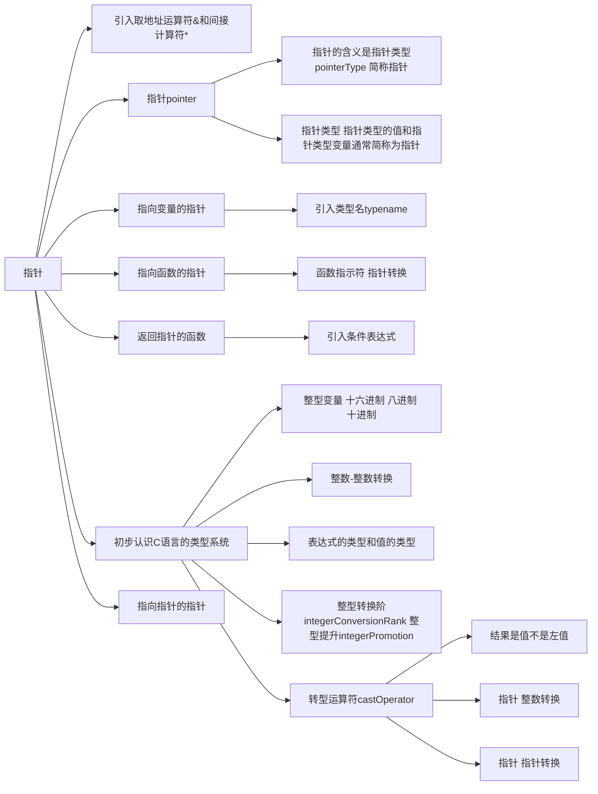
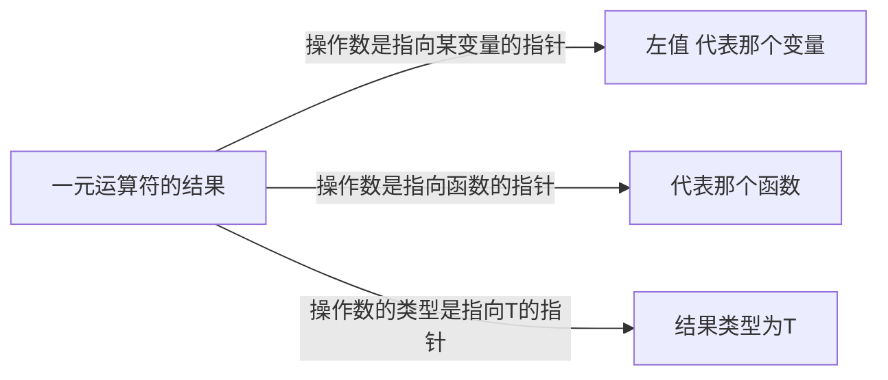

# 指针



## 一元`&`和一元`*`运算符

两个操作符只需要一个右操作数，一元`&`运算符用于取得变量或者函数的地址而一元`*`运算符则根据一个地址得到那个变量或者函数本身。

**优先级**：一元`*`运算符和一元`&`运算符的优先级相同，且高于赋值运算符，但它们是从右往左结合的，所以`* & m = 2` 等价于`(* (& m)) = 2`。表达式 `& m`得到变量`m`的地址，然后，一元`*`运算符则通过地址得到该地址上的那个变量——实际上就说变量`m`。

“变量”不是用于描述表达式的属于，“左值”才是。指示或者说代表变量的表达式称为左值，既然表达式`* & m`代表一个变量，那么它就是一个左值；表达式`* & m = 2`是将2赋给这个左值。又因为这个左值实际上是代表变量`m`的，所以语句`* & m`等价于`m = 2`。


### Checkpoint4.2
判断题：
(1)通过变量的地址可以得到该地址上的变量(√)。
(2)若var是变量，则表达式*&var等价于左值var。(√)

## 指针

**简单地将一元`&`运算符的结果视为地址是有问题的**。仅凭地址是没有类型信息是无法读取内容的。在C语言里，一元`&`运算符的结果（值）并单纯是一个地址，而是一个包含类型的地址。如果变量`m`的类型是int，则表达式`& m`的值是一个**用于访问一个int类型的变量**。


一元`&`运算符称为取地址运算符，它需要一个右操作数，而且必须是左值或者函数指示符。只有内存中的变量和函数才有地址，如果一个左值是一元`&`运算符的操作数，则不执行左值转换。像`int m = 1;`中，`& m`不执行左值转换，不会转换成`& 1`.

人们经常把指针类型的值也叫作“指针”。C语言规定，如果操作数的类型为T，则一元`&`运算符的结果是指向T的指针。这里的“指针”就是“指针类型的值”。

### 一元运算符`*`的结果

反之，要还原指针所指向的变量和函数，需要使用一元`*`运算符。一元`*`操作数必须是一个指针（类型的值）。如果操作数是指向某变量的指针，则一元`*`运算符的结果是个`左值`，代表那个变量；如果操作数是指向函数的指针，则一元`*`运算符的结果是函数指示符，代表那个函数；如果操作数的类型是指向T的指针，则一元`*`运算符的结果类型为T；



## 指针类型的变量

```C
int * p;
```

如何声明：标识符`p`的右边是分号`;`，所以要向左读。左边是一个星号“*”，所以读作“p的类型是指针”或者“p是一个指针”。所以读作：**P是一个指针类型的变量**。


```C
int * p, * q;
```

`*`的位置，它是独立的，意思是“指针”，不和类型指定符int结合，也不和标识符p,q结合。带有星号p和q意味着实体是指针，不带星号则意味着实体不是指针。

p93……


## unordered

- 一元 `*` 运算符的操作数必须是一个 `指针` 。 

如果不是指针，无法寻址或不指定寻址变量的类型，是无意义的。

- 如果操作数是指向某变量的指针， 则一元 `*` 运算符的结果是个 `左值` ，代表那个变量；

例如语句： `int * p = 0;` 中 `p` 为指向 `int` 类型的指针，当需要为 `p` 指向的值进行赋值时，会使用 `* p = 1` 这样的语句， `* p` 代表了该变量的位置，不执行左值转化，不会出现`0 = 1` 把0赋值1的情况；

- 如果操作数是指向函数的指针， 则一元 `*` 运算符的结果是函数指示符，代表那个函数

在下面例子中， 使用新的指针pf指向swap所指向的函数；


```c
char * swap(char * a, char * b){
    char tmp = * a;
    * a = * b;
    * b = tmp;
    return * a > * b? a : b;
}

int main(void){
    char (* pf) (char *,char *) = swap;
}
```

### `* E` 是合法的表达式，表达式结果不可能是 `值`

![[#一元运算符的结果,1:#*]]

- 表达式会进行逻辑运算，每个表达式都可以计算出 `值` ，但因为 `* E` 表达式作为一个整体，本身不进行计算，所以不能得出 `值` 

![[左值转换|cs.lang.c.1-const#左值和左值转换,0:#*]]

- 结果是一个带有类型的值(变量)；

- 如果 `* E` 在 `=` 左边，则 `* E` 是左值；

## 类型

### ul后缀

后缀 `u` 或者 `U` 是 `unsigned` 的意思，后缀 `l` 或者 `L` 是 `long` 的意思； 后缀 `ll` 或者 `LL` 是 “long long” 的意思。这几种后缀可以单独使用或组合使用，但只能 `ll` or `LL`，不能 `lL`。`ull` `uLL` 都可以。

### 进制

- 十进制：以非0数字开头；

- 八进制：以数字0开头；

- 十六进制：以 `0x` 开头；

### 转型

分为三种情况： 目标类型为 `_Bool` 、可以用转换后的新类型表示、不可以用转换后的新类型表示

- `_Bool` C99开始，任何整数类型的值转换为 `_Bool` 时，零值转换为 `0` ，非零值转换为 `1` ；

- 如果一个整数类型的值转换为除 `_Bool` 以外的整数类型时，如果这个值可以用新类型表示，则转换后的值同原值不变；

- 如果不可以：
    - 目标类型为 `无符号整数` ：会将该值重复 **加上** 或 **减去** 比新类型所能表示最大值大1的数；
    - 目标类型为 `有符号的整数`：取决于C实现。

如： 

`unsigned char` 类型所黁给表示的最大值是 `255`， 所以将 `3700` 赋值时会用 `3700` 不断减去 `256` 直到结果小于或者等于 `255` 。

某无符号整数类型可表示的最大值为 `M` ，那么， 把 `-1` 赋给这种类型的变量后， 该变量的值是 `-1 + (M+1) = M`;

### 整型转换阶和整型提升

- **只在原有的类型** 上操作，例如前缀递增运算符和后缀递增运算符，他们不要求改变操作数的类型。再比如赋值运算符，它不要改变左操作数的类型，而是要求右操作数必须转换为左操作数的类型。

- **不在原来的类型** 上操作，例如：

```c
int main(void){
    signed char cx = 1, cy = 2;
    signed long int sl = 0;
    unsigned long int ul = 0;

    sl += cx + cy;
    sl += cx * 3L;
    ul += sl <= ul;

    unsigned char uc = -1;
    cy = - uc ++;
}
```

在表达式 `sl += cx + cy` 中，虽然 `cx` 和 `cy` 的类型为 `signed char` ,但计算时需要进行整型转换再相加。
