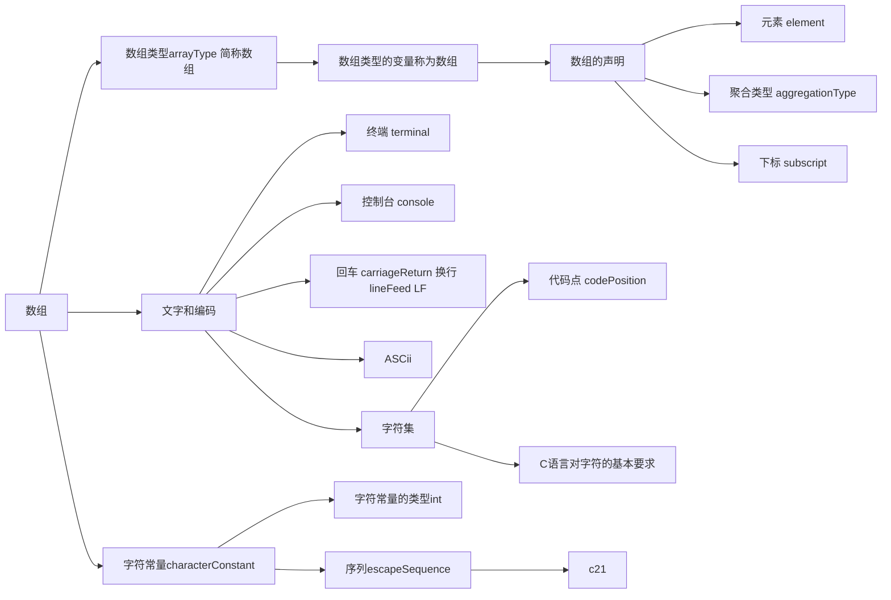

# 数组和字符



## 什么是数组

```C
int vars [5];
```

标识符`vars`指示或者说代表一个在程序运行时创建的变量，`[5]`表示变量由5个子变量组成；`int`表示了子便令的类型；`vars`变量是数组类型的变量。


数组变量有如下特点：

- 子变量称为数组的元素

- 数组的元素不但要连续分配，还须具有相同的类型

### 数组变量的声明

如果标识符右边是“[”，则它代表一个数组。如图 5-2 所示，在上述声明，标识符vars的右边是“[”，则我们先要向右读，读作“vars的类型是数组”，或者“vars是一个数组”


数组由元素（子变量）聚合一起合成，所以被称为**聚合类型**。数组变量的元素没有名字，只能按照序号访问，每个序号称为**下标**，第`N`个元素的下标是`N-1`;

### Checkpoint5.1

某数组有7个元素。第6个元素的下标是几？

> 5

### 数组的初始化

可以在变量的声明中用符号“=”连接一个初始化器，当变量创建时就用初始化器来初始化变量，例如：
```C
int x = 6, * p = & x;
```

如果一个变量以其类型而言是由自变量组成，则它的初始化器必须用一堆花括号“{”和“}”围起来。在数学上，我们也是用花括号来形成一个集合。

```C
int main(void){
    int studs [5] = {1, 2, 3, 4, 5};
}
```

在这里，{1, 2, 3, 4, 5} 是数组变量studs的初始化器，表达式1、2、3、4、5分别是其每个元素（子变量）的初始化器。

数组元素的初始化器还可以包含一个指示器，用于指定初始化哪个元素。**没有指定的元素会被初始化为0**

```
[下标] = 值
```

```C
int main(void){
    int a [50] = {[3] = 1},
    /*
    (gdb) p a
    $1 = {0, 0, 0, 1, 0 <repeats 46 times>}
    */
    ;
}
```

- 如果数组初始化器中没有指示器（如：`[1] = 2`），初始化程序是按照元素的下标进行，先初始化下标为0的元素，然后到1，直到所有元素初始化完成为止。

```C
    int 
    c [5] = {1, 3},
    /**
    (gdb) p c
    $1 = {1, 2, 0, 0, 0}
    */
    
    d [3] = {2},
    /*
    (gdb) p d
    $2 = {2, 0, 0}
    */

    e [2] = {1, 2, 3}
    /**
    c0413.c:7:24: warning: excess elements in array initializer
    7 |         e [2] = {1, 2, 3}
      |                        ^
    c0413.c:7:24: note: (near initialization for ‘e’)

    (gdb) p e
    $1 = {1, 2}
     */
     ;
```

- 如果数组中含有指示器，则指示器的下一个元素会延续指示器的下标进行，直到遇上下一个初始化器

```C
    int b [22] = {3, [11] = 33, [9] = 5, 1, 2};
    /**
    (gdb) p b
    $2 = {
        3, 0, 0, 0, 0,
        0, 0, 0, 0, 5,
        1, 2, 0, 0, 0,
        0, 0, 0, 0, 0,
        0, 0
    }
    */
```

- 一般来说，初始化器会一直进行直到所有元素初始化完成或初始化器中没有元素为止，但以下例子中初始化器的长度大于数组长度，在编译时编译器会发出warning，实际运行时，超出部分不会进行初始化

```C
    int e [2] = {1, 2, 3};
    /**
    c0413.c:7:24: warning: excess elements in array initializer
    7 |         e [2] = {1, 2, 3}
      |                        ^
    c0413.c:7:24: note: (near initialization for ‘e’)

    (gdb) p e
    $1 = {1, 2}
     */     
```

- 如果一个数组声明中仅有初始化器而未指定数组元素的数量，则数组的元素数量由初始化器决定。具体来说，由最大下标决定

```C
int main(void){
    int a [] = {1, 2, [199] = 8, [99] = 7, 3};
    /**
    (gdb) p a
    $1 = {
        1, 2, 0 <repeats 97 times>, 7, 3, 0 <repeats 98 times>, 8
    }
    */
}
```

> tips: 初始化器中最后一个元素可以跟一个逗号，无害，利于版本控制
```C
int [3] = {1,2,3,};
```

### `sizeof`和乘性运算符

`sizeof` 运算符只需要一个右操作数，可以是表达式或`()`包裹的类型名

```
sizeof 表达式
sizeof ( 类型名 )
```

> 由运算符`sizeof`和它的操作数组成的表达式称为尺寸表达式，或者叫`sizeof`表达式。以下例子中都是合法的尺寸表达式：

- 如果`sizeof` 运算符的操作数是一个类型名，则它返回类型的大小（类型可用于声明变量，它决定的变量的大小，这个大小可视为类型的大小）。因此，表达式`sizeof (int *)`返回“指向int的指针”类型大小；表达式`sizeof (int (*) (void))` 返回“指向函数的指针”类型的大小；表达式`sizeof (char)`和 `sizeof (int)`分别返回`char` 类型和 `int` 类型的大小；

```c
sizeof (char);
sizeof (int);
/**
(gdb) p sizeof (int)
$5 = 4
*/
sizeof (int *);
sizeof (int (*) (void));
/**
(gdb) p sizeof (int (*) (void))
$4 = 8
*/
```

- 如果`sizeof` 运算符的操作数是一个表达式，则它仅抽取表达式的类型。这里的3是整型常量表达式，其类型为int，故表达式`sizeof 3`的结果是`int`类型的大小；3ULL也是整型常量表达式，其类型为`unsigned long long int`故表达式`sizeof 3ull`的结果是`unsigned long long int` 类型的大小；

```C
sizeof 3;
sizeof 3ull;
/**
(gdb) p sizeof 3ull
$2 = 8
(gdb) p sizeof (unsigned long long int)
$3 = 8
*/
```

- 如果`sizeof` 运算符的操作数是一个代表变量的左值，则不进行左值转换直接抽取左值的类型，并返回该类型的大小

```C
sizea = sizeof a; //S1
sizeb = sizeof b; //S2
```
在语句S1中，表达式`sizeof a`的结果是变量a的大小，以字节计。尽管`a` 是个左值，但并不执行左值转换。变量`a` 是一个数组， 数组的大小取决于元素的数量和每个元素的大小，或者说是元素的数量乘以每个元素的大小。 然而，`sizeof` 并不是通过访问数组`a`来得到这个总大小的， 相反，它仅仅是依靠`a` 的类型来计算的。 

```C
numa = sizeof a / sizeof (int); //S3
```
语句S3的的作用是计算数组`a`的元素个数，它的做法是用数组的大小初一每个元素的大小。在这里，运算符 `sizeof` 的优先级最高，运算符`/` 次之，运算符`=` 的优先级最低。

运算符`/`属于乘性运算符，乘性运算符都是二元运算符，需要左、右两个操作数，包括`*`、`/` 和 `%` 。

- `*` 运算符的结果是乘积；

- `/` 是左操作数除以右操作数的商，如果两个操作数都是整数，则运算符`/`的结果是一个舍弃了小数部分的整数；

- `%` 的两个操作数只能是整数类型，其结果也是一个整数，而且左操作数除以右操作数之后得到的余数；

也就是说：`15 / 6 = 2 余 1`
```gdb
(gdb) p 15 * 6
$10 = 90
(gdb) p 15 / 6
$11 = 2
(gdb) p 15 % 6
$12 = 3
```

### 变长数组

在C99以前，`sizeof` 运算符并不求值它的操作数，而仅仅是提取它的类型。该运算符的结果在翻译时已经得到了，且是一个整型常量。C99以后，因为**变长数组**的引入，`sizeof`的操作数为变长数组时，结果只能在运行时确定。

```C
unsigned int var_arr (int n){
    signed char va [n];
    return sizeof va; //S1
}

int main(void){
    unsigned int n = 30, siz = sizeof 0;//D1

    signed char c = 0;
    siz = sizeof (c = 1);//S2

    siz = sizeof (int [30]);//S3
    siz = var_arr(n); //S4
    siz = sizeof (int [++n]); //S5

    siz = sizeof sizeof c; //S6
}
```

#### `sizeof`的操作数不求值情况

1. 赋值表达式：在语句`S2`中 `sizeof` 运算符的操作数是一个赋值表达式，但实际上并不求值，也就是说并不会真的把`1` 赋给左值 `c`。因为`sizeof` 运算符的优先级高于赋值运算符，所以要用括号括住 `siz = sizeof (c = 1);`， 否则会变成 `siz = (sizeof c) = 1;` 这样的非法语句。

另一方面，每个表达式都有类型，表达式的类型也是该表达式的值的类型，之所以可以提取赋值表达式`c = 1`的类型，是因为赋值表达式的类型就是赋值运算符的左操作数类型。所以`sizeof (c = 1)` 等价于 `sizeof (signed char)`

为了方便描述数组类型，我们也可以使用类型名。类型名可以从声明中抽取，数组类型是以元素类型和元素数量为特征的，利用这一特点不需要借助于声明就可以写出类型名。比如：数组a有20个元素，且元素的类型是int，则a的类型是`int [20]` 

> 如果`sizeof` 的操作数是数组类型，则该运算符的结果是数组的大小，以字节计。在这里，操作数既可以是数组类型的变量，也可以是数组类型名。因此，在接下来的语句S3中，因为`sizeof` 运算符的操作数是一个类型名，代表着“具有30个元素，且元素类型为int”的数组类型，故运算符的结果是`sizeof (int) * 30`

在C99以前，声明一个数组必须是一个整型常量，从C99开始，可以使用声明数组大小，这种数组称为**变长数组**，变长数组的长度无法在翻译时决定，只有在程序实际运行时才能确定。

> 在上述程序中，在函数 `var_arr` 里声明了一个变长数组`va`，它的长度由函数的参数`n`决定，在实际运行时才能决定；

2. `sizeof` 操作符：运算符`sizeof`是从右往左结合的，因此，在最后一条语句S6中，表达式`sizeof c`等价于表达式`sizeof (sizeof c)`。但是，这里并不求值表达式`c`也不求值`sizeof c`，运算符`sizeof`有自己的结果类型（无符号整型），所以左边的哪个`sizeof` 将返回这个类型的大小。

```C
    siz = sizeof sizeof c; //S6
```

#### 运行时才工作的`sizeof`

对于一个完整的数组类型来说，元素是的数量和元素的类型缺一不可。要想从一个变长数组类型的操作数中提取类型信息（元素的数量和元素的类型），则`sizeof` 运算符必须在程序实际运行时才能开始工作。因此，`sizeof va`的值要在语句实际运行时才能确定。

无论如何，因为数组`va` 的元素类型是`signed char` ，所以在语句S4中，函数调用`var_arr` 的返回值和变量`n`的值相同，都是30。然后，这个30被赋值给变量`siz`；

#### `sizeof`操作数求值情况

```c
    siz = sizeof (int [++n]); //S5
```

接下来，在语句S5中，运算符`sizeof` 的操作数的类型`int [++n]`，其大小需要在程序运行期间求值表达式`++n`才能确定，C语言规定，**若`sizeof`的操作数是变长数组类型，则求值该操作数**。所以`sizeof`的结果是`sizeof (int) * 30`，在笔者机器测试长度等于`unsigned long long int`

```gdb
16          siz = sizeof sizeof c; //S6
(gdb) p siz
$2 = 8
(gdb) p sizeof c
$3 = 1
(gdb) p sizeof (unsigned long long int)
$4 = 8
```

## 文字和编码

### 字符数组

在声明一个数组时，可以直接用字符的`ASCII`码来初始化

```C
int main(void){
    char a [7] = {67, 104, 105, 110, 101, 115, 101};
//     (gdb) p a
// $1 = "Chinese"
    char b [7] = {0x43, 0x68, 0x69, 0x6e, 0x65, 0x73, 0x65};
//     (gdb) p b
// $2 = "Chinese"
}
```

- 数组`a`的初始化器是由整型常量组成，这些常量的类型是`int`，但数组的元素类型是`char`，类型并不匹配。`char`类型可能等价于`signed char` 也可能等价于 `unsigned char` 这要由具体的C实现来决定[^fsignedchar] 。但无论如何，上述`int`类型的常量值（字符编码）都能用`char`类型的变量容纳，因为`ASCII`编码的值不会大于127。我们为已经学过整数——整数类型的转换，在这里，可以从`int`类型转换为`char`类型，但转换后的值不变；
- 数组`b`的声明，在该声明的初始化器里使用了十六进制整型常量。虽然形式不同，但只是数制的区别而已；

#### gdb `p`指令拓展

`p` 指令除了可以打印表达式结果外，还可以控制打印参数，控制输出格式：

- `p/d` 以有符号整数的形式打印输出；
- `p/x` 以十六进制的形式打印输出；
- `p/c` 以字符的形式打印输出；

> `p/d` 和`p /d`的效果一样；

```gdb
(gdb) p a
$1 = "Chinese"
(gdb) p b
$2 = "Chinese"
(gdb) p /d a
$3 = {67, 104, 105, 110, 101, 115, 101}
(gdb) p /x a
$4 = {0x43, 0x68, 0x69, 0x6e, 0x65, 0x73, 0x65}
(gdb) p /c a
$5 = {67 'C', 104 'h', 105 'i', 110 'n', 101 'e', 115 's', 101 'e'}
(gdb) p /d b
$6 = {67, 104, 105, 110, 101, 115, 101}
```

### 字符常量

在数组声明的初始化器中使用整型常量有两个问题：

- 不直观（不能直接知道0x43代表的ASCII字符）；
- 可移植性低（不能确定在不同计算机中的运行结果，万一别人不用ASCII呢？）；

为了实现程序的可移植性，最好不要直接使用字符编码：

```c
int main(void){
    char a [7] = {'C', 'H', 'I'};
    char b [] = {'C', 'H', 'I'};
    char c [7] = {'C', 'H', 'I'};    
}
```

在程序中，数组a 、b、c的声明里都有初始化器，且这些初始化器都是由字符串常量组成的。在C语言中，最简单的字符常量由一堆单引号`''`，以及单引号里面的字符序列共同组成。在程序翻译期间，字符常量被转换为字符的编码值，但编码值取决于当前所使用的字符集和编码方式。

> 在程序翻译中，`'C'`会被映射为`int`类的字符编码值，并转换为`char` 类型以初始化数组成员。

### 脱转序列

单引号“`'`”用于组成字符常量，但如果字符常量的字符就是本身，则应该使用**脱转序列** 。脱转序列更经常地被称为 **转义序列**，它用于使某些字符脱离原先的序列，改变它的含义和解释方法，并被转换为其他字符。

脱转序列以反斜杠`\`引导，后面跟着被转移的字符。所以，要想得到单引号的常量，应该用： ` \' `

> 反斜杠也可以，写成 `\\`即可

但这还不是引入脱转序列的主要目的，真正的原因是因为有些字符属于显示不出来的非图形字符，比如换行符、回车符、警示符（遇到这个字符，点传蜂鸣器会叫一声）、制表符（使字车或者显示器的光标移动若干个字符的位置，以达到文本对齐的效果），等等。这些字符看不见也无法通过键盘输入，要想构造出它们的字符常量，只能通过脱转序列用别的字符代替。如：

```
'\a' 代表响铃符
'\r' 代表回车符
'\n' 代表换行符
'\t' 代表水平制表符
```

> 然而，并不是所有非图形字符都分配了`\+字母` 的替代形式。为此，可以使用八进制脱转序列或者十六进制脱转序列。如果字符常量的单引号里反斜杠和数字，则它的一个八进制脱转序列`\107`；十六进制：`\xab`。注意八进制脱转序列中最多允许3个八进制数字，例如`'\009'`，都被解释为只包含单个字符的字符常量；

在数组`b`的声明中，`0` 和 `'\0'`是相同的。在C语言中，编码值为`0`的字符叫做空字符。在指定空字符时，可以直接使用整型常量0，或者用字符常量`'0'`来表示。这里的`\0`的八进制脱转序列，代表那个编码值为`0`的字符；

> 注意，字符常量`'\0'`虽然和`0`相同，但和`'0'`是不同的，前者是空字符串，字符编码是0，后者是数字字符0，其`ASCII`编码为48。

### Checkpoint5.2

观察字符常量`'\''` `'\n'` `\\` 的编码值是多少。字符串常量`'\1001'` 和`'\x41'` 是同一字符吗？

> 字符串常量`'\1001'` 和`'\x41'` 是同一字符。

```gdb
(gdb) p/c '\''
$9 = 39 '\''
(gdb) p/c '\n'
$10 = 10 '\n'
(gdb) p/c '\\'
$11 = 92 '\\'
(gdb) p '\101' == '\x41'
$12 = 1
```

### 字面串和字符串

使用字面串初始化变量可以避开整型常量移植性差的问题和字符常量书写麻烦的问题。所谓的“串”是一个连续的字符序列，以遇到的第一个空字符终止，且这个空字符也是串的组成部分，是最后一个字符。因为是字符的序列，所以又叫 **字符串**。

> 字符串以空字符结束是有原因的。如：显示字符、在字符串中查找指定的字符、将两个字符串合并、比较两个字符串是否相同。如果没有空字符，就需要记住字符串的长度避免越界，空字符是一个记录字符串末尾的标志和约定。

`"hi"`在程序翻译期间会被创建为一个不可见的、元素类型为`char`的 **数组**，数组的内容除了双引号内的字符外，还会自动在末尾添加一个空字符，这并不是真正的字符串，而只具有字面上的意义，是“字面上的”字符串，所以我们称我为**字面串**。

字面串的类型是数组，而且是字符类型数组。不管字符串出现在程序中的什么地方，哪怕在函数内，由它创建的数组具有很长的生存期，从程序启动时开始，到程序退出时终止。但是，因为它没有名字，无法直接使用，只能通过字面串本身来引用。

**字面串在源文件里被用作数组类型的表达式，而且是一个左值，指示或者说代表着那个在程序翻译期间所创建的、不可见的字符数组**。当然，这个字符数组的内容通常是一个字符串。

在以下声明中，初始化器`sizeof "speed"` 。因为字面串`"speed"` 是一个数组类型的左值，具体类型为`char [6]` 所以这个表达式的结果是`6 * 1` 

```c
int siz = sizeof "speed";
```

字面串还可以直接初始化另一数组变量，如：

```diff
- char a [] = {'h', 'a', '\0'};
+ char a [] = "ha";
```

#### 初始化器长度

在声明一个数组时，如果数组的大小不足以容纳字面串的全部内容，则只能用字面串的前面一部分来初始化；如果数组大小超过了字面串的长度，则超出部分自动初始化为0；

```c
char b [3] = "speed";
//等价于 char b [3] = {'s', 'p', 'e'};

char c [7] = "speed";
//等价于 char c [7] = {'s', 'p', 'e', 'e', 'd', '\0', 0};
```

#### 字面串中的脱转序列与空串

和字符常量一样，字面串里也可以使用脱转序列，包括八进制脱转序列和十六进制脱转序列。

```c
char d [] = "speed\0is\0delphi\0";
// 总共有3+1个空字符，一个在末尾
```

字符串初始化后的数组`d` 里有4个字符串，最后一个仅包含空字符，我们把仅包含空字符的串称为 **空字符串**，简称 **空串**；


不包含任何字符的字面串`""`用于得到一个空串。程序翻译期间，这将创建一个仅包含空字符的数组，因此，数组`e`的声明：

```c
char e [] = "";
//等价于 char e [] = {'\0'};
```

#### 多个邻接字面串

互相邻接的多个字面串会合并成一个完整的字面串。在数组`f`的声明中，多个字符串会被合并成字符串`"hello ma'ma."`。此后，这个合并的字面串用于创建一个不可见的数组，并用它的内容初始化数组`f`。

```c
char f [] = "hello" " " "ma'ma.";
```

#### 字面串是一个指示变量的左值

```c
int m = 65535, * p = & m;
char a [] = "hello";
```


> 在声明中，标识符`m`代表那个存储值为65536的变量；在表达式里。`m`是个左值，代表着存储值为63355的变量；表达式`* p` 求值结果是一个左值，指示着存储值为63355的变量，甚至我们通常说表达式`* p` 本身在整体上是一个左值， 这样可以省略求值过程。 同样的，表达式`a` 也是一个左值，代表着背后的数组。

与`m *p a`一样， 字面串`"hello"` 也是一个左值，代表那个用它创建的隐藏数组。**但凡是数组类型的表达式可以出现的地方，字面串也能出现**（因为字面串本质上是一个char类型的数组的左值，所以在需要数组类型表达式的地方使用）。同时，字面串还能在声明中初始化一个变量。

## 访问数组元素

### 左值不可直接作为初始化器

```c
int main(void){
    int a, b = 8;
    a = b;
    
    int c [2], d [2] = {1,2};
    c = d;
    
    char s [20];
    s = "speed";
}
/*
c0510.c: In function ‘main’:
c0510.c:3:7: error: assignment to expression with array type
    3 |     c = d;
      |       ^
c0510.c:5:7: error: assignment to expression with array type
    5 |     s = "speed";
      |       ^
*/
```

一个数组类型的变量，其内容被解释为那种数组类型的值。但**赋值表达式不可以把一个数组的变量值保存到另一个数组变量**。**数组类型的左值规定为不允许修改，也不发生左值转换**。

> 我们知道，当左值是赋值运算符的左操作数，或者是`++ -- & sizeof` 等运算符的操作数时，不发生左值转换，现在多了一个限制：左值不能是数组类型。

所以在示例程序中，表达式`c = d` 和 `s = "speed"` 是非法的，`c` 和 `s` 都是数组类型的左值，按规定不允许修改，所以不能放在赋值运算符的左侧；表达式`d`和字面串`"speed"` 是数组类型的左值，但不能转换为值。 不能用一个数组给另一个数组赋值，也不能用一个数组初始化另一个数组，**唯一的例外是可以用字面串初始化另一个字符数组**。

### 数组——指针转换

C语言规定，除非作为`sizeof` 和 `&` 的操作数，或者是一个字面串且被用于初始化数组变量，否则，一个数组类型的表达式会被转换为指向该数组首元素的指针，而且不再是一个左值。如果数组的（元素）类型为T，则转换后的类型为指向T的指针。

```c
    int a [20] = {5}, m = * a;
```

- 首先，因为表达式`a`的类型是数组，数组元素的类型为`int`，所以执行数组——指针转换，转换为指向`int`的指针，而且指向数组的第一个元素（下标为0）；
- 更进一步地，因为为一元`*` 操作符的操作数是指针，故该元素的结果是一个左值，代表一个变量。实际上，这个变量就是数组`a`的首元素。
- 最后，既然`*a` 是左值，就要执行左值转换。既然它代表数组`a` 的首元素，那么自然要转换为数组`a` 首元素的值，也就是5，并用来初始化变量`m`

```c
    * a = 6;
```

- 同理，在表达式`* a = 6`中，子表达式`* a` 是一个左值，代表数组`a` 的首元素。作为运算符`=` 的左操作数，它不执行左值转换，而是接受赋值。 赋值后，数组`a` 的首元素不再是5，而是6了

```c
    char c = * "hello";
```

- 变量`c` 的声明中带有初始化器`* "hello"` ，在这个表达式中，字面串`hello"` 是数组类型的左值，被转换为指针，指向那个隐藏数组的首元素。
- 因为一元运算符`*` 的操作数是指向`char` 的指针，所以表达式`* "hello";`是一个`char` 类型的左值，代表那个被隐藏数组的首元素，该元素的值是字符`h` 的编码， 并用于初始化变量`c`

```c
    * "go" = 'G';
/*
Program received signal SIGSEGV, Segmentation fault.
main () at c0511.c:6
6           * "good" = 'G';
*/
```

尽管字符串会创建一个数组，且该数组的生存期贯穿程序运行过程，但这个数组不能吸入，所以以上语句不合法。

[^fsignedchar]: GCC提供了两个翻译选项：`-figned-char`用于将`char`强制为`signed char`；`-funsigned-char`用于将`char`强制为`unsigned char`；

### Checkpoint5.4

表达式`* "good" = 'G'` 中， 字符常量`'G'` 的类型是什么？子表达式`"good"` 的类型是什么？子表达式`* "good"` 的类型是什么？在该表达式求值的过程中，都发生了哪些类型转换？

> 字符常量`'G'`的类型是int；
>
> 子表达式`"good"`的类型是数组`char [5]`；
>
> 子表达式`* "good"`的类型是`char`；
>
> 在该表达式求值的过程中，`"good"`是数组类型（`char [5]`)的左值，自动转换为指向数组首元素的指针(`char *`)；`*"good"`得到一个左值，代表数组首元素，类型为`char`。 

### 指针运算和for语句

C语言规定，加入一个指针`P`指向数组的第`M`个元素，且数组足够大，`N`是一个整数，那么 `P + N` 是结果是一个新的指针，指向该数组的第`M + N` 个元素；`P - N` 的结果也是一个指针，指向数组的第`M - N` 个元素；

```c
int main(void){
    int a [] = {5, [7] = 7, [11] = 8}, 
    b [sizeof a/ sizeof (int)];

    for(int x = 0; x < sizeof a / sizeof (int); x ++){
        * (b + x) = * (a + x);
    }
    /*
    (gdb) p b
	$2 = {5, 0, 0, 0, 0, 0, 0, 7, 0, 0, 0, 8}
    */
}
```

- 声明数组`b` 时，使用`sizeof a / sizeof(int)`计算出数组`a`的大小，因为`a`不是变长数组，该表达式在程序翻译期间已经得到结果，是一个常量表达式；
- `for`循环中遍历数组`a`中的每个元素赋值给`b`

#### `for`语句


```
for (decl or el; e2; e3) 语句；
```

其中，`decl` 代表第一种形式里的声明；`e1` 、`e2` 和 `e3` 对应于那三个表达式。

如图所示，`for`循环先处理第一部分，也就是`decl`和`el`，而且在`for`语句的整个执行过程中只处理一次。如果这个部分是`decl` 则处理这个声明；如果是`el` 则求值该表达式。如果没有这一部分，则直接求值`e2`。


- `e2`是`for`语句的控制表达式，如果`e2`求值的结果不为0，则执行圆括号后面的语句，也就是循环体；如果为0，则退出`for`语句。如果`e2`不存在，则翻译语句时，会自动插入一个不为0的常量。这将产生一个无限循环，**也就是死循环**；
- 执行完循环体后，求值`e3`，然后再次求值`e2`。如果没有`e3`，则执行完后再次求值`e2`，无论如何，`e2`求值的结果决定了是否继续执行循环体；

```c
	char c = * ("are" + 2);
/*
(gdb) p c
$1 = 101 'e'
*/
```

上面我们介绍，字面串`"are"` 是数组类型的表达式，不但用于创建一个隐藏的数组，而且自动转换为指向`char`的指针，指向编码值为“A”的那个元素。将这个指针加2，将得到一个新的指针，指向编码值为“e”的元素。

#### 在gdb中打印数组指针值

在gdb命令中直接输入“`p a`”并不会打印指针地址，需要这样： `p a + 0`

```gdb
(gdb) p a + 0
$3 = (int *) 0x7fffffffdee0
(gdb) p a
$4 = {5, 0, 0, 0, 0, 0, 0, 7, 0, 0, 0, 8}
```

指令`p a + 1`中，`a`只加了`1`， 但实际上在数值上相差一个int的长度，`4`个字节。


### Checkpoint5.5

将上述for语句改为while语句，以实现相同功能；

```c
int main(void){
    int a [] = {5, [7] = 7, [11] = 8}, b [sizeof a/ sizeof (int)], c [sizeof a /
        sizeof (int)];
    for(int x = 0; x < sizeof a / sizeof (int); x ++){
        * (b + x) = * (a + x);
    }
    
    int count = -1;
    while(count ++,count < sizeof a / sizeof (int)){
        * (c + count) = * (a + count);
    }
}
```

书中参考：

```c
int main (void)
{
    int x = 0, a [] = {5, [7] = 7, [11] = 8}, b [sizeof a / sizeof (int)];
    
    while (x < sizeof a / sizeof (int))
    {
        * (b + x) = * (a + x);
        x ++;
    }
}
```

### 下标运算符

```diff
- * (e1 + e2);
+ e1 [e2];
```

上述使用指针的数组访问不方便，于是使用`[]` 进行操作。运算符`[]`的两个操作数一个是指针类型，另一个是整数类型，而且表达式`e1 [e2]` 等同于`* (e1 + e2)`。如：`a [1] = 1`等同于`* (a + 1) = 1`；

```c
int main(void){
    int a [3], b = 2;

    a [0] = 1;
    a [1] = b;
    2 [a] = 1 [a];

    char c = "Tom." [2];
}
```

- 对于运算符`[]`，C语言并未规定哪个是指针，哪个是整数，所以才有了`    2 [a] = 1 [a];`这样的表达式，等价于`*(2 + a) = * (1 + a)` ，这实际上就是 `a [2] = a [1]`。
- 变量`c`的声明中，初始化器是表达式`"Tom." [2]`，等同于`* ("Tom." + 2)`，是一个左值，代表着那个被隐藏数组的第三个元素。表达式`* ("Tom." + 2)`经过左值转换后，得到字符`"m"`的编码用于初始化初始化变量`c`

### Checkpoint5.6

给定声明：

```c
int a [5] = {37, 1, 62, 58, 33}, b [7];
```

编写程序将数组`a`的内容复制到数组`b`，要求使用下标运算符。

```c
int main(void){
    int c [5] = {37, 1, 62, 58, 33}, d [7];
    for(int x = 0; x < sizeof c / sizeof (int); x ++){
        d[x] = c[x];
    }
/*
(gdb) p d
$2 = {37, 1, 62, 58, 33, 0, 1431654496}
(gdb) p c
$4 = {37, 1, 62, 58, 33}
*/
}
```

### 指针的递增和递减

尽管用指针访问数组和用下标访问数组等效，但在程序设计时各有适用场景。以下是一个拼接字符串的函数：

```c
char * s_joint(char * d, char * s){
    char * r = d;

    while (* d != '\0') d ++;
    while ((* d ++ = * s ++) != '\0');

    return r;
}

int main (void){
    char a [10] = "Hi,", * ps = 0;

    ps = s_joint(a, "Tom,");
}
```

- 函数`s_joint`的返回类型是指向`char`的指针，连接工作完成后，这个返回值指向连接后的新串。实际上，这个返回值就是传递给参数`d`的值，故函数一上来就要保存该值；
- `main`函数中，声明了一个字符类型的数组`a`，它有10个元素，是用于字面串`"Hi,"`初始化的；同时，我们还声明了一个变量`ps`，其类型为指向`char`的指针，用于接受函数`s_joint`的返回值，它被初始化为空指针；
- 接下来，调用了函数`s_joint` 并把返回值赋值给左值`ps`。 调用时，实际参数是表达式`a`和字面量“`"Tom"`”，它们都是数组类型的左值，将转换为指向数组首元素的指针，分别传递给形式参数`d`和`s`
- 如图所示，进入函数`s_joint`时会有两个数组。第一个`while`语句用于执行到数组`d`的末尾`'\0'`处；
- 第二个`while` 语句：左值`d`的类型是指针，左值转换后得到一个指针类型的值，在循环刚开始，它指向数组`a`的首元素。因此，表达式`* d`是一个左值，左值转换为`char`类型的值并与字符常量`'\0'`进行比较。如果不相等，则控制表达式`* d !=  '\0'` 的值为1，执行循环体`d ++` ，使变量`d`的值指向下一个数组元素；如果不等，退出循环；


> 以上数组`a`的初始化过程中我们提到：创建两个隐藏的数组。但事实上，C实现中为了提高运行效率，如果一个字面串很短，且除了用于初始化一个数组之外没有别的用处，C实现可能不会创建一个隐藏数组。在这里，很可能只用字符“H” “i” 等的编码值直接初始化数组`a`；

#### `++ ` `--` 对指针的操作

如果P的一个左值，其类型为指向 *T* 的指针，则表达式 `P ++ 或 P --` 的值是P递增或递减之前原始指针值；表达式 `++ P 或 -- P` 的值是P递增或递减之后的指针值；递增的大小是一个`sizeof (T)` ，并不一定是`1`；

```c
(* d ++ = * s ++) != '\0'
```

这个表达式要完成赋值和`!=`的判断工作，在这过程中还有递增变量`s` 和 `d` 的存储值的副作用。

- `(* d ++ = * s ++)` 等价于 `(* (d ++)) = (* (s ++))`。

> 调用`s_joint`函数时：参数变量`d`的值所指向的字符串，其所在数组必须有足够的空间以容纳被附加的字符串，而且这个数组不能位于一个无法写入的保护区域，也不能和变量`s` 在存储空间上重叠，否则行为是未定义的。

### Checkpoint5.7

1.关于表达式`( * d ++ = * s ++ ) !=\0'`，判断以下说法是否正确，并说明原因。
a. 先得到运算符`++`的结果，再计算一元`*` 运算符的值。

> 对，但表达式`d ++`计算完成后，值仍然是`d` ，副作用在完成赋值后再发生；

b. 先得到子表达式`* d ++`和`* s ++`的值，再计算运算符`=`的值。（)

> 对

c. 先计算表达式`(* d++ = * s++)`和`'\0'`，再计算运算符`!=`的值。（)

> 对

d. 运算符`++`的副作用和它的值计算同时发生。()

> 错

2.如果将源文件中的声明

```diff
- char a [10] = "Hi,", * ps = 0;
+ char * a = "Hi,", * ps = 0;
```

则程序运行时会怎样？为什么？

> 调用函数`s_joint`时，在第一个`while`时报错，因为无法对字面串数组`"Hi, "` 进行写入操作；
>
> ```gdb
> Program received signal SIGSEGV, Segmentation fault.
> 0x000055555555516f in s_joint (d=0x555555556008 "Tom,", s=0x555555556009 "om,") at c0514.c:5
> 5           while ((* d ++ = * s ++) != '\0');
> ```

3.编写一个函数以比较两个字符串是否相同（包括末尾的空字符)。

```c
_Bool s_equal(char * d, char * s){
    char * d1 = d, * s1 = s;
    while (* d1 != '\0' && * s1 != '\0'){
        if(* d1 ++ != * s1 ++) return 0;
    }
    //循环结束后，有可能两个字符串是部分相同的，比如"abc"和"abcd" 
    return 1;
}
```


使用指针操作来连接两个字符串当然是极简洁、极方便的，但如果使用数组下标操作会怎样呢？让我们来看一看。不过我们仅仅修改函数`s_ joint`,程序的其他部分不动。

```diff
- while (* d != '\0') d ++;
+ while (d[0] != '\0') d ++;

- while ((* d ++ = * s ++) != '\0');
+ while ( d ++ [0] = s ++ [0] != '\0');
```

> 表达式`e1 [e2]` 是代表一个元素的左值，要得到下一个元素，既可以增加`e1` 的值，也可增加 `e2`的值，最终都是左值`* (e1 + e2)` 。

我们递增变量`s` 和 `d` 的值，毕竟都是指针变量；至于`[]`里面的操作数，设置为0即可。在表达式`d ++ [0] = s ++ [0]` 中，后缀运算符和`[]` 优先级相同，都是从左往右结合的，因此表达式等同于：`((d ++) [0]) = ((s ++) [0])`

### Checkpoint5.8

假设数组`a`的内容是字符串`"hello"`，编写程序进行反转，且不得借助于另一个数组；

供参考的答案：

```c
int main (void)
{
    char a [] = "hello,world.";
    char * p = a, * q = a;	//令p和q的值都指向数组开头
    while (* q != '\0') q ++;	//令q的值指向数组末尾的空字符

    -- q;			//令q的值指向数组最后一个非空字符
    char c;
/*向后移动p的值所指向的元素，向前移动q的值所指向的元素，
**每次移动前先交换它们所指向的数组元素的值
**循环持续的条件：两个指针是相对移动且没有相遇。
*/
    while (p < q)
    {
        c = * p, * p = * q, * q = c;
        p ++, q --;
    }
}
```

自制：

```c
void s_reverse(char * a){
    char * start = a, * end = a, temp;

    while(end ++ [0] != '\0');
    // 运行到末尾时，end已指向'\0'，且副作用生效，需要 -2 才能指向最后一个字母
    end -= 2;

    while(start < end){
        temp = start[0];
        start ++ [0] = end [0];
        end -- [0] = temp;
    }
}
```

## 指向数组的指针

#### 手动转换数组首指针

在下面语句中，表达式`p = a` 是将`a` 自动转换为指向其首元素的指针并写入变量`p`；

```c
int a [3], * p;
p = a;
```

这种自动转换非常方便，当然也可手动转换：

```c
p = & a [0];
```

表达式`q  = & a [0]` 等价于 `q  = & (a [0])`

#### 声明一个指向数组的指针

```c
int a [3], (* r) [3];
r = & a;
```

- 一元`& ` 运算符的操作数必须是左值，如果左值类型是*T* ，则结果是指向 *T* 的指针。如果左值类型是数组，则结果类型是数组。因为表达式`& a` 的结果类型是`int [3]` ，所以`(* r)` 的类型也必须是`int [3]`。

- 变量`r`的声明中，`()` 阻断了标识符和`[]`的结合，需从左往右读，左边`*` ，`(* r) `要读作“`r`的类型是指针”，然后往右读，遇到`[`，读作“指向数组”；数组有3个元素，然后再往左读“元素的类型为`int`”。


- 所以，`r`是一个**指向数组类型的指针，被指向的数组类型为int长度为3** 。简言之，`r`是一个指向`int [3]`的数组，类型名是`int * [3]` ；

```c
( * r ) [0] = 1; //S4
( * r ) [1] = 2;
( * r ) [2] = ( * r ) [1] + 1;
```

- 语句S4中，使用1给数组下标0的元素赋值，**因为下标运算符的优先级高于一元`*`运算符，需要使用圆括号**；

#### 使用指向数组的指针

```c
int fsum(int (* pints) [5]){
    int sum = 0;
    for (unsigned x = 0; 
         x < sizeof * pints / sizeof (int); x ++){
        sum += (* pints) [x];
    }
    return sum;
}

int main(void){
    int a [] = {3, 10, -5, 6, 22}, r;
    r = fsum (& a);
}
```

以上，函数`fsum` 的参数 `pints` 是一个指向数组的指针，它的值指向一个数组，而该函数的功能是返回这个数组所有元素的累加和。

- `x < sizeof * pints / sizeof (int)` 等价于 `x < sizeof (* pints) / sizeof (int)`
- 左值`pints`的类型是指向数组的指针，指向左值转换，得到一个指针类型的值，一元`*` 运算符作用于它，得到数组类型的左值；
- 更进一步地，`(* pints) [x]` 得到该数组下标为`x`的元素；

#### 不完整类型

该函数的形式参数声明不合理，如果数组大小不同，会造成形参和实参不一致，造成编译器的警告；

为了避免该警告，同时为了能让程序能够接受不同大小的数组，可以更改声明为：

```diff
int fsum(
- int (* pints) [5]
+ int (* pints) [], unsigned int siz
){ /* 略，原有函数体无法使用 */ }
```

对比之下上述声明：

- 被指向的数组类型未指定大小。在C语言里，如果某个类型缺少必要的信息，从而无法知道它的大小，则这样的类型称为**不完整类型**。未指定元素数量的数组类型是不完整的数组类型，所以，形参`pints`所指向的类型是不完整的数组类型；

> C语言允许存在指向不完整数组类型的指针，原因：所有指向数组的指针都具有相同的大小，与所指向的数组有几个元素无关。尽管指针指向的数组不知道大小，但指针本身的大小是确定的，这种指针类型本身是完整类型。C语言里的所有指针类型是完整类型；

- 为了能够在被调用函数内知道数组的大小，新的声明添加了一个参数`siz`，使用者负责将数组的带下通过它传递进来。

C语言规定，如果两个数组中一个具有常量大小，而另一个不具有常量大小（是变长数组）或者未指定大小（是不完整的数组），只要它们的元素类型是兼容是，则它们属于兼容的数组类型。也就是说，数组类型`int [5]` 和 `int []` 是兼容的；所以`int * [5]`和 `int * []` 也是兼容的；

> 修改后，原有函数体无法使用，因为`sizeof` 运算符要求其操作数的类型必须是完整类型，原有函数体会引起翻译期间错误；

#### Checkpoint5.9

1. 若函数faas的参数是指向数组的指针，该函数的功能是将下标为0和1的元素相加，赋给下标为2的元素。请写出这个函数的定义。

```c
void faas(int (* ptr) []){
    (* ptr) [2] = (* ptr) [0] + (* ptr) [1];
}
```

2. 将上述带有参数siz的函数fsum补充完整，用它代替原来的fsum函数，并在你的机器上翻译和调试以验证自己的修改是否正确。

```c
int fsum(int (* pints) [], int siz){
    int sum = 0;
    for(unsigned x = 0; x < siz; x ++){
        sum += (* pints)[x];
    }
    return sum;
}
/*
(gdb) p fsum(&a,3)
$1 = 3
*/
```


2. C语言不允许声明不完整类型的变量，除非是一个数组且能够根据初始化器确定它的大小。以下，变量a和pa的声明是否合法？

```C
char a [], (* pa) [];
```

> 变量a的声明不合法，但pa的声明合法。`a` 没有确定大小，也没有初始化器确定大小；但`pa` 声明自己为一个指针，指向的类型为`char []`数组，类型为`char * []` ；


如果数组里面保存的是字符串，则它的大小可以通过`'\0'`（空字符）进行判定，以下函数用于比较两个字符串是否完全相同；

```c
_Bool fstrcmp(char (* para)[], char (* parb) []){
    char * p = * para, * q = * parb;    
    
    while(* p != '\0' && * q != '\0'){
        if(* p ++ != * q ++) return 0;
    }
    return * p == * q; //S1
}

int main(void){
    char a [] = "The Wizard of Oz";
    _Bool b = fstrcmp(& a, & "haha");
    
    char (* pc)[] = & a;
    b = fstrcmp(pc, & a);
}
```

- 字符串的比较通过`while`语句完成，循环持续的条件是变量`p`和`q`所指向的字符都不为空，也就是都没到字符串的尾部。为此，`while` 语句的控制表达式为`* p != '\0' && * q != '\0'`。在这里有三种运算符，按照从高到低排序：`* != &&`，这个表达式等价于`((* p) != '\0') && ((* q) != '\0')`
- `while` 语句的循环体是一个`if`语句，其控制表达式为`* p ++ != * q ++`，等价于`(* (p ++)) != (* (q ++)`
- `return`语句中，通过比较两个末尾的变量判定两个数组长度是否不一致，也可改写成：

```c
return * p == '\0' && * q = '\0';
```

#### Checkpoint5.10

1. 用类型名写出表达式`&"Goodbye Mr Ho11 ywood"`的类型。

`char * [21]`

2. 为什么fstrcmp可以比较同一个数组里的字符串而不会引起混乱？

> 因为两个独立的指针可以指向同一个字符串但不会相互混淆。

3. 如下所示，我们想改写fstrcmp函数，使用数组下标来比较两个字符串，而不是先前的指针操作。变量m和n的值在程序中用做数组下标，请将这个函数补充完整。

```c
_Bool fstrcmp(char (* para)[], char (* parb) []){
    char * p = * para, * q = * parb;    
    int i = 0, j = 0;
    
    while((* para)[i] != '\0' && (* parb)[j] != '\0'){
        if((* para)[i ++] != (* parb)[j ++]) return 0;
    }
    return (* para)[i] == (* parb)[j]; //S1
}
```

## 元素类型为指针的数组

数组元素类型也可以是指针，这样它就保存了一大堆指向其他变量或者函数的“地址”。在下面的程序中，变量`arrpi` 和 `arrps` 就是这样的数组。

```c
int main(void){
    int a, b, * arrpi[2]; // 与 int (* arrpi) [] 不一样
    
    arrpi [0] = & a; //S1
    * arrpi[0] = 111; //S3
    
    char c, d, * arrps [2];
    
    arrps[0] = "Search"; //S5
    arrps[1] = "Project"//S6
    c = * arrps [0]; //S7
    d = * arrps [1]; //S8
}
```

- 声明：`int a, b, * arrpi[2]`中，标识符的左边`*`，右边是“`[`”。尽管声明中的标点符号不是运算符，但却具有作为运算符时的优先级属性，所以标识符`arrpi` 先与方括号结合。


通过上图可知，变量`arrpi`的类型是数组，它有两个元素，元素的类型是`int`的指针。同理，程序后面的`arrps`也是数组，元素类型为指向`char`的指针；

#### Checkpoint5.11

语句S5中，`arrps[0]` 的类型为`char *`，`"Search"` 转化成指向第一个元素的指针，类型为`char *`。

> ```c
>     arrps[0] = "Search"; //S5
> ```
>
> - 对于S5，字面串"Search"的类型为数组（char [7]），将执行数组到指针的转换，转换为char *类型。表达式arrps [0]代表数组arrps的下标为0的元素，元素的类型为char *，是左值但不执行左值转换且进行赋值。
>
> ```c
>     arrps[1] = "Project"//S6
> ```
>
> - 对于S6，字面串"Project"的类型为数组（char [8]），将执行数组到指针的转换，转换为char *类型。表达式arrps [1]代表数组arrps的下标为1的元素，元素的类型为char *，是左值但不执行左值转换且进行赋值。
>
> ```c
> c = * arrps [0]; //S7
> ```
>
> - *对于S7，运算符[]的优先级高于*，故表达式* arrps [0]等价于* (arrps [0])。表达式arrps [0]代表数组arrps的下标为0的元素，元素的类型为char *，而且是一个左值，执行左值转换后得到char *类型的值，这是一个指针，指向字符串“Search”。一元*运算符作用于这个指针，得到一个左值，它所代表的变量存储了字符串“Search”的首字符S。进一步地，执行左值转换，得到这个元素的值，即字符S的编码，赋值左值c。
>
> ```c
> d = * arrps [1]; //S8
> ```
>
> - 对于S8，运算符[]的优先级高于*，故表达式* arrps [1]等价于* (arrps [1])。表达式arrps [1]代表数组arrps的下标为1的元素，元素的类型为char *，而且是一个左值，执行左值转换后得到char *类型的值，这是一个指针，指向字符串“Project”。一元*运算符作用于这个指针，得到一个左值，它所代表的变量存储了字符串“Project”的首字符P。进一步地，执行左值转换，得到这个元素的值，即字符P的编码，赋值左值c。


#### 在GDB中打印数组里面的地址


在显示数组`arrps`的内容时，结果有点奇怪。但不要误会，这并不是说数组arrps存储了字符串。在处理char类型时，GDB总是显得过分热情。数组arrps仅存储了两个指向char的指针，这种指针通常用于指向字符串，所以热情的GDB索性把指针所指向的字符串一并显示出来。

```c
int f_add(int x, int y) return x + y;
int f_sub(int x, int y) return x - y;
int f_mul(int x, int y) return x * y;
int f_div(int x, int y) return x / y;
int f_mod(int x, int y) return x % y;
int f_max(int x, int y) return x > y ? x : y;
int f_min(int x, int y) return x < y ? x : y;
int f_avg(int x, int y) return (x + y) / 2;

int main(void){
    int (* af []) (int, int) = {
        f_add, f_sub, f_mul, f_div,\
            f_mod, f_max, f_min, f_avg},\
        r [sizeof af / sizeof (int (*) (int, int))];
    
    for (unsigned n = 0; 
        n < sizeof r / sizeof (int); 
        n ++){
        r[n] = af [n] (8, 6);
    }
}
```

p161……
