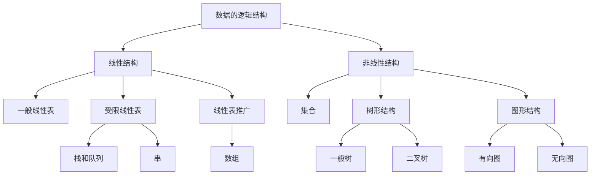

# 导论

## 基本概念

### 基本概念和术语

1. **数据**

数据是信息的载体，是描述**客观事物属性**的数、字符及所有**能输入到计算机**中并被计算机程序所**识别和处理**的符号的集合。数据是计算机程序加工的原料。

2. **数据元素**

**数据元素是数据的基本单位**，通常作为一个整体进行考虑和处理。一个数据元素可由若干个数据项组成，数据项是构成数据元素的不可分割的最小单位。例如，学生记录就是一个数据元素，它由学号、姓名、性别等数据项组成。

3. **数据对象**

**数据对象是具有相同性质的数据元素的集合**，是数据的一个子集。例如：整数对象是集合N={0, +- 1, +- 2}。

4. **数据类型**

数据类型是一个值的集合和定义在此集合上的一组操作的总称：

- 原子类型。其值不可再分的数据类型；
- 结构类型。其值可以再分解为若干成分（分量）的数据类型；
- 抽象数据类型。抽象数据组织及与之相关的操作；

5. **数据结构**

**数据结构是相互之间存在一种或多种特定关系的数据元素的集合**。在任何问题中，数据元素都不是孤立存在的，他们之间存在某种关系，这种数据元素之间相互之间的关系称为结构（Structure）。数据结构包含三方面的内容：**逻辑结构、存储结构和数据的运算**。

数据的逻辑结构和存储结构是密不可分的两个方面，一个算法的设计取决于所选定的逻辑结构，而算法的实现依赖于所采用的存储结构。

### 数据结构三要素

#### 数据的逻辑结构

逻辑结构是指数据元素之间的逻辑关系，即从逻辑关系上描述数据。它与数据的存储无关，是独立于计算机的。数据的逻辑结构分为线性结构和非线性结构，线性表是典型的线性结构；集合、树和图是典型的非线性结构。数据的逻辑结构：

集合：同属一个集合，无别关系；

线性结构：只存在一对一关系；

树形结构：一对多；

图或网：多对多；

#### 数据的存储结构

存储结构是指数据结构在计算机中的表示（又称映像），也称物理结构。它包括数据元素的表示和关系的表示。数据的存储结构是用计算机语言实现的逻辑结构，它依赖于语言。常见如下：

**顺序存储**：逻辑上相连的元素存储在物理位置上也相邻的存储单元中；每个元素占用空间小，缺点是占据连续空间，容易造成内存碎片；

**链式存储**：借助指示元素存储地址的指针来表示元素之间的逻辑关系。其优点是不会出现碎片现象。

**索引存储**：在存储信息同时还建立附加的索引表。索引表中的项叫索引项，索引项的一般形式是（关键字，地址）。其优点是检索速度快，缺点是附加的索引表额外占用存储空间。增删也要修改索引表，花费较多时间。

**散列存储**：根据元素的关键字直接计算出元素的存储地址，又称哈希（hash）存储，有点是检索、增加和删除节点的操作都很快；缺点是若散列函数不好，则可能出现元素存储单元冲突，而解决冲突会有额外的增加时间和空间开销；

#### 数据的运算

施加在数据上的运算包括运算的定义和实现。运算的定义是针对逻辑结构的，指出运算的功能；运算的实现是针对存储结构的，

## 算法和算法评价

算法（Algorithm）是对特定问题求解步骤的一种描述，它是指令的有限序列，其中的每条指令表示一个或多个操作。
