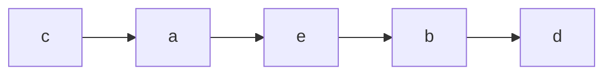

# 线性表

## 顺序表

### 表示

#### 顺序表的定义

静态分配：

```c
#define MaxSize 50
typedef struct {
    ElemType data[MaxSize];
    int length;
} SqList;
```

- 一维数组可以是静态分配的，也可以是*动态分配*的。动态分配是值重新划分一块更大的内存空间用于替换原有的存储空间，从而达到扩充存储空间的目的。

动态分配：

```c
# define InitSize 100
typedef struct {
    ElemType * data;
    int MaxSize, length;
}
```

- 声明为动态时，有两个不同：
  - data不同，变为指向ElemType的指针；
  - 还需要保存最大值和长度，用于判断操作合法等；
- 初始化data的语句如下：

> ! 注意：大小记得要乘以元素的数量

```c
L.data = (ElemType *)malloc(sizeof (ElemType) * InitSize);
```

> 动态存储并非链式存储，它同样属于顺序存储结构，物理结构没有变化，依然随机存取方式，只是分配的空间大小可以在运行时指定。

- 顺序表的最主要特点是随机访问，即通过首地址和元素序号可在时间O(1)内找到指定的元素；
- 顺序表的存储密度高，每个结点只存储数据元素；
- 顺序表逻辑上相邻的元素在物理上也相邻，所以插入和删除要移动大量元素；


### 基本操作实现

```c
# include <stdlib.h>
# include <stdio.h>
# define InitSize 100
typedef int ElemType;
typedef struct {
    ElemType * data;
    int MaxSize, length;
} SqList;
```

#### 初始化

- 为data分配相应的存储空间
- 设置当前长度为0
- 将最大长度设为初始长度

```c
_Bool InitList(SqList * L){
    L->data = malloc(sizeof (ElemType) * InitSize);
    L->length = 0;
    L->MaxSize=InitSize;
}
```

#### 插入

- 在顺序表L的第 i (1 <= i <= L.length + 1)个位置插入新元素 e 。
  - 若 i 的输入不合法，则返回 false ，表示插入失败；
  - 否则，将第 i 个元素及其后的元素依次往后移动一个位置，腾出一个空位插入新元素e，顺序表长度 + 1，插入成功，返回 true；

```c
_Bool ListInsert(SqList * L, int index, ElemType e){
    // 判断插入位置，少于1或大于长度+1都是非法的
    if(index < 1 || index > L->length + 1){
        return 0;
    }
    // 如果当前长度已满，则无法再插入
    if(L->length >= L->MaxSize) return 0;
    // 从最后一个元素开始移动元素，一直到要插入位置为止
    for(int i = L->length; i >= index; i --){
        L->data[i] = L->data[i - 1];
    }
    // 将元素插入
    L->data[index - 1] = e;
    L->length++;
}
```

#### 删除

删除顺序表L中第 i （1 <= i <= L.length）个位置的元素，用引用变量e返回。

- 若 i 的输入不合法，则返回false；否则，将被删元素赋给引用变量e；
- 将 i + 1 个元素及其后的所有元素依次往前移动一个位置
- 调整顺序表长度
- 返回1；

 ```c
 _Bool ListDelete(SqList * L, int index, ElemType e){
     // 判断删除位置，少于1或大于长度都是非法
     if(index < 1 || index > L->length) return 0;
     // 如果当前长度为0，则无法删除
     if(L->length == 0) return 1;
     e = L->data[index - 1];
     for(int i = index - 1; i < L->length - 1; i ++){
         L->data[i] = L->data[i + 1];
     }
     // 调整数组长度
     L->length --;
     return 1;
 }
 ```


#### 按值查找

 在顺序表L中查找第一个元素值等于e的元素，并返回其位序

```c
int ListFind(SqList * L, ElemType e){
    // 判断值是否合法
    // 查看顺序表长度
    for(int i = 0; i < L->length; i++){
        // 若找到返回其位序
        if(L->data[i] == e) return i + 1;
    }
    return 0;
}
```


### 复杂操作实现

#### 逆置 Reverse

考点：可能会灵活利用：“移动” “转换顺序” 等字眼。

##### ！元素逆置

>  思路：依次从两头借助临时变量交换元素，空间复杂度为O(1)

```c
_Bool ListReverseSimple(SqList * L){
    int mid = L->length / 2, \
        len = L->length;
    ElemType tmp;
    for(int i = 0; i < mid; i ++){
        tmp = L->data[i];
        L->data[i] = \
            L->data[len - i - 1];
        L->data[len - i - 1] = tmp;
    }
    return 1;
}
```

##### 逆置部分元素

```c
_Bool ListReverse(
    SqList * L, int start, int end
){
    if(
        start < 0 || 
        end > L->length
    ) return 0;
    ElemType tmp;
    while(start < end){
        tmp = L->data[start];
        L->data[start ++] = \
            L->data[end];
        L->data[end --] = tmp;
    }
    return 1;
}
```

两个序列，交换两个序列的位置

```log
1 2 3 4 5 7 8 9
7 8 9 1 2 3 4 5
```

```c
_Bool ListReverseAB(
    SqList * L, int SegmentIndex
){
    ListReverse(L, 0, SegmentIndex - 1);
    ListReverse(L, SegmentIndex, L->length - 1);
    ListReverse(L, 0, L->length - 1);
    return 1;
}
```


#### 删除 Delete

考点：删除元素的条件、删除元素的个数（1或多个）

##### 无删除动作

略

##### 多个删除动作 Dual Pointer

删除顺序表中值等于x的所有元素

> 思路： 双指针白名单

```c
_Bool ListDeleteMany(
    SqList * L, ElemType e
){
    // 判断值是否合法
    // 查看顺序表长度
    if(L->length == 0) return 1;
    int left = 0, right = 0, newLen = 0;
    while(
        right < L->length
    ){
        // 如果不符合删除条件，进行保留
        if(L->data[right] != e){
            L->data[left ++] = L->data[right];
            ++newLen;
        }
        ++right;
    }
    //调整数组长度
    L->length = newLen;
    return 1;
}
```

##### 单个删除动作

```c
_Bool ListDeleteOne(SqList * L, int index){
    // 判断值是否合法
    // 查看顺序表长度
    if(L->length == 0) return 1;
    for(int i = index; i < L->length - 1; i++){
        L->data[i] = L->data[i + 1];
    }
    -- L->length;
    return 1;
}
```

## 链表

### 表示

指通过一组任意的存储单元来存储线性表中的数据元素。

#### 结构定义

关于结构体引用的注意，如果题目给出了这样的结构定义：

```c
/*
 * struct ListNode {
 *     int val;
 *     struct ListNode *next;
 * };
*/
```

则引用结构体时，需要改成：

```c
struct ListNode * node = 
    malloc(sizeof (struct ListNode));
// 相应地，形参定义
void fool(struct ListNode * head);
```

##### 单链表

```c
typedef Node{
    int data;
    struct Node * next;
} Node;
```

在单链表基础上：

- 根据是否循环：循环单链表
- 根据是否有尾指针：首尾单链表、首指针、尾指针单链表；

##### 双链表

```c
typedef Node{
    int data;
    struct Node * prev, * next;
}
```

- 根据是否循环：循环双链表；
- 根据是否有头指针：带头指针的单链表；

##### 静态链表

静态链表借助数组来描述线性表的链式结构，节点也有数据域data和指针域next，与前面所讲的指针不同的是，这里的指针是节点的相对地址，又称游标，**讲台链表需要一段连续的内存空间**

| 地址  | 元素 | 链接地址 |
| ----- | ---- | -------- |
| 1000H | a    | 1010H    |
| 1004H | b    | 100CH    |
| 1008H | c    | 1000H    |
| 100CH | d    | NULL     |
| 1010H | e    | 1004H    |
| 1014H |      |          |




### 基本操作实现

#### 插入

##### 头插法

- 为指向新节点的指针分配内存
- 将新节点的next指向当前头节点
- 将头指针指向新节点

```c
Node * LinkedListInsertHead(
    Node * head
){
        Node * newNode;
        int input;
        scanf("%d", & input);
        while(
            input != 999
        ){
                newNode = malloc(sizeof (Node));
                newNode->data = input;
                newNode->next = 
                    head->next;
                head->next = newNode;
                scanf("%d", & input);
        }
        return head;
}
```

##### 尾插法

- 找到链表尾部
- 为新节点分配内存，next指针初始化为NULL
- 将尾部节点的next指向新节点

```c
Node * LinkedListInsertTail(
    Node * head
){
        Node * newNode, * tail = head;
        while(
            tail->next != NULL
        ) tail = tail->next;
        int input;
        scanf("%d", & input);
        while(input != 999){
                newNode = malloc(sizeof (Node));
                newNode->data = input;
                newNode->next = NULL;
                tail->next = newNode;
                tail = newNode;
                scanf("%d", & input);
        }
        return head;
}
```

双向循环链表下，有以下改动：

- 尾部可以直接用`head->next->prev`找到

插入之后，要更改:

```c
    newNode = malloc(sizeof (Node));
    newNode->data = ?;
    newNode->prev = tail;
	newNode->next = head->next;

    tail->next = newNode;
    tail = newNode;

	head->next-prev = newNode;
```

#### 查找

##### 按下表

- 判断下标有效性
- 初始化int变量用于计数， curr 指针用于指向目标；
- 移动curr

```c
Node * LinkedListGetElem(
    Node * head, int index
){
        if(index < 0) return NULL;
        int currIndex = 0;
        Node * curr = head->next;
        while(currIndex < index && curr != NULL){
                curr = curr->next;
                ++currIndex;
        }
        return curr;
}
```

##### 按值

```c
Node * LinkedListLocateElem(
    Node * head, int e
){
        if(head->next == NULL) 
            return NULL;
        Node * curr = head->next;
        while(curr != NULL){
                if(curr->data == e)\ 
                    break;
                curr = curr->next;
        }
        return curr;
}
```

#### 插入

插入有两种情况：确定位置（后插）、不确定位置（前插），不确定位置的插入的操作如下：

##### 顺序链表

>  以下操作只针对单链表，双链不需要这样操作

```c
Node * LinkedListOrderedInsert(
    Node * head, int newValue
){
        Node * newNode = 
            malloc(sizeof (Node)), \
            * prior = head, \
            * curr = head->next;
        // 当前指针指向不为空时
        while(curr != NULL){
                // 如果待插入值小于节点值，
                // 则将新节点插入该节点前
                if(newValue < \
                   curr->data) break;
                // 不小于，继续移动
                prior = curr;
                curr = curr->next;
        }
        // 找到待插入位置
        newNode->data = newValue;
        newNode->next = curr;
        prior->next = newNode;
        return head;
}
```

#### 删除

##### 双指针（不确定位置、删除多个）

```c
void LinkedListDeleteRange(
    Node * head, int min, int max
){
        Node * prior = head, * curr = head->next;
        while(curr != NULL){
                if(curr->data >= min && curr->data <= max) {
                        prior->next = curr->next;
                        free(curr);
                        curr = prior->next;
                        continue;
                }
                prior = curr;
                curr = curr->next;
        }
}
```

### 复杂操作实现

#### 删除

##### 递归删除（多个）

> 难在于如何处理才不会断链

通过引入递归的返回值，使得每个局部都有解

[剑指 Offer 18. 删除链表的节点 - 力扣（LeetCode）](https://leetcode.cn/problems/shan-chu-lian-biao-de-jie-dian-lcof/)

```c
Node* deleteNode(
    Node* head, int val
){
    // 若节点为空，返回
    if(head == NULL) return NULL;
    // 若节点不为空，返回下一个递归删除结果
    if(head->val == val){
        Node* next = head->next;
        free(head);
        return deleteNode(next, val);
        // 若题目保证值不连续相同        
//        return head->next;
    }
    head->next = 
        deleteNode(head->next, val);
    return head;
}
```

同样地，通过改变条件可以删除多个，如：

```c
Node * LinkedListDeleteMany(
    Node * head, int min, int max
){
        if(head == NULL) return NULL;
        //判断是否需要删除
        if(
            head->data >= min && head->data <= max
        ){
                Node * next = head->next;
                free(head);
                return LinkedListDeleteMany(next, min, max);
        }
        head->next = LinkedListDeleteMany(head->next, min, max);
        return head;
}
```

##### 双指针删除（多个）

[上述实现的](#不确定位置的删除)

##### 延迟删除

```c
Node * LinkedListDeleteMin(Node * head){
        Node * prior = head, \
            * curr = head->next, \
            * delPrior = head;
        if(head->next == NULL) \
            	return head;
        int min = head->next->data;
        while(curr != NULL){
                if(curr->data < min){
                        min = curr->data;
                        delPrior = prior;
                }
                prior = curr;
                curr = curr->next;
        }
        Node * del = delPrior->next;
        delPrior->next = del->next;
        free(del);
        return head;
}
```

#### 逆置

逆置一般要求就地逆置

#### 寻找

##### 公共节点

先移动到距离祖先节点相同的位置，再进行比较；

```c
int getLength(Node * head){
        int count = 0;
        Node * curr = head->next;
        while(curr != NULL){
                ++count;
                curr = curr->next;
        }
        return count;
}

Node * findAncestor(Node * head1, Node * head2){
        int len1 = getLength(head1), len2 = getLength(head2), needToMove = len1 - len2;
        Node * L1 = head1, * L2 = head2;
        // 比较大小，将较大的赋值到L1上
        if(len2 > len1) {
                L1 = head2, L2 = head1;
                needToMove = len2 - len1;
        }
        while(needToMove --){
                L1 = L1->next;
        }
        while(L1 != L2){
                L1 = L1->next, L2 = L2->next;
        }
        return L1;
}
```

#### 合并

##### 合并两个有序链表

- 递归

```c
Node * mergeLinkedList(Node * head1, Node * head2){
    if(head1 == NULL) return head2;
    if(head2 == NULL) return head1;
    if(head1->data > head2->data){
        head2->next = 
            mergeLinkedList(head1, head2->next);
        return head2;
    }
    head1->next = 
        mergeLinkedList(head1->next, head2);
    return head1;
}
```

- 双指针

思路，双指针，不断比较；


## 附录

### 公共祖先节点——测试用例

```c
_Bool testAncestor(){
        Node * head1 = malloc(sizeof (Node)),\
        * head2 = malloc(sizeof (Node)), \
        * ancestor = malloc(sizeof (Node));

        // 以下为这些头节点进行初始化
        {
                Node * an4 = malloc(sizeof (Node));
                an4->data = 9;
                Node * an3 = malloc(sizeof (Node));
                an3->data = 8;
                an3->next = an4;
                Node * an2 = malloc(sizeof (Node));
                an2->data = 7;
                an2->next = an3;
                Node * an1 = malloc(sizeof (Node));
                an1->data = 4;
                an1->next = an2;
                ancestor->next = an1;
        }

        // 为head1链接节点
        {
                Node * n13 = malloc(sizeof (Node));
                n13->data = 3;
                n13->next = ancestor->next;
                Node * n12 = malloc(sizeof (Node));
                n12->data = 2;
                n12->next = n13;
                Node * n11 = malloc(sizeof (Node));
                n11->data = 1;
                n11->next = n12;
                head1->next = n11;
        }

        // 为head2链接节点
        {
                Node * n22 = malloc(sizeof (Node));
                n22->data = 6;
                n22->next = ancestor->next;
                Node * n21 = malloc(sizeof (Node));
                n21->data = 5;
                n21->next = n22;
                head2->next = n21;
        }

        // 展示head1 head2
        LinkedListPrint(head1);
  printf("\n===\n");
        LinkedListPrint(head2);
  Node * res = findAncestor(head2, head1);
  printf("res:%d", res->data);
        return 1;
}
```

```log
NULL ->1 ->2 ->3 ->4 ->7 ->8 ->9 ->
===
NULL ->5 ->6 ->4 ->7 ->8 ->9 ->res:4
```


