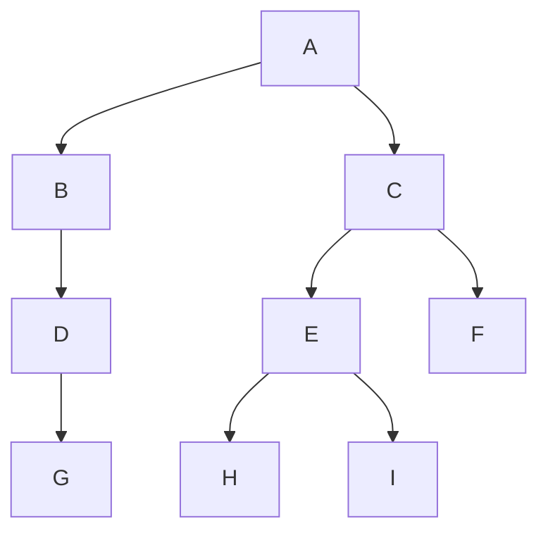

# 栈、队列和数组

## 栈

```c 
#include <stdlib.h>
#include <stdio.h>
#define MaxSize 50
typedef int ElemType;
```

### 定义

- 栈的顺序结构

```c
typedef struct {
    ElemType data[MaxSize];
    int top;
} SqStack;
```

栈顶指针：`S.top`，初始时设置`S.top=-1`；

栈顶元素：`S.data[S.top]`；

进栈操作：栈不满时，栈顶指针+1，再送值到栈顶元素；

出栈操作：栈非空时，先取栈顶值，再将栈顶指针-1；

> 以上的指针定义和栈顶元素可变，具体取决于题目

- 栈的链式结构


### 基本运算

#### 初始化

```c
Stack * initStack(Stack * s){
    s->top = -1;
    return s;
}
```

#### 判空、判满

```c
_Bool isEmpty(Stack * s){
    return s->top == -1;
}

_Bool isFull(Stack * s){
    return s->top == MaxSize - 1;
}
```

#### 进出栈

```c
_Bool pop(Stack * s, ElemType * e){
    if(isEmpty(s)) return 0;
    * e = s->data[s->top--];
    return 1;
}

_Bool push(Stack * s, ElemType e){
    if(isFull(s)) return 0;
    s->data[++s->top] = e;
    return 1;
}
```

#### 获取头

```c
_Bool head(Stack * s, ElemType * e){
    if(isEmpty(s)) return 0;
    * e = s->data[s->top];
    return 1;
}
```

#### 打印

```c
void printS(Stack * s){
    int dummyTop = s->top;
    printf("top:%d\n",dummyTop);
    while(dummyTop + 1){
        // 此处会存在序列点问题，
        // 造成dummyTop--的副作用
        // 发生在printf函数调用参数dummyTop前
        printf("\n%d : %d", dummyTop + 1, s->data[dummyTop--]);
    }
}
```

结果：

```c
int main(){
    Stack * s = malloc(sizeof (Stack));
    initStack(s);
    push(s, 1);
    push(s, 2);
    push(s, 3);
    int dump;
    pop(s, & dump);
    printS(s);
}
/*
top:1

1 : 2
0 : 1
*/
```


## 队列

### 定义

队列是一种操作受限的**线性表**，只允许表的一端进行插入，在另一端进行删除；删除元素叫做出队或离队；其特性是 **先进先出**；以下是队列的三个概念：

- 队头（Front）。允许删除的一侧，又称队首
- 队尾（Rear）。允许插入的一侧。
- 空队列。队列中不存在任何元素。

### 基本运算

> 队列指针的定义具体视题目而定，此处preset：

- 为循环队列；
- 牺牲一个元素区分队列是否已满；
- front 指向队列中待删除的元素(第一个元素 )；
- rear 指向队列中待插入的位置；

#### 初始化

initQueue(Q * q); 初始化队列，构造一个空队列；

```c
void initQueue(SqQueue * q){
    q->front = 0;
    q->rear = 0;
}
```

#### 判空、判满、长度

- 判空条件：`q->front == q->rear`
- 判满条件：`q->front == (q->rear + 1) % MaxSize`
- 长度：`length = (q->rear - q->front + MaxSize) % MaxSize`

##### 判空

```c
_Bool isEmpty(SqQueue * q){
    return q->front == q->rear;
}
```

##### 判满

```c
_Bool isFull(SqQueue * q){
    return q->front == 
        (q->rear+1) % MaxSize;
}
```

##### 长度

```c
int length(SqQueue * q){
    return (
        q->rear - q->front + MaxSize
    ) % MaxSize;
}
```

#### 进、出队

##### 进队

```c
_Bool enQueue(SqQueue * q, ElemType e){
    if(isFull(q)) return 0;
    q->data[q->rear] = e;
    q->rear = (q->rear + 1 + MaxSize) 
        % MaxSize;
    return 1;
}
```

##### 出队

```c
_Bool deQueue(SqQueue * q, ElemType * x){
    if(isEmpty(q)) return 0;
    * x = q->data[q->front];
    q->front = (q->front + 1 + MaxSize) % MaxSize;
    return 1;
}
```

#### 打印

```c
int printQ(SqQueue * q){
    int i, front = q->front, \
        len = length(q);
    printf("\nlength:%d\n", len);
    for(i = 0; i < len; i++){
        printf("->%d", q->data[front]);
        front = (front + 1 + MaxSize) % MaxSize;
    }
}
```

#### 带tag的操作

> tag标志位主要用于区分队列是满还是空，此处规定：

- tag == 1 为满


初始化：
```c
typedef struct {
    ElemType data[MaxSize];
    int front, rear, tag;
} SqQueue;
void initQueue(SqQueue * q){
    q->front = 0;
    q->rear = 0;
    q->tag = 0; 
    // 0 is empty while 1 is full
}
```

##### 判空、判满、长度

- 判空条件：`q->front == q->rear && q->tag == 0`


```c
_Bool isEmpty(SqQueue * q){
    return q->front == q->rear && q->tag == 0;
}
```

- 队满条件：`q->front == q->rear && q->tag == 1;`

```c
_Bool isFull(SqQueue * q){
    return q->front == q->rear && q->tag == 1;
}
```

- 长度

```c
int length(SqQueue * q){
    if(isFull(q)) return MaxSize;
    return (q->rear - q->front + MaxSize) % MaxSize;
}
```


##### 入队 出队

```c
_Bool enQueue(SqQueue * q, ElemType e){
    if(isFull(q)) return 0;
    q->data[q->rear] = e;
    q->rear = (q->rear + 1 ) % MaxSize;
    q->tag = 1;
    return 1;
}

_Bool deQueue(SqQueue * q, ElemType * x){
    if(isEmpty(q)) return 0;
    * x = q->data[q->front];
    q->front = (q->front + 1) % MaxSize;
    q->tag = 0;
    return 1;
}
```


## 数组

这里只列举两种常考的，下文中的$L$代表每个数组元素所占的存储单元，$LOC(a_i)$代表第$i$个元素的位置。

### 一维数组

以一维数组$A[0...n-1]$为例，其存储结构关系式为
$$
LOC(a_1)=LOC(a_0)+i*L \\
(0\le i<n)
$$

### 二维数组

对于多维数组，有两种映射的方式：按行有限和按列优先。以二维数组为例，按行有限的基本思想是：先行后列，设二维数组的*行下标* 和*列下标* 分别是$[0,h_1]$和$[0,h_2]$，则其存储关系是：

- 按行优先：

$$
LOC(a_{i,j})=LOC(a_{0,0})+[i*(h_2+1)+j]*L
$$

- 按列优先：

$$
LOC(a_{i,j})=LOC(a_{0,0})+[j*(h_1+1)+i]*L
$$ ^ey83614twvnw


## 应用

### 栈

#### 表达式求值

简单的应用题考验如何将生活中的常识进行抽象、量化，使用代码语言表达出来。在日常对表达式的求值中，我们会：

- 找出优先计算的优先级（如：()内的要先算）
  - 本质上是处理不同运算符的优先级
- 根据优先级进行计算
  - 未计算到的先入栈

##### 优先级的理解

在上面的介绍中，我们强调了**优先级**这个概念。但什么是优先级，如何根据 **优先级** 来“区别待遇”是本题的难处所在。在形成思路前，我们先理清楚需求：

- **优先级**：我们需要一个优先级列表来判断不同的符号；（如：`* /`的优先级需要比`+ -`高，`(` 需要比每个运算符的优先级都要高）
- **“区别待遇”**：我们需要一个抽象数据结构来“临时”存储低级的符号，并且它最好是“先进后出的”，优先级高的始终在上面，这样才能方便我们一个个处理运算符；

根据上述需求，我们分为两个阶段，一是：优先级的排序，形成一个中间表达式；二是：使用该中间表达式计算得结果；用术语说就是：

1. 将中缀表达式通过算法转换为逆波兰表达式（后缀表达式）；
2. 使用逆波兰表达式（后缀表达式）进行计算；

> 转化前需要先理解后缀表达式是如何求值的。开始前注意，以下读取表达式的过程都是从左往右的。
>
> 此外，还有波兰表达式（前缀表达式）

##### 后缀表达式求值

后缀表达式可以简单地理解为：**遇到数字时入栈，遇到运算符时弹出两个数字进行计算**。如表达式`12+5*` ：

计算步骤是：

1. 读取数字1 2入栈，然后读取 + ，弹出1 2， 进行 + 操作， 最后将结果 3 入栈；
2. 读取数字 5 入栈，读取 * ，弹出栈中的 3 与 5进行计算，将结果15入栈；
3. 表达式结束，将结果弹出；

```c
_Bool isOperator(char c); 
// 该方法判断是否为运算符，可自行实现；

_Bool calSuffixExp(char * c,int * result){
    int sum = 0, i = 0;
    char * tmp = c;
    Stack * s = malloc(sizeof(Stack));
    initStack(s);
    // 初始化操作
    
    while(tmp[i] != '\0'){
        // 当表达式未结束时
        if(isOperator(tmp[i])){
            int num1, num2, res;
            pop(s, & num2);
            pop(s, & num1);
            res = calWithOperator(num1, num2, tmp[i]);
            push(s, res);
        }else{
            push(s, tmp[i] - '0');
        }
        ++i;
    }
    pop(s, result);
    return 1;
}
```

其实上述步骤就是对数字进行两两计算，是一种没有优先级的计算，所以要体现优先级，我们还需下面的中缀转后缀过程；

##### 中缀转后缀

我们在上面的两个需求：区分优先级、区别待遇；对于两个需求，我们可以这样实现思路：

1. 利用栈和队列的存储：

在上述逆波兰表达式的计算中，我们可以知道当遇到运算符时，就会弹出最上面的两个数字进行运算。在下文中，我们将考虑读取表达式的过程：

- 读取表达式时，是从左往右读取的；
- 使用一个队列，一个栈，队列存储后缀表达式，栈存储运算符。读取的数字加入队列中，根据优先级规则，确定对应的运算符加入到栈还是队列中；
- 读取时，会有这几个成员：
  - 表达式中被读取到的一个“字符”，它可能是一个数字、运算符、括号；
  - 运算符栈中的成员；

2. 利用运算规则进行优先级的区分：

- 如果两个数字的运算优先级是当前最高的（如 * /），那么这两个数字的逆波兰表达式后面应该跟上其的运算符。因此，如果新加入的字符优先级低于栈顶的运算符，则应该先出栈，先把高优先级的运算符加入表达式，在一个适当的机会再将该低优先级运算符入栈；
- 如果两个数字的运算优先级较低的（如 + -），则应该先将运算符存入栈，看看后面是否还有优先级更高的运算符；

综上所述，我们达成的共识：

- 运算符入栈的条件是：通过优先级比较，读取到的运算符的比栈顶的运算符高；
- 运算符出栈的条件是：通过优先级比较，读取到的运算符的比栈顶的运算符低；

3. 优先级的规定：

我们一直在讨论优先级的问题，但从未对它有过量化的定义，所谓优先级的量化，无非是在将大小关系变成代数关系。在形成代数关系时，我们理清楚大小关系：

- `()` > `* /` > `+ -` 这是最基本的优先级关系；
- 在运算符是否入栈时，我们希望栈外的`(`具备最高优先级，因为`()`内的运算符比外面的运算符优先级要高。同时，希望`)`优先级最低，以弹出与`(`所包裹的运算符到表达式中，以形成“优先级”；
- 在运算符`* /` 和`+ -`中，我们需要特别关心`/ -`两个运算符：运算方向、运算顺序。运算方向可以在实现中再考虑。现在考虑运算顺序，栈外的`/ -` 优先级需要小于栈内的`* +`，举例：中缀表达式：`1+2-3+4`，转化为后缀表达式的过程：
  - 1 2 入队，+ 入栈；
  - 若 `-` 的优先级比栈内的高，则入栈，弹出时，结果为：`1234+-+`，运算到3时，会先计算`2-7`，出现错误。
  - 反之 `-` 的优先级若比栈内的`+`低，结果为：`12+3-4+`，计算结果为`3-3+4=4`；
  - 因此，栈外的`-` 优先级需低于栈内的`+`，使栈内的`+`先弹出进入到表达式中；

据此，得到以下的优先级：
$$
P_{()} > P_{* /} > P_{+ -} \\
P_{栈内*+} > P_{栈外/-} \\
$$
所以，得到下面表格：

|         | #    | (    | */   | +-   | )    |
| ------- | ---- | ---- | ---- | ---- | ---- |
| ISP栈内 | 0    | 1    | 5    | 3    | N/A  |
| ICP栈外 | 0    | 6    | 4    | 2    | 1    |

> `#` 该符号表示：空元素，即栈空或表达式为空的情况；
>
>  N/A：该元素不会进栈;

```c
char * midfixToSuffixExp(char * c){
    // 初始化
    Stack * exp = malloc(sizeof(Stack)),\
          * opt = malloc(sizeof(Stack));
    // 此处用栈存储，因为没有出队需要，栈一样用
    initStack(exp);
    initStack(opt);

    int ptr = 0; // 初始化指示表达式数组的下标

    while(c[ptr] != '\0'){ //当指示的字符不为空时
        // 分别获取栈外字符和栈内字符的优先级
        int icp = getIcp(c[ptr]), isp;
        // 如果为数字，直接入表达式栈，进入下一个循环
        if(icp == 0){
            push(exp, c[ptr]);
            ++ptr;
            continue;
        }
        if(isEmpty(opt)){
            // 如果操作符栈空，直接入栈
            push(opt, c[ptr]);
            ++ptr;
            continue;
        }
        char top;
        head(opt, & top);
        isp = getIsp(top);
        if(icp > isp){
            push(opt, c[ptr]);
            ++ptr;
            continue;
        }
        // 如果栈外运算符优先级小于栈内运算符
        // 需要先弹出栈内的运算符
        pop(opt, & top);
        // 然后将该运算符加入表达式栈
        if(top != '(' && top != ')') push(exp, top);
        // 如果当前pop出的字符已经是'('
        // 则停止pop，并移动到下一位
        if(top == '(' && c[ptr] == ')') ++ptr;
    }


    // 运算结束后，依次将运算符加入表达式栈
    while(!isEmpty(opt)){
        char top;
        pop(opt, & top);
        push(exp, top);
    }

    printS(exp);

    // 初始化指针用于反转栈输出
    int ptr_res = length(exp);
    char * res = malloc(sizeof(char) * (ptr_res + 1));
    res[ptr_res] = '\0';
    while(ptr_res){
        char top;
        pop(exp, & top);
        res[ptr_res - 1] = top;
        --ptr_res;
    }
    return res;
}
```


#### 斐波那契数列

利用栈特性，主要是“递归调用”。 在进行递归时，会保存当前的状态到一个隐形栈中，然后优先处理下一个递归，完成后返回。

```c
int fib(int n){
    if(n == 0) return 0;
    if(n == 1) return 1;
    return fib(n - 1) + fib(n -2);
}
```

不利用栈的特性，展示动态规划的思想： ^zfehj40ceel5

```c
// 获得第n个fib
int getFib(int n,int fib []){
    if(n == 0) return 0;
    if(n == 1) return 1;
    
    // 初始化前1到2项
    fib[0] = 0, fib[1] = 1;
    int curr = 2;

    while(curr <= n){
        fib[curr] = fib[curr - 1] + fib[curr - 2];
        ++curr;
    }
    return fib[n];
}
```
 ^qdllhkspe5b4

测试用例

```c
void testGetFib(){
    int fib[6];
    printf("%d", getFib(5, fib));//expect 5;
}
```

### 队列

#### 二叉树层序遍历

在二叉树的层序遍历中使用队列，如果未学习过可以先跳过，会在树的章节进行实现，以下为思路：




>  层序遍历：指优先处理当“层”的所有节点。

在对上述二叉树进行层序遍历时，当进入新“一层”时，当前记录的数据有：当前层的节点个数（由上一层统计得）、上一层的节点（在队列中）；

- 依次将上一层的节点输出（已记录当前层的节点个数N，直接输出N次即可）
- 每输出一个节点，就将该节点的左右孩子加入到队列中；
- 当队列为空，即完成遍历；

#### 在计算机中的应用

队列解决两件事情：速度不匹配、多用户竞争。理解即可解决选择题；

**速度不匹配**：生产及消费方速度不匹配。如主机和打印机，主机传输一个文件的时间和打印机打印的时间相差很大，需要用队列用作缓存，避免计算机长时间的等待；也可以利用网络交换机的例子理解；队列不是无限的，会发生溢出；

**多用户竞争**：如一系列等待运行的进程，他们会形成一个队列。类比日常排队买东西，大家的关系是竞争的，需要有序等待；

## 测试用例

### 栈应用

#### 表达式

```c
void testMidToSuffix(){
    char * input =  "1+(2+3)*4-5", * input2 = "1+(2-(3-4))*5",* tmp = input;
    int size = 0;
    while(* tmp != '\0') {
        size++;
        ++tmp;
    }
    char * res 
        = midfixToSuffixExp(input2);
    // 此处记得加上\n刷缓存
    printf("\nres:%s\n", res);
}

int main(){
	testMidToSuffix();
}
```

```log
==top:8==
8 : +
7 : *
6 : 5
5 : -
4 : -
3 : 4
2 : 3
1 : 2
0 : 1
==end==

res:1234--5*+
```

