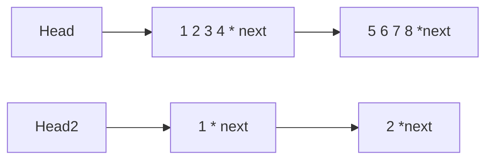

# 串

## 定义

串（String）是由零个或多个字符组成的有限序列。一般记为
$$
S='a_1, a_2...a_n' \ (n\ge0)
$$

其中，S是串名，单引号括起来的字符串序列是串的值；$a_i$可以是字母、数字或其他字符；串中字符个数$n$称为串的长度。$n=0$时的串称为空串（用$\empty$表示)；

### 重要概念

#### 子串（substring）

 串中任意多个连续的字符组成的的子序列为该串的子串，包含子串的串称为主串。

如字面串：

```c
char s[] = "012345"
```

我们想要取从下标`1 - 4`的子串，那就是：`"1234"`；

#### 与线性表的区别

- 串和线性表在逻辑结构上相似。区别仅在于串的数据对象限定为字符集。
- 在基本操作上，串和线性表。线性表的基本操作主要以**单个**元素，如查找、插入或删除某个元素等；而串的基本操作通常以子串作为操作对象，如查找、插入或删除一个子串等。

### 存储结构

#### 定长

```c
#define MAXLEN 255
typedef struct{
    char ch[MAXLEN]; //存储字符
    int length; //字符串长度
} HString;
```

如何确定长度？

- 通过如上述的length配合MAXLEN确定；
- 像字面串那样，在串上添加一个'\0'（空字符）作为末端；

#### 堆分配空间

```c
typedef struct{
    char * ch;
    int length;
} HString;
```

如何确定长度？

- 通过上述的`length`

怎么使用存储空间？

- malloc + free


#### 块链存储



## 基本操作

此处主要演示堆分配空间的串，因为串的创建非常多，所以需灵活控制占用空间；

### 判空、求长度

两个操作都与长度有关

```c
_Bool StrIsEmpty(HString * s){
    return s->length == 0;
}

int StrLength(HString * s){
    return s->length;
}
```


### 初始化、赋值、复制

> 操作均与初始化分配堆空间内存有关

#### 初始化

初始化时，需指定串和长度；

```c
void StrInit(HString * s, int size){
    if(s->ch) free(s->ch);
    s->ch = malloc(sizeof(char) * size);
    s->length = size;
}
```

#### 使用字面串赋值

字面串可以通过`'\0'`判断结束；

```c
// 根据字面串初始化串
_Bool StrAssign(HString * target, char * ch){
    int chPtr = 0;
    //此处求字面串的长度
    while(ch[chPtr] != '\0'){
        chPtr++;
    }
    // 如果字面串为空，返回
    if(chPtr == 0) return 0;
    // 初始化包括分配内存，并设定长度
    StrInit(target, chPtr);

    // 重置字面串的指针，开始进行复制操作
    chPtr = 0;
    while(ch[chPtr] != '\0'){
        target->ch[chPtr] = ch[chPtr];
        ++chPtr;
    }
    return 1;
}
```

#### 将另一个串赋值到目标串

将另一个串的内容复制到目标串，主要步骤有：

- 使用源串的长度初始化目标串的长度；
- 遍历赋值

```c
// 从另一个串复制值
_Bool StrCopy(HString * target, HString * source){
    int sourcePtr = 0;
    // 初始化目标串
    StrInit(target, StrLength(source));

    while(sourcePtr < StrLength(source)){
        target->ch[sourcePtr] = source->ch[sourcePtr];
        ++sourcePtr;
    }
    return 1;
}
```


### 比较、求子串

#### 比较

此处比较比较玄学，主要是比较两个串的最小共同字符串，返回值的规律如下：

- 一个串是另一个串的子串（包括空串），有两种可能：
  - 长度相同，返回 0；
  - s1比s2长，返回值 > 0；
  - s2比s1长，返回值 < 0；
- 两个串有相同的子串，比较第一个不同字符的大小，有两种可能：
  - s1 编码比 s2 大，返回值 > 0；
  - s2 编码比 s1 大，返回值 < 0；

```c
// S>T 返回值 > 0; S=T 返回值 = 0; S<T 返回值 < 0
int StrCompare(HString * s1, HString * s2){
    // l1 l2 分别为两个串的长度
    int i, l1 = StrLength(s1), l2 = StrLength(s2);
    for(i = 0; i < l1 && i < l2; i ++){
        if(s1->ch[i] != s2->ch[i]) return s1->ch[i] - s2->ch[i];
    }
    // 如果到达了一个字符串的末尾仍未找到
    // 证明有一个字符串比另一个长
    return l1 - l2;
}
```

附上测试用例：

```c
void testCompare(){
    HString * s = malloc(sizeof(HString)), * s2 = malloc(sizeof(HString));
    StrAssign(s, "HelloWorld");
    StrPrint(s);
    StrAssign(s2, "HelloWorldHaha");
    StrPrint(s2);
    
    //构造了s1比s2短的串，expect = -4
    printf("%d\n", StrCompare(s, s2)); 

    
    StrAssign(s, "HelloWbrld");
    StrPrint(s);
    StrAssign(s2, "HelloWarld");
    StrPrint(s2);
    
    //构造了不同的字串，expect = 1
    printf("%d\n", StrCompare(s, s2)); 
}
```


#### 求子串

不合法的参数：

- 起始或长度不正确；
- 起始与长度搭配不当，超出边界；

```c
// 返回指定下标from开始、长度为size的串
_Bool StrSubString(HString * source, HString * out, int from, int size){
    int lenS = StrLength(source), count;
    // 不合法的参数
    if(from < 0 || from > lenS - 1 || size > lenS - from) return 0;

    // 初始化存储结果的空间
    StrInit(out, size);

    // 复制子串
    for(count = 0; count < size; count++){
        out->ch[count] = source->ch[from + count];
    }

    return 1;
}
```

测试用例：

```c
void testSubString(){
    HString * s = malloc(sizeof(HString)), * s2 = malloc(sizeof(HString));
    StrAssign(s, "012345");
    StrSubString(s, s2, 2, 3); // expect "234"
    StrPrint(s2);
}
```


### 串联接、定位（暴力匹配子串）

#### 串联接

传入两个需要联接的串，在前面的是s1，然后target存放结果；

```c
_Bool StrConcat(HString * s1, HString * s2, HString * target){
    int len1 = StrLength(s1),\
        len2 = StrLength(s2),\
        lent = len1 + len2,\
        /* 这些都是下标 */
        s1Ptr = 0, s2Ptr = 0, tPtr = 0;

    //初始化结果存储空间
    StrInit(target, lent);

    //分别遍历读取两个串
    while(s1Ptr < len1){
        target->ch[tPtr] = s1->ch[s1Ptr];
        ++tPtr;
        ++s1Ptr;
    }
    while(s2Ptr < len2){
        target->ch[tPtr] = s2->ch[s2Ptr];
        ++tPtr;
        ++s2Ptr;
    }
    return 1;
}
```

测试用例：

```c
void testConcat(){
    HString * s1 = malloc(sizeof(HString)),
            * s2 = malloc(sizeof(HString)),
            * out = malloc(sizeof(HString));
    StrAssign(s1, "Hello");
    StrAssign(s2, "World");
    StrConcat(s1, s2, out);
    StrPrint(out);
}
```

#### 定位（暴力匹配法）

其实就是依次扫描主串，如果不匹配就重置子串的指针：

- 主串匹配不成功时进行后退。目的是为了遍历每一个子串，测试其是否与模式串匹配；

难点：

- 为什么匹配不成功进行回滚时，`sPtr = sPtr - subPtr + 1`，`subPtr = 0`？
- 为什么返回 `sPtr - subLen`？

```c
int StrIndex(HString * source, HString * sub){
    int sPtr = 0, subPtr = 0, sLen = StrLength(source), subLen = StrLength(sub);
    while(sPtr < sLen && subPtr < subLen){
        if(source->ch[sPtr] != sub->ch[subPtr]){
            subPtr = 0;
            sPtr = sPtr - subPtr + 1;
            continue;
        }
        ++subPtr;
        ++sPtr;
    }
    // 如果subPtr == subLen 证明匹配成功
    if(subPtr == subLen) return sPtr - subLen;
    // 否则返回-1表示错误
    return -1;
}
```

测试用例：

```c
void testIndex(){
    HString * s1 = malloc(sizeof(HString)),
            * s2 = malloc(sizeof(HString)),
            * out = malloc(sizeof(HString));
    StrAssign(s1, "01234567");
    StrAssign(s2, "345");
    printf("%d", StrIndex(s1, s2)); //expect 3
}
```


### 打印、清空、销毁

#### 打印

第二个`printf("\n")`主要是为了刷行缓存；

```c
void StrPrint(HString * s){
    int i;
    printf("\n\"");
    for(i = 0;i < s->length; i++){
        printf("%c", s->ch[i]);
    }
    printf("\"\n");
}
```

#### 清空

```c
_Bool StrClear(HString * s){
    if(s->ch) free(s->ch);
    s->ch = NULL;
    s->length = 0;
    return 1;
}
```

#### 销毁

```c
_Bool StrDestory(HString * s){
    if(s->ch) free(s->ch);
    free(s);
    return 1;
}
```


## 高级操作

### KMP匹配

在开始前，需要了解什么是前后缀、公共前后缀：

#### 前缀、后缀、公共前后缀

以字符串：`"abcab"`为例

**前缀**：除了末尾的元素`"b"`外，从首字母`"a"`开始按顺序组合任意个数的字符串，如：`"a" "ab" "abc" "abca" `；

**后缀**：除了首元素`"a"`外，从后往前，在不改变顺序的清空下组合任意长度的字符串：`"b" "ab" "cab" "bcab"`；

**公共前后缀**：从上述前后缀中，有一些是相同的（如：前缀：`"ab"`和后缀：`"ab"`），但实际上它们位于的位置*并不同*。**位于的位置不同**非常重要，下面要考！

- 为什么说它们位于的位置并不同？ 这是因为前后缀分别是主串的两个不完全重合的子集（因为他们分别舍弃了“首”和“尾”两个字符）；
- 也可从下图“模式串”部分看，这两个`"ab"`位置确实不同：


<center>图源[如何更好地理解和掌握 KMP 算法? - 知乎 (zhihu.com)](https://www.zhihu.com/question/21923021)</center>

> 注：字符串`"a"` 中，不存在前缀和后缀子集

#### 公共前后缀有什么用？

##### 什么是“已知条件”？

在介绍作用前，先回顾一下我们的初代字符串匹配方法：


<center>GIF出处：[KMP 算法详解](https://zhuanlan.zhihu.com/p/83334559)</center>

我们可以发现，每一次匹配失败时，主串和子串都会跳回最初的地方重新开始下一轮匹配。如果遇到上面这种情况，时间复杂度：$O(n*m)$，时间代价非常大。那是否存在优化空间呢？

有。在上一章中，我们充分利用了“已知条件”，即：`fib(n) = fib(n - 1) + fib(n + 1)` 中的`fib(n- 1) 和 fib(n - 2)`在求值的过程中始终已知，这样就能避免在通过栈计算值过程中对`fib(n)` 的重复计算；
![[degree.master.c.03-栈、队列和数组#^zfehj40ceel5:#^qdllhkspe5b4]]

##### 串匹配的过程中的“已知条件”

在串匹配过程中，我们也有一些“已知条件” 的，但在暴力匹配的过程中没有用上。观察下面的匹配过程：


<center>GIF出处：[KMP 算法详解](https://zhuanlan.zhihu.com/p/83334559)</center>

与暴力匹配最大的不同在于发生不匹配时：

- 主串的指针并没有后退；

- 模式串的指针只后退了一部分；

上述的操作会引发疑问，此处分别进行解析：

- 要想知道主串为什么不后退，需要先了解在暴力匹配中主串和模式串为什么要后退，子串为什么要重置为0？

  - 主串和模式串后退是为了重头开始匹配；

  - 但事实上这种 “重头开始”的思想相当于丢弃了已有条件；

- 上述提到的 “已有条件” 实际上是一种可能：不匹配的情况发生时，主串最近匹配到的子串和模式串的一个前缀是相同的：


<center>图源[如何更好地理解和掌握 KMP 算法? - 知乎 (zhihu.com)](https://www.zhihu.com/question/21923021)</center>

就如上图的第二步中，主串和模式串虽然发生了匹配错误，但是可以知道的是：

- 主串最近肯定匹配过一个子串`"aba"`，主串中必定含有至少一个`"aba"`（实际上是两个）；
- 子串`"aba"`在模式串中，出现了两次；

所以，当发生不匹配的情况时，没必要将主串和模式串都重置，只需要将模式串的指针移动回上一个出现`"aba"`的地方即可。那这样移动后：模式串的前一部分和主串必定是匹配的，这样就省去了时间；

用之前的“前后缀、公共前后缀”来表达这种可能产生的原因：

> 我们之前在定义前后缀时，固定了一个字符串，但在本题中，该字符串的后缀指针需要是可变的，因此会有很多不同的子串，并且这些子串会存在“递推”关系。这个不用纠结，后面实现next数组时会讲。

- 模式串的子串中，存在公共前后缀；
- 又因为公共前后缀只有**位置不同**，发生错误时可以从后缀的位置先转移至前缀的位置，此时串仍然相同，仍然匹配；

综上所述，我们想要节省时间，就需要获取一个能告诉我们移动子串位置的“东西”，这个“东西”会告诉我们 **在样式串的某个位置匹配失败时可以返回到哪个之前的位置**。

#### 上一个相同前后缀数组的位置的数组（next数组）

>  在上面，我们提到了在匹配中，并不像定义中刻意固定一个完整的字符串，而是动态地使用一个完整字符串中的子串，并且这些子串之间会存在递推关系；

- 为什么模式串的匹配中需要移动后缀的指针？

模式串的前缀是不动的。因此在此处求next数组的过程中，只有后缀的指针动。

- 所以，在设计产生next数组的算法时，需要设置两个指针，一个用于指向前缀，一个用于指向后缀；
- 在开始时，左指针从0开始，右指针从1开始（因为至少要两个字符才有前缀后缀）
- 循环的条件是：当右指针小于长度，即：遍历除第一个以外的其他字符

```c
_Bool getKMPNext(HString * s, int next[]){
    // 因为只有一个字符的话，没有子序列
    // 所以右指针从1开始
    int left = 0, right = 1, len = StrLength(s);
    next[0] = 0;
    while(right < len){
        
    }
    return 1;
}
```

到此，大框架已完成，接下来开始考虑每次循环中的情况：

- 右指针指向的字符与左指针指向的字符相等。即：`s->ch[left] == s->ch[right]`。
  - 说明当前的字符与`left`所指向的前缀相同；
  - 如有无法匹配时，可以返回到`left`所指向的*下一个位置* 重新开始匹配；
  - 上一条中的 *下一个位置*  非常关键，这决定了本次代码的编写及搜索时的使用，需注意；
  - 完成后，移动两个指针 `++left, ++right`；

```c
if(s->ch[left] == s->ch[right]){
// 此处++left和next[right]=left的位置
// 会影响下面的search方法中的定义
	++left;
// 如果匹配，回退时可以回退到左指针的下一个位置
	next[right] = left;
	++right;
	continue;
}
```

- 右指针指向的字符与左指针指向的字符不相等。即：`s->ch[left] != s->ch[right]`。
  - 说明当前字符与`left`所指向的前缀不同；
  - 此时需要移动`left`指针，分为两种情况：
    - `left != 0` 意思是该前缀已经匹配了一个或以上，也意味着，`right`在指向与前缀不同的字符前，曾与这些前缀匹配过，因此令 `left = next[left - 1]`， 回到已匹配前缀的 *下一个位置* 重新进行匹配，此时**不能**移动`right`指针；
    - `left == 0` 意思是该前缀没匹配过`right`指向的后缀，则只需要移动`right`即可；
  - 值得注意的是，`left`指针在回退的时候，一定是`left = next[left - 1]`而不是`left = next[right - 1]`，这是因为后者`next[right - 1]` 指向的是左指针刚遍历过的串，这样赋值相当于没有回退，务必注意；

```c
if(left != 0) left = next[left - 1];

if(left == 0){
// 如果此时left已经是0，
// 无法再缩
	next[right] = 0;
	++right;
	continue;
}
```

完整的算法如下：

```c
_Bool getKMPNext(HString * s, int next[]){
    // 因为只有一个字符的话，没有子序列
    // 所以右指针从1开始
    int left = 0, right = 1, len = StrLength(s);
    next[0] = 0;
    while(right < len){
        if(s->ch[left] == s->ch[right]){
            // 此处++left和next[right]=left的位置
            // 会影响下面的search方法中的定义
            ++left;
            // 如果匹配，回退时可以回退到左指针的下一个位置
            next[right] = left;
            ++right;
            continue;
        }
        if(left == 0){
            // 如果此时left已经是0，
            // 无法再缩
            next[right] = 0;
            ++right;
            continue;
        }
        left = next[left - 1];
    }
    return 1;
}
```


#### 利用next数组进行搜索

```c
int KMPSearch(HString * target, HString * pattern, int next[]){
    int left = 0, right = 0, lenT = StrLength(target), lenP = StrLength(pattern);
    while(left < lenP && right < lenT){
        // 如果匹配，那就继续
        if(pattern->ch[left] == target->ch[right]){
            ++left;
            ++right;
            continue;
        }
        if(left == 0) {
            ++right;
            continue;
        }
        // 不匹配，调整左指针
        left = next[left - 1];
    }
    if(left == lenP) return right - left;
    return -1;
}
```

总测试用例：

```c
void testKMP(){
    HString * s = malloc(sizeof(HString)), * pattern = malloc(sizeof(HString));
    char ch[] = {"ababaabaabac"}, ptn[] = {"abaabac"};
    int size = (sizeof ptn) - 1, next [size], i;
    StrAssign(s, ch);
    // 获取next数组
    StrAssign(pattern, ptn);
    getKMPNext(pattern, next);
    
    //打印next数组
    printf("\nnext[]:{");
    for(i = 0; i < size; i++){
        printf("%d ",next[i]);
    }
    printf("}\n");
    printf("\nexpect 5, res is:%d\n", KMPSearch(s, pattern, next));
}
```


趁着手感，把lc.28过了：[28. 实现 strStr() - 力扣（LeetCode）](https://leetcode.cn/problems/find-the-index-of-the-first-occurrence-in-a-string/)

```c
_Bool buildNext(char * s, int lenS, int next[]){

    //初始化左右指针
    int left = 0, right = 1;
    next[0] = 0;

    while(right < lenS){
        // 当前缀与后缀匹配时，说明可以回退到该位置
        if(s[left] == s[right]){
            ++left;
            next[right] = left;
            ++right;
            continue;
        }
        // 无路可退
        if(left == 0){
            // 该位置设为0，意思是从头开始
            next[right] = 0;
            ++right;
            continue;
        }
        // 如果已经匹配到不止一个字符了，说明可以回退
        left = next[left - 1];
    }
    return 1;
}

//力扣28
int strStr(char * haystack, char * needle){
    if(needle[0] == '\0') return 0;

    int nLen = 0, hLen = 0, i;
    while(needle[nLen] != '\0') ++nLen;
    while(haystack[hLen] != '\0') ++hLen;

    int next[nLen];
    buildNext(needle, nLen, next);

    int left = 0, right = 0;
    while(left < nLen && right < hLen){
        if(haystack[right] == needle[left]){
            ++left;
            ++right;
            continue;
        }
        if(left == 0){
            ++right;
            continue;
        }
        left = next[left - 1];
    }
    if(left == nLen) return right - left;
    return -1;
}
```

