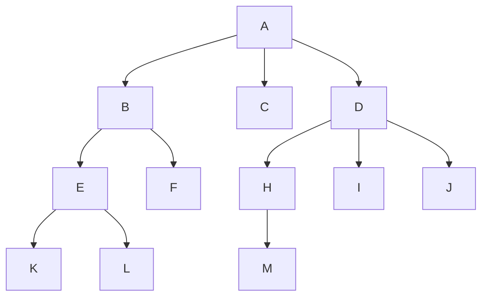
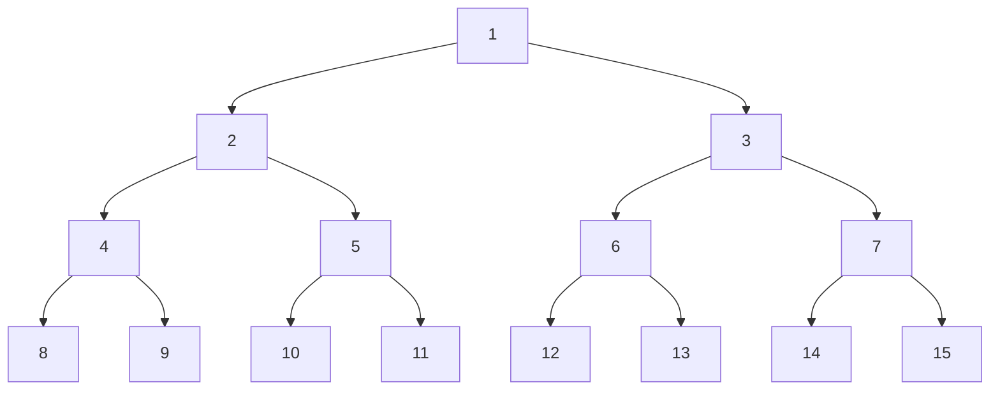
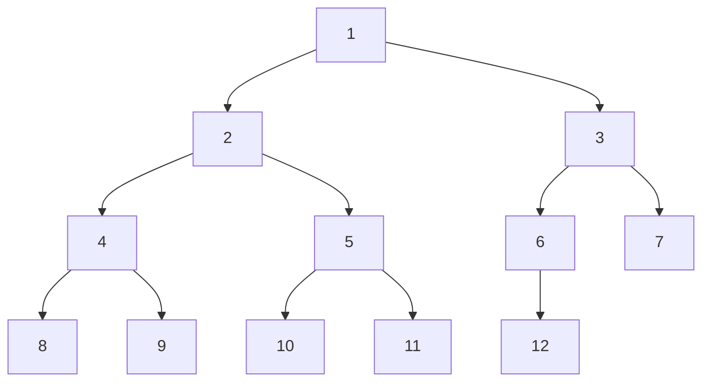
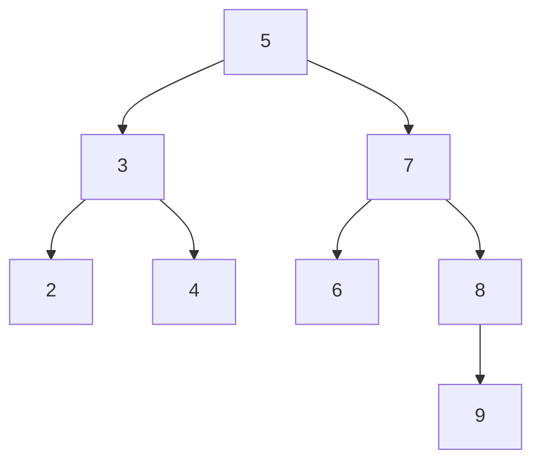
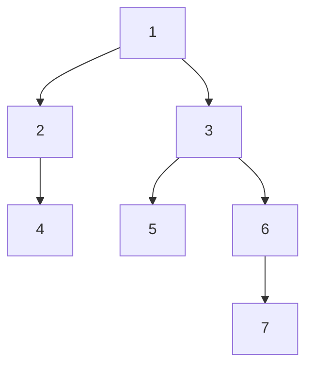
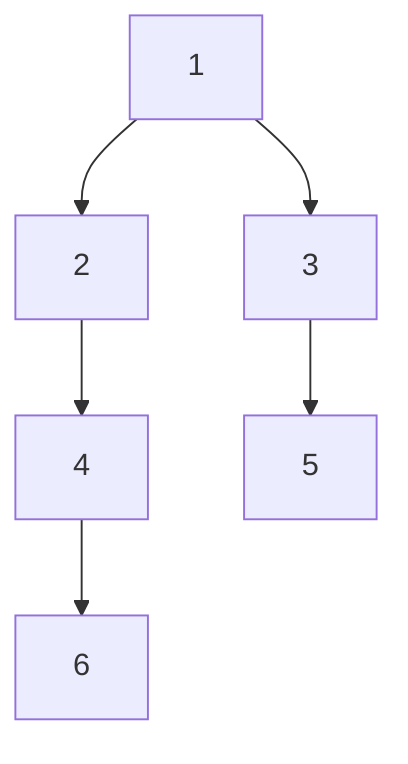
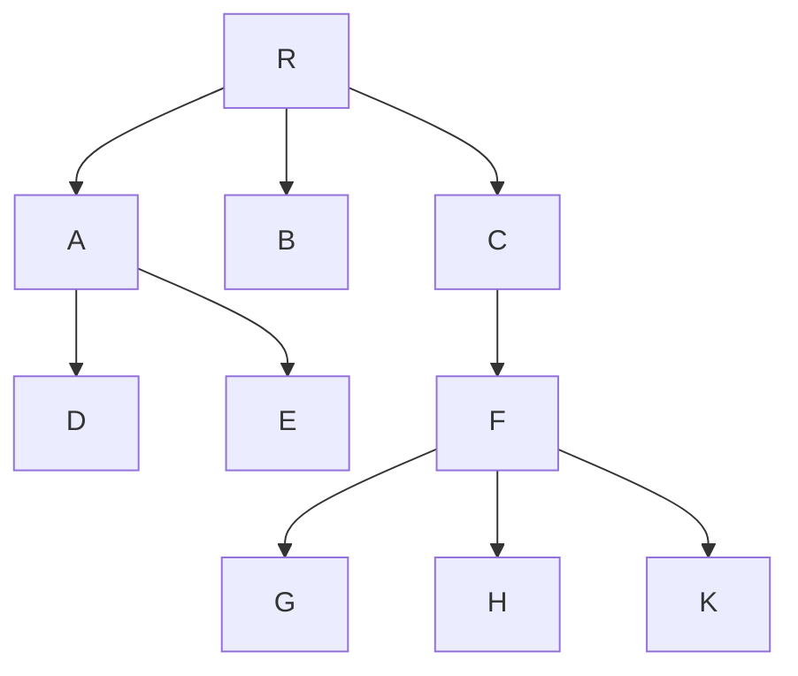

# 树和二叉树

## 前言

最近被很多好朋友批评指针使用不规范，指针错误使用，常引发[SIGSEGV](https://baike.baidu.com/item/SIGSEGV/7360054)；于是重学指针、`malloc` `free`，得出的规范如下：

### 规范

#### 指针创建的三种可能

避免未初始化指针的使用，指针的使用只有三种可能：

```c
int main(){
    // 初始化为空指针
    BiTNode * node = NULL, other;
    // 初始化为其他指针
    BiTNode * nodeOther = & other;
    // 为指针分配堆内存
    BiTNode * nodeHeap = malloc(sizeof(BiTNode));   
}
```

#### 指针使用的几种规范

1. 作为函数参数时：

- 作为形参时，传入方法的实际上是原值的一个副本，修改副本不影响原值；

- 不修改该指针本身，因为不生效；

```c
void asParams(BiTNode * e){
    BiTNode * inHeap = malloc(sizeof(BiTNode));
    e = inHeap;
}
```

2. 作为参数返回值时：

- 只能返回在堆中分配的地址，或者传入的地址；
- 不返回当前方法栈中的地址；

```c
void * asRetValue(){
	BiTNode inFuncStack = {1, NULL, NULL};
	// return & inFuncStack // 不要返回这种指针；
    BiTNode * inHeap = malloc(sizeof(BiTNode));
    // 应该返回inHeap
    return inHeap;
}

```


#### 内存分配和释放规则

- 有`malloc`必有`free`；如果handle消失，该内存板块将无法被GC；
- 有`free`必有`NULL`；如果handle所指区域已被free后无法再次写入，如果不置为`NULL` 标记为失效容易产生`SIGSEGV`;

####  综合实例：“传递一个引用进方法，通过引用返回数据” 

> 注意，在函数调用中修改指针是没有用的

```c
BiTNode * GetNode(BiTNode * e){
    /*some magic*/
    // 实际上，此种方法在！返回值不为BiTNode *时！造成无法回收的问题
    BiTNode * inHeap = malloc(sizeof(BiTNode));
    
    // 如果返回值不为BiTNode，推荐：
    BiTNode inFuncStack = {1, NULL, NULL};
    // 对应地，这种方法下不能返回方法栈中的地址
    // return & inFuncStack;
    
    // 可以通过传入的指针修改所指向的内存区域
    // 这个操作有前提，那就是该区域必须是可用的，已被分配的；
    * e = * inHeap;
    
    // 在方法中单纯地修改指针是无效的
    // 因为传入方法时，是拷贝的形参，单纯地对形参修改无法达到效果；
    // 以下因此，这句话的作用仅限于在方法GetNode内，对外界无影响
    e = inHeap;
    return inHeap;
}
int mian(){
    
    BiTNode e; 
    //在程序参数栈中分配一个变量e的空间；
    GetNode(& e);
    Visit(& e);//可以正常被使用
    
    // 以下则不能，因为指针所指向的地方未被分配空间
//    BiTNode * foo; //也不合法
    BiTNode * foo = NULL;
//    GetNode(foo); //无法访问到
    
    * foo = malloc(sizeof(BiTNode));
    GetNode(foo); //此处可行,因为空间已被分配
    //有malloc必有free
    if(foo != NULL) {
        free(foo);
        //有free必有NULL
        foo = NULL;
    }
}
```


## 树

### 定义

**树**是$n(n\ge0)$个结点的有限集。当$n=0$时，成为空树。在任意一颗非空的树中应满足：

- 有且只有一个特定的根节点
- 当$n>1$时，其余结点可分为$m(m>0)$个互不相交的有限集$T_1,T_2,...,T_m$，其中每个集合本身又是一棵树，并且称为根的子树；

**树**是递归的，树的定义中又用到了其自身，树作为一种逻辑结构，同时也是一种分层结构，具有以下两个特点：

- 树的根节点没有前驱，除根节点外的所有节点有且只有一个前驱；
- 树中所有节点可以有零或多个后继；

因此，在$n$个节点的树中最多有$n-1$条边；


### 基本术语


阅读第一部分 [树的基础](https://zhuanlan.zhihu.com/p/391549915)



- **祖先和子孙**： 对于结点K，根A到K的唯一路径上的**任意**结点，称为K的*祖先*；如结点B是K的*祖先*，则K是B的*子孙*。
- **双亲**： 路径上最接近结点K，的结点E称为K的双亲，而K为结点E的孩子。根A是唯一没有双亲的结点。有相同双亲的结点称为*兄弟* 。可以观察[双亲表示法](https://zhuanlan.zhihu.com/p/136566184)加深理解
- **结点的度**：树的一个结点的孩子个数称为该节点的**度** ，树中结点的最大读树称为 **树的度**；
  - 度大于0的结点称为*分支结点* （非终端结点）；度为0（没有子女结点）的结点称为 *叶子结点* 。
  - 在分支结点中，每个结点的分支数就是该结点的度；
- 深度、高度、层次：
  - 层次：从根开始定义，根为第一层，同一层的结点称为 *堂兄弟* ；
  - 深度：从根节点开始自顶向下逐层累加的；
  - 高度：从叶结点开始自底向上逐层累加的；
  - 树的高度或深度是树中结点的最大层数；如上图，高度为4，深度为4；

- **有序树和无序树**：树中结点的个子树从左到右是由次序的，不能互换，称为该树的**有序树**，否则称为**无序树**；
- **路径和路径长度**： 树中两个结点之间的*路径* 是由这两个结点之间所经过的结点序列构成，而*路径长度* 是路径上所经过的边的个数；

> 注意： 由于树中的分支是有向的，即从双亲指向孩子，所以树中的路径是从上向下的，同一双亲的两个孩子之间不存在路径。

- **森林**：森林是$m(m\ge0)$棵不相交的树的集合。森林的概念与树的概念十分相近，因为只要把树的根节点删除就成了森林。反之加上，只要给$m$颗树加上一个结点，并把这$m$颗树作为该结点子树，则森林变成了树；

> 概念不会直接考察，在题目中体现，不用背。


### 性质

> 以下性质很有可能作为选择题出现，务必刻入DNA

- 树中的结点数等于所有的结点的度数之和加1（这个1是根结点）；
- **层**：度为$m$的树中第$i$层至多有$m^{i-1}$个结点（$i\ge1$）；

> 已知第一层是根结点，没有兄弟结点，需要用i-1；

- **结点数**：高度为$h$的$m$叉树最多有$(m^h-1)/(m-1)$个结点；
- **高度**：具有$n$个结点的$m$叉树的最小高度为$[\log_{m}(n(m-1))+1]$
   ^cd86a6f7e9uj
   其实节点数和高度这两条公式可以互推，只需要记忆一条即可：

通过单层结点数累加求最大节点数，度为$m$的树中第$i$层至多有$m^{i-1}$个结点（$i\ge1$），求树最大结点：
$$
S=m^{h-1}+m^{h-2}+m^{h-3}+...+m+1 \\
=\frac{m^h-1}{m-1}
$$
依照上述公式，具有$n$个结点的$m$叉树反过来求高度：
$$
\because \frac{m^h-1}{m-1}=n \\
m^h = n(m-1)+1 \\
\therefore h = \log_{m}[n(m-1)+1]
$$
- **空指针数**：在含 *n*个结点的二叉树中有 *n+1* 个空指针：

> 符号：$n_{number}$ 表示 有 number 个子结点的结点数量

因为：叶子结点有 *2* 个空指针，读为 *1* 的结点有 *1* 个空指针，空指针总数为 $2n_0+n_1$ ；

又因为：$n_0=n_2+1$ ；

所以：总数 $n_0+n_1+n_2+1=n+1$ 

 ^v25hp7lycs3k

## 二叉树

### 定义

- 二叉树特点是每个结点最多有两个子树，区分左右；
- 二叉树不是度为2的树，度为2的树至少有3个结点，而二叉树可以为空。

- 度为2的有序树的孩子左右次序是相对于另一个孩子而言的，若某个结点只有一个孩子，则无需区分左右孩子；但二叉树无论结点数量是否为2，都需要区分左右孩子；


#### 特殊的二叉树

##### 满二叉树

- 一颗高度为h，且含有$2^h-1$个结点的二叉树称为满二叉树；

> $2^h-1$ 是使用上述计算树最大结点的公式计算得来

可以对满二叉树按层序编号，根节点为1，那对于编号为$i$的结点：

- 若有双亲，则双亲为$[i/2]$；
- 若有孩子，则左孩子为$2i$，右孩子为$2i+1$；



<center>满二叉树</center>

##### 完全二叉树

完全二叉树是高度为h、有n个结点的二叉树，当且仅当其每个结点都与高度为h的满二叉树中编号为1~n的结点一一对应时，称为*完全二叉树*，如图所示：

> 其实完全二叉树就是满二叉树缺失最右边的一些连续结点。以下性质可以结合最下面的图进行理解；

- 若$i\le[n/2]$，则结点$i$为分支结点，否则为叶子结点；
- 叶子结点只可能在层次最大的两层出现，最大层次中的叶子结点，都依次排列在该层最左边的位置上；
- 若有度为1的结点（编号i），则可能只有一个：该节点只有左孩子而无右孩子，则编号大于i的结点均为叶子节点；
- 若n为奇数，则每个分支结点都有左孩子和右孩子；若n为偶数，则编号最大的分支结点（编号为n/2）只有左孩子， 没有右孩子；其余结点都有左右孩子；




<center>完全二叉树</center>


##### 二叉排序树

左子树上所有结点的关键字都小于根节点的关键字；右子树的所有结点的关键字均大于根节点的关键字；左子树和右子树又各是一颗二叉排序树



##### 平衡二叉树

树上任意结点的左右子树的深度差均不超过1




### 二叉树的存储结构

使用不同形态存储二叉树结点时，相应算法也不同，需要根据实际应用场合选择合适的存储结构；

#### 顺序存储结构（数组存储）

用一组**地址连续**的存储单元依次自上而下、自左至右存储完全二叉树上的结点元素，即将完全二叉树上编号为 i 的结点元素存储在一维数组下标为 i-1 的分量中；

根据性质，完全二叉树和满二叉树利用顺序存储比较合适，树中的结点的序号可以唯一地反映结点之间的逻辑关系，这样既能最大可能地节省存储空间，又能利用数组元素的下标值确定结点在二叉树中的位置，以及结点的关系；

但一般情况下，为了让下标反映二叉树中结点之间关系，只能添加一些不存在的空结点。在最坏情况下，一个高度为 h 且只有 h 个结点的单支树要占据 $2^h-1$ 个存储单元；




| 下标 | 0    | 1    | 2    | 3    | 4    | 5    | 6    | 7    | 8    | 9    | 10   | 11   |
| ---- | ---- | ---- | ---- | ---- | ---- | ---- | ---- | ---- | ---- | ---- | ---- | ---- |
| 值   | 无   | 1    | 2    | 3    | 0    | 4    | 0    | 5    | 0    | 0    | 6    | 0    |

> 这种存储方式从数组下标1开始，若从0则不符合性质4；


#### 链式存储结构

类型定义

```c
typedef struct BiTNode{
    ElemType data;
    struct BNode * left, * right;
} BiTNode;
```

## 二叉树的遍历

遍历前需要引入之前的栈

```c

#ifndef BtreeElemType
typedef int BtreeElemType;
#endif

typedef BiTNode StackElemType;
#include "Stack.h"

void VisitNode(BiTNode * root){
	printf("%d", root->data);
}
```

### DFS 遍历

在使用一个数据结构的时候，上来第一步就是要“输出”它，但采用什么顺序输出更为标准且直观，涉及到遍历时采用的算法；

#### DFS遍历的理解

> 遍历是按照一定顺序依次对每个结点进行处理，如：前序遍历是先输出中结点、中序是完成左子树的遍历后再输出中结点、后序是先完成左子树和右子树的输出后再输出中结点。因此我们可以知道，所谓什么序，其实就是什么时候输出中结点。而遍历的顺序是不影响的，在这里除题目要求外，我们均默认优先遍历左子树；

倘若我们不考虑输出的时机，先考虑遍历，只考虑 “经过” 这个结点，那我们就需要理解遍历过程中的需求：

在理解需求前，可以先看看遍历过程的动画：


<center>出处https://github.com/youngyangyang04/leetcode-master/blob/master/problems/二叉树的迭代遍历.md</center>

- 每次遍历时，需要灵活地返回“上一个地方”（也是后文介绍的“回溯”）或“下一个需要处理的地方”，如遍历完左边的树之后，需要返回到祖先，或者直接返回到右子树；
- 需要“先进后出”的结构保存我们未遍历过的结点；

根据需求，先设计每次遍历时能先返回“下一个需要处理的地方”动作：

- 使用一个栈存储结点，刚开始时将头结点存入栈；
- 进入一个循环，条件是栈不为空，每一次循环时有：
  - 从栈顶取出元素；
  - 因为先遍历左边，所以先存入右子结点，随后存入左子结点；

则有下面的算法；

```c
void JustTraversal(BiTNode * root){
    Stack * s = malloc(sizeof(Stack));
    InitStack(s);

    Push(s, * root);

    BiTNode * top;

    while(!StackEmpty(s)){
        Pop(s, top);
        if(top->rchild) Push(s, * top->rchild);
        if(top->lchild) Push(s, * top->lchild);
        printf("%d->", top->data);
    }
}
```

我们可以发现，它的运行路径是这样的：

```log
PreOrder:
54126
JustTraversal:
5->4->1->2->6->end
```

对于每个结点，都只经过1次，意味着不存在从孩子结点返回父结点的情况：


于是乎，这种算法能够很简单地进行“前序遍历”，但局限性来了：这种算法只能进行前序遍历；

倘若使用栈记录上一个“上一个地方”，然后使用一个指针不断进行遍历， 则思路为：

- 既然需要先往左遍历，那不如先找到最左边的结点，如果当前不是一个空结点，则：
  - 每次移动前，先将当前结点的指针保存在栈中，方便回退；
  - 指针向左孩子移动；
- 如果当前已经是一个空结点，则需要判断它是否还有兄弟（即右结点）；
  - 使用栈pop出父结点；
  - 然后令指针向右孩子移动；
- 若栈空了，则说明没有元素了；

```c
// 该程序仅表达思路，并不能运行，会产生数组越界错误
void RecordTraversal(BiTNode * root){
    Stack * s = malloc(sizeof(Stack));
    InitStack(s);

    BiTNode * curr = root;

    while(!StackEmpty(s) || curr){
        //如果结点仍在
        if(curr){
            //保存当前结点
            Push(s, * curr);
            //转移到左结点，
            //此处注意是对指针赋值
            curr = curr->lchild;
            continue;
        }
        Pop(s, curr);
        curr = curr->rchild;
    }
}
```

这种方法虽然能返回上一层，相对于上一种，可以进行中序遍历，但却不能进行“后序遍历”，因为在遍历完右孩子后，并不返回，即使能返回，也会掉入循环；

结论：**遍历是遍历，x序是x序**。遍历不一定需要返回到中结点才能返回，直接到“下一个需要处理的地方”也是可以的。

#### 标记法

经过上述的折腾，我们明白了“x序遍历”的本质不在什么时候返回，而是**选择恰当的时机输出“中结点”**，于是乎，产生了一种想法。如果我们用直觉思考，去进行后序遍历时，我们知道：

- 每次看到有子结点的结点时，都会进行跳过，并“提醒”自己等会记得返回这里再输出；
- 如果没有子结点，可以开始选择输出了；

我们注意到，其中有个思维细节：“提醒” ，是否可以通过一种方式进行“提醒”呢？ 所以我们想到了进行标记。

使用这个思路，我们在上述`JustTraversal`的基础上进行改进，对“中结点”进行标记，每次遇到中结点就输出中结点；通过调整 “中结点” 在栈中的顺序，从而达到“前序、中序、后序”；在栈中的“中结点” 、 “左孩子”、 “右孩子” 的顺序实际上就是最后输出的顺序：如果前序就把“中结点”放在栈的最上面， “中序”放中间，“后序”放后面；

```c
void MarkOrderStack(BiTNode * root){
    if(root == NULL) return;
    BiTNode * dummyHead, * markNode = malloc(sizeof(BiTNode));
    markNode->data = '\0';
    Stack * s = malloc(sizeof(Stack));
    InitStack(s);

    //加入根结点
    Push(s, * root);

    while(!StackEmpty(s)){
        Pop(s, dummyHead);
        if(dummyHead->data == markNode->data){
            //遇到标记，说明下一个结点是中结点；
            Pop(s, dummyHead);
            //固定处理中结点
            VisitNode(dummyHead);
            continue;
        }
        if(dummyHead->rchild) Push(s, * dummyHead->rchild);
        /* 
        	想要中序，所以放中间
        */
        Push(s, * dummyHead);
        Push(s, * markNode);
        if(dummyHead->lchild) Push(s ,* dummyHead->lchild);
    }
    free(markNode);
    DestoryStack(s);
}
```

趁手感，顺便把LC[144. 二叉树的前序遍历 - 力扣（LeetCode）](https://leetcode.cn/problems/binary-tree-preorder-traversal/)秒了，按上述思路的结果：

```c
/**
 * Definition for a binary tree node.
 * struct TreeNode {
 *     int val;
 *     struct TreeNode *left;
 *     struct TreeNode *right;
 * };
 */

/**
 * Note: The returned array must be malloced, assume caller calls free().
 */
int* preorderTraversal(struct TreeNode* root, int* returnSize){

    int top = -1, //初始化栈顶指针
    * res = malloc(sizeof(int) * 2000); //初始化结果集
    
    * returnSize = 0; //初始化返回数组长度

    if(!root) return res;

    struct TreeNode * stack [2000], //模拟栈
    * markNode = malloc(sizeof(struct TreeNode)), //模拟标记结点
    * tmpHead; //临时头结点

    markNode->val = -101;//初始化标记结点


    stack[++top] = root; //将首元素入栈

    while(top != -1){ //当栈不为空
        tmpHead = stack[top--]; //提取栈顶结点

        if(tmpHead->val == markNode->val){ //当前结点不是标记结点时
            tmpHead = stack[top--]; //弹出中间结点
            
            res[(* returnSize)++] = tmpHead->val;//将结果加入结果集

            continue;
        }

        if(tmpHead->right) stack[++top] = tmpHead->right;

        if(tmpHead->left) stack[++top] = tmpHead->left;

        //前序遍历，优先输出头结点，需放在最上面
        stack[++top] = tmpHead;
        stack[++top] = markNode;
    }
    return res;
}
```

#### 标记法应用——寻找二叉树最近公共结点

先读题目[236. 二叉树的最近公共祖先 - 力扣（LeetCode）](https://leetcode.cn/problems/lowest-common-ancestor-of-a-binary-tree/)；读完后，整个流程应该是很容易理解的，直观上的步骤：

- 寻找左边的结点，然后接着寻找右边结点；
- 找到后，从下往上寻找他们的最近祖先结点；

思路：

- 既然要遍历，需要选择一种合适的遍历方法，一旦寻找到两个数值，就停止遍历；  
- 使用标记法遍历时，需要记录栈的最小长度和最小长度时的中结点，因为只有中结点才能称为祖先，**栈最小长度时的祖先**就是最近公共祖先，这句话先不用理解，做完就懂了；


#### 递归

递归实际上是使用了调用时的隐性栈，如果能理解上面的话，此处不进行解释了。

```c
void PreOrder(BiTNode * root){
    if(root == NULL) return;
    VisitNode(root);
    PreOrder(root->lchild);
    PreOrder(root->rchild);
}

void InOrder(BiTNode * root){
    if(root == NULL) return;
    InOrder(root->lchild);
    VisitNode(root);
    InOrder(root->rchild);
}

void PostOrder(BiTNode * root){
    if(root == NULL) return;
    PostOrder(root->lchild);
    PostOrder(root->rchild);
    VisitNode(root);
}
```

### BFS 遍历

BFS实际上是优先搜索一层的元素，我们只需要一个能先进先出的队列存储下一层元素的父亲们即可；

> 在本次操作的需求中，实际上这个“当层元素的个数”是不必要的，因为这个算法不要求进行“分层”操作；但在往后的计算中，有统计层数的需要这个“当层元素的个数”或“最大层数”，遇到此类题可以借鉴这个思想。

```c
void LevelOrder(BiTNode * root){
    SqQueue * queue = malloc(sizeof(SqQueue));
    initQueue(queue);

    enQueue(queue, * root);

    int size = 1;

    BiTNode node;

    while(!QueueEmpty(queue)){
        int i, levelSize = size;
        size = 0;

        for(i = 0; i < levelSize; i++){
            deQueue(queue, & node);
            VisitNode(& node);
            if(node.lchild) {
                enQueue(queue, * node.lchild);
                ++size;
            }
            if(node.rchild) {
                enQueue(queue, * node.rchild);
                ++size;
            }
        }

    }
}
```

运行结果示例：

```log
LevelOrder:
54612
===
```

思考：如果反过来从下往上，从右往左输出结点呢？

```diff
void levelOrderReverse(BiTNode * root){
    Stack * s = malloc(sizeof(Stack));
    SqQueue * q = malloc(sizeof(SqQueue));
    initQueue(q);
    InitStack(s);
    BiTNode tmp;
    enQueue(q, * root);
    while(!QueueEmpty(q)){
        deQueue(q, & tmp);
-		VisitNode(& node);
// 只需在此处将输出改为入栈即可
+        Push(s, tmp);
        if(tmp.lchild) enQueue(q, * tmp.lchild);
        if(tmp.rchild) enQueue(q, * tmp.rchild);
    }
    while(!StackEmpty(s)){
        Pop(s, & tmp);
        VisitNode(& tmp);
    }
    //记得回收内存 DestoryStack(s), DestoryQueue(q);
}
```

#### 求树高度

通过非递归BFS的方式，下面附上LC[104. 二叉树的最大深度 - 力扣（LeetCode）](https://leetcode.cn/problems/maximum-depth-of-binary-tree/)版

```c
/**
 * Definition for a binary tree node.
 * struct TreeNode {
 *     int val;
 *     struct TreeNode *left;
 *     struct TreeNode *right;
 * };
 */

struct QueueNode {
    struct TreeNode * tree;
    struct QueueNode * next;
};

struct QueueNode * newQueueNode(struct TreeNode * tree, struct QueueNode * next){
    struct QueueNode * q = malloc(sizeof(struct QueueNode));
    q->tree = tree;
    q->next = next;
    return q;
}

int maxDepth(struct TreeNode* root){
    if(root == NULL) return 0;
    struct QueueNode * q = newQueueNode(root, NULL), * head = q, * tail = q, tmpQueueNode, * tmpTogc;
    struct TreeNode tmp;
    int height = 0, size = 1;
    while(head != NULL){
        // 遍历每一层的结点
        int i, levelSize = size;
        // 重置大小
        size = 0;
        for(i = 0; i < levelSize; i++){
            // 出队
            tmpQueueNode = * head;

            tmp = * tmpQueueNode.tree;
            if(tmp.left) {
                tail->next = newQueueNode(tmp.left, NULL);
                tail = tail->next;
                
                ++size;
            }
            if(tmp.right) {
                tail->next = newQueueNode(tmp.right, NULL);
                tail = tail->next;

                ++size;
            }
            
            //当层完成，回收队列结点内存，并完成上述的出队操作
            tmpTogc = head;
            head = head->next;
            free(tmpTogc);
        }
        // 遍历完一层，高度增加1
        ++height;
    }
    return height;
}
```

当然还有递归的方式：

```c
int maxDepth(struct TreeNode* root){
    if(root == NULL) return 0;
    return fmax(maxDepth(root->left), maxDepth(root->right)) + 1;
}
```

每次递归时：

- 终止条件：当指针为空；
- 返回：左子树和右子树高度中最大的一个并 + 1；


### 构造二叉树（前/后 + 中序）

> 看完标题之后，你可能会想，为什么只能是前或后序和中序构造二叉树，不能是前序和后序构造二叉树？这就要回到x序遍历的本质了；

在前面，我们反复强调“**x序实际上是中结点出现的先后**”，因此，可以依照中结点出现的先后去构造二叉树。但问题来了，如何确定出现的位置？

我们知道，要确定树的位置，实际上就是确定一个个**中结点**的位置。我们之前在实现三种遍历时，发现：

- 前序和后序可以相互转化：以左子树为先的前序遍历 == 以右子树为先的后序遍历；

- 前序和后序只能表示遍历过程中的出现**先后**，不能表示结点的**左右关系**；

  - 为什么前后序只表示了**先后**？ 显然，下面两个树的前序遍历实际是一样的：

  

  <center>Pre: 前序 In: 中序</center>

  - 中序遍历是不变的，因为其表示两个子结点的**左右**关系，例如在数组中，结点 1 的左边是 42 ，在图中亦然；

- 显然，在构造一棵子树时，表示**先后**、**左右**关系的各需要一个；

那如何去构造呢？ 在这里，我们需要根据前、后序的特点进行构造：

- 先从前、后序号数组中找中结点：
  - 如果是前序，那下标 0 的元素就是根结点；
  - 如果是后序，那最后一个元素就是根节点；
- 在中序数组中找到的根节点的位置，切割数组；

> 因为中序数组左边的元素一定出现在左边，所以从根结点切开左右；

- 根据左右中序数组的长度对后序数组进行切割；

>  对于此处为什么要根据长度进行切割？
>
> - 首先，两个数组是等长的；
> - 其次，至于先后顺序，因为在后序遍历中，虽然根结点最后再输出，但与**根结点接近的前面一组后序遍历一定是右子树的后序输出**；

- 切割后，再次循环该动作，去寻找该结点的左右结点；

从思路中看出，整个过程需要进行迭代操作，于是需要寻找迭代终止条件：

- 终止条件：切到只剩下一个元素，直接返回该元素即可；

此处举例从“后序遍历”和“前序遍历”中构造二叉树：

```c
BiTNode * buildTree(int* inorder, int inorderSize, int* postorder, int postorderSize){
    printf("\ni:%d, iS:%d, p:%d, pS:%d\n", inorder, inorderSize, postorder, postorderSize);
    if(inorderSize < 1) return NULL;
    // 在后序数组中找到当前中结点的值
    int midVal = postorder[postorderSize - 1];
    // 设置中结点
    BiTNode * mid = malloc(sizeof(BiTNode));
    // 初始化中结点
    mid->data = midVal;
    mid->lchild = NULL, mid->rchild = NULL;
    // 如果只有一个元素，直接返回即可
    if(inorderSize == 1) return mid;

    int midValIndex = 0;
    // 在中序数组中寻找中结点元素的下标
    while(inorder[midValIndex] != midVal) midValIndex++;

    printf("\nmidV:%d, midVI:%d\n");

    // 切割中序数组
        // 产生中序左数组
    int lInorderSize = midValIndex, * lInorder = inorder;
        // 产生中序右数组
        // 此处右中序数组的起始指针计算是难点
        // 右中序起始 = 中序数组开始 + 中结点下标 + 1
    int rInorderSize = inorderSize - 1 - lInorderSize,
        * rInorder = inorder + midValIndex + 1;
    printf("\nlIS:%d, lI:%d, rIS:%d, rI:%d\n", lInorderSize, lInorder, rInorderSize, rInorder);

    // 根据切割长度对后序数组进行切割
        // 产生后序左数组
    int lPostorderSize = lInorderSize, * lPostorder = postorder;
        // 产生后序右数组
    int rPostorderSize = rInorderSize, * rPostorder = lPostorder + lPostorderSize;
    printf("\nlPS:%d, lP:%d, rPS:%d, rP:%d\n", lInorderSize, lInorder, rInorderSize, rInorder);

    mid->lchild = buildTree(lInorder, lInorderSize, lPostorder, lPostorderSize);
    mid->rchild = buildTree(rInorder, rInorderSize, rPostorder, rPostorderSize);

    return mid;
}
```

测试用例：

```c
void testBuildTree(){
    int postorder [] = {9,15,7,20,3}, inorder [] = {9,3,15,20,7};
    BiTNode * root = buildTree(inorder, 5, postorder, 5);

    printf("\nPreOrder:\n");
    PreOrderStack(root);
    printf("\n===\n");

}

/*
PreOrder:
3 9 20 15 7
*/
```

完成后，可以完成LC.106[从中序与后序遍历序列构造二叉树 - 力扣（LeetCode）](https://leetcode.cn/problems/construct-binary-tree-from-inorder-and-postorder-traversal/)

改一些细节，即可完成LC.105：[从前序与中序遍历序列构造二叉树 - 力扣（LeetCode）](https://leetcode.cn/problems/construct-binary-tree-from-preorder-and-inorder-traversal/)


## 线索二叉树

> 在上述二叉树的遍历中，我们经常遇到一个遍历时的问题： 不能借助树本身的field返回上一个遍历结点和下一个遍历结点，线索二叉树的产生为了解决这个问题；

### 概念

线索二叉树增加了两个子数据作为标签，充分利用结点左右空闲指针，定位其前继和后继结点；

与上面二叉树不同，在结构体field内添加两个属性：

```c
typedef struct ThreadNode{
    ElemType data;
    struct BiTNode * left, * right;
    int ltag, rtag;
} ThreadNode;
```

在建立线索二叉树时：

- 若无左子树 `lchild == NULL ` 。则设置 `ltag = 1`，并把`lchild` 设置为其前置结点的指针；
- 若无右子树 `rchild == NULL ` 。则设置 `rtag = 1`，并把`rchild` 设置为其后置结点的指针；

构造该二叉树时，需要先建立该树，再将该树线索化：

### 构造

中序二叉树线索化：

```c
void inThread(ThreadNode * root, ThreadNode * prev){
    if(root != NULL) return;
    // DFS线索化二叉树
	// 递归左结点
	inThread(p->lchild, prev);
	// 如果左孩子为空，将其设置为上一个结点
	if(p->lchild == NULL){
		// 将左孩子设置为前置结点
		p->lchild = prev;
		p->ltag = 1;
	}
        
	if(prev != NULL && prev->rchild == NULL){
    	// 将上一个结点的右孩子设置为当前结点
        prev->rchild = root;
        prev->ltag = 1;
	}
    // 递归右结点
    prev = root;
    inThread(root->rchild, prev);
}
```


主过程：

```c
void CreateInThread(ThreadNode * root){
	ThreadNode * prev = NULL;
    if(root != NULL){
        inThread(root, prev);
        prev->rchild = NULL;
        prev->rtag = 1;
    }
}
```

### 遍历

#### 寻找中序序列下的第一个结点

寻找中序遍历下第一个输出的结点，也就是寻找最左边的结点，即寻找第一个`ltag != 0`的结点；

```c
ThreadNode * FirstNode(ThreadNode * root){
    ThreadNode * p = root;
    while(p->ltag = 0) p = p->lchild;
    return p;
}
```

#### 寻找中结点p在中序序列下的后继

```c
ThreadNode * NextNode(ThreadNode * p){
    // 如果有右子树，则寻找右子树在中序遍历下输出的第一个结点
    // 也就是其直接后继
    if(p->ltag == 0) return FirstNode(p-rchild);
    // 如果有直接后继，那返回其指针即可
    else return p->rchild;
}
```

#### 不含头结点的中序线索二叉树的中序遍历方法

```c
void InOrder(ThreadNode * T){
    for(
        ThreadNode * p = FirstNode(T);
        p != NULL;
        p = NextNode(p);
    ) VisitNode(p);
}
```

 

## 高级操作


### 二叉树

> 标题带 `*` 的为应试题目，不要求实现，了解过程思路即可

#### 判断完全二叉树

> 我们在上面说过，完全二叉树是对应相同高度的满二叉树的缺失最下层最右边的一些连续叶子结点的树。

可采用层序遍历的办法，在上述层次遍历的代码中稍微进行改动，在遍历的过程中：

- 如结点为空，则往队列中加入空结点；
- 若读取二叉树时读取到空指针，则将队列的结点逐一出队，看看是否存在非空结点；
  - 若存在则为非完全二叉树
  - 不存在，正常遍历后返回

```c
_Bool isComplete(BiTNode * root){
    SqQueue * queue = malloc(sizeof(SqQueue));
    initQueue(queue);
    BiTNode nullNode = {INT_MAX, NULL, NULL}, tmp;

    enQueue(queue, * root);
    while(!QueueEmpty(queue)){
        deQueue(queue, & tmp);
        // 改动 1
        if(tmp.data == nullNode.data){
            // 读取到空结点，即到最后一层，开始清空队列
            while(!QueueEmpty(queue)){
                deQueue(queue, & tmp);
                if(tmp.data != nullNode.data) return 0;
            }
            break;
        }
        // 改动2
        if(tmp.lchild){
            enQueue(queue, * tmp.lchild);
        }else{
            enQueue(queue, nullNode);
        }
        if(tmp.rchild){
            enQueue(queue, * tmp.rchild);
        }else{
            enQueue(queue, nullNode);
        }
    }
    return 1;
}
```


#### 判断双分支结点数

和求高度类似。

递归：

```c
int getDualNodes(BiTNode * root){
    if(root == NULL) return 0;
    int curr = 0;
    // 如果当前是双分支结点，将curr设为1
    if(root->lchild != NULL && root->rchild != NULL) curr = 1;
    return getDualNodes(root->lchild) + getDualNodes(root->rchild) + curr;
}
```


#### 交换左右子树

递归顺序是：

- 交换左子树的左右子树
- 交换右子树的左右子树
- 交换当前结点的左右子树

自然而然想到后序遍历

```c
void swapBTree(BiTNode * root){
    if(root == NULL) return;
    swapBTree(root->lchild);
    swapBTree(root->rchild);
    BiTNode * tmp = root->lchild;
    root->lchild = root->rchild;
    root->rchild = tmp;
}
```


#### 输出前序遍历的第 k 个结点值

其实就是多传递三个变量：

- 当前遍历次数的地址
- 目标次数
- 返回值的地址

每次遍历时：

- 判断是否终止
  - 为空终止
  - 已经遍历完成，修改返回值，终止
- 修改当前遍历次数

```c
void PreOrderWithCount(BiTNode * root, int * count, int target, int * res){
    // 如果当前指针为空或已经递归完毕（* count == -1）
    if(root == NULL || * count == -1) return;
    // 达到次数时
    if(* count == target) {
        * res = root->data;
        * count = -1;
        return;
    }
    ++(* count);
    PreOrderWithCount(root->lchild, count, target, res);
    PreOrderWithCount(root->rchild, count, target, res);
}
```


#### * 删除每个以元素值为 x 的结点为根的子树

采用层序遍历的方法

```c
void PreOrderWithDelete(BiTNode * root, BtreeElemType data){
    if(root == NULL) return;
    // 队列存放指针
    SqQueue * q = malloc(sizeof(SqQueue));
    initQueue(q);
    // 将头元素入队
    enQueue(q, root);
    // 如果根结点为目标结点，删除整颗树
    if(root->data == data){
        DestoryTree(root);
        root = NULL;
        return;
    }

    while(!QueueEmpty(q)){
        // 出队
        BiTNode * curr = deQueue(q);
        
        // 遍历左右子树
        if(curr->lchild){
            // 如果左子树需要删除
            if(curr->lchild->data == data){
                DestoryTree(curr->lchild);
                curr->lchild = NULL;
            }else{
                enQueue(q, curr->lchild);
            }
        }
        if(curr->rchild){
            // 如果左子树需要删除
            if(curr->rchild->data == data){
                DestoryTree(curr->rchild);
                curr->lchild = NULL;
            }else{
                enQueue(q, curr->lchild);
            }
        }
    }
}
```

 

## 树、森林 

### 树的存储结构

#### 双亲表示法（找孩子麻烦）

有以下的树，对于每个结点（除根结点外），都有唯一的双亲。



于是用一个数组进行表示，得

| index | data | parent |
| ----- | ---- | ------ |
| 0     | R    | -1     |
| 1     | A    | 0      |
| 2     | B    | 0      |
| 3     | C    | 0      |
| 4     | D    | 1      |
| 5     | E    | 1      |
| 6     | F    | 3      |
| 7     | G    | 6      |
| 8     | H    | 6      |
| 9     | K    | 6      |

数据结构描述如下：

```c
#define MAX_TREE_SIZE 100
typedef struct {
    ElemType data; // 数据域
    int parent; // 双亲下标域
} PTNode;
typedef struct {
    PTNode nodes[MAX_TREE_SIZE]; // 树的双亲表示数组
    int length; //结点数量
} PTree;
```

那上述的表格所代表的数组就是该数据结构`PTree.nodes`

区别于顺序存储结构于二叉树的顺序储存结构。

- 在树的顺序存储结构中，**数组下标**代表**结点编号**，下标对应的**数组元素**中所存的内容指示了**结点之间的关系**。
- 而在二叉树的顺序存储结构中， 数组下标既代表了结点的**编号**，又指示了二叉树中各结点之间的**关系**。

> 如何理解这两句话？ 只需要明白：二叉树的结构只能存二叉树，里面可以存入数字 0，下标代表唯一位置；树的存储结构中，下标仅代表结点编号；

二叉树属于树，因此二叉树都可以用树的存储结构来存储，但树不一定能用二叉树的存储结构存储。

**优缺点**：**容易**获得结点的双亲结点，**难以**求一个结点的孩子，求一个结点的孩子往往需要遍历整个数组。

#### 孩子表示法（找双亲麻烦）

孩子表示法存储普通树采用的是 "**顺序表+链表**" 的组合结构。数组中存储的内容：

- 元素值
- 指向存储有孩子结点信息的链表：
  - 链表存储：孩子结点在数组中的下标；
  - 链表存储：指向下一个孩子的指针；


因此，*n* 个结点就有 *n* 个孩子链表，此种方法找孩子的非常容易，但找双亲需要遍历 *n* 个结点中的孩子链表指针域所指向的  *n*  个孩子链表；


#### 孩子兄弟表示法（找双亲麻烦）

孩子兄弟表示法又称 *二叉树表示法*，即以二叉链表作为树的存储结构。孩子兄弟表示法使每个结点包含三部分内容：结点值、指向结点第一个孩子结点的指针，及指向结点下一个兄弟结点的指针。

```c
#define ElemType char
typedef struct CSNode{
    ElemType data;
    struct CSNode * 
        firstchild,*nextsibling;
}CSNode,*CSTree;
```


**优缺点**：**方便地将树转换为二叉树**。易于查找结点的孩子（沿着孩子指针域一直找就行），缺点是寻找双亲较难。


### 树、森林与二叉树的转换

如图所示：每一颗树按照上述的 [[.~degree.master.c.05-树和二叉树#孩子兄弟表示法找双亲麻烦]] 都可以建立一个唯一的二叉树


**森林转换二叉树**：

- 先将森林中的每颗树转换为二叉树，由于任何一棵树和对应的二叉树右子树必为空

> 如何理解 “任何一棵树和对应的二叉树右子树必为空”？
>
> 因为使用 [[.~degree.master.c.05-树和二叉树#孩子兄弟表示法找双亲麻烦]] 表示树时，左侧指针是指向孩子的，右侧指针是指向兄弟的，因为根节点没有双亲，所以根结点的右侧指针使用为空

- 将森林中的第二颗树是为第一颗树的右兄弟，即将第二棵树对应的二叉树当作第一颗二叉树的右兄弟；同时将第三颗树当成第二课树的右兄弟；

结果如图：


### 树和森林的遍历

#### 树

- 先根遍历。若树非空：

  - 访问根结点；

  - 遵循先根后子树，依次遍历根节点的每颗子树；

> 其遍历序列与这棵树对应的二叉树先序遍历相同；

- 后根遍历。若树非空：
  - 访问子树；
  - 遵循先子树后根，依次遍历根节点的每颗子树；
  - 访问根结点；

> 其遍历序列与这棵树相应的二叉树中序序列相同


如图：先根遍历序列：`A B E F C D G` 后根遍历序列： `E F B C G D A` ;

#### 森林

- 先序遍历森林。若森林为非空：
  - 访问森林中第一棵树的根结点；
  - 先序遍历第一棵树中根节点的子树森林；
  - 先序遍历剩余树（第二、三...）这样；

- 中序遍历森林。若森林为非空：
  - 中序遍历森林中第一颗树的根结点的子树森林；
  - 访问第一颗树的根结点；
  - 中序遍历除去第一棵树之后剩余的树构成的森林；


先序遍历序列为：`A B C D E F G H I` 中序遍历序列为 `B C D A F E H I G`

> 其实中根遍历和后根遍历，都是最后才访问中结点，称中根遍历是相对其二叉树而言的，可以理解为同一种遍历方法。

对应关系：

| 树       | 森林     | 二叉树   |
| -------- | -------- | -------- |
| 先根遍历 | 先序遍历 | 先序遍历 |
| 后根遍历 | 中序遍历 | 中序遍历 |

