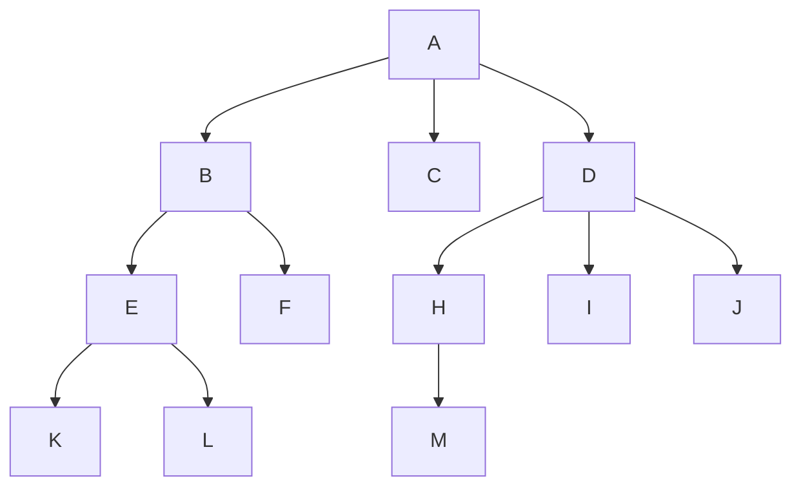

# 树和二叉树

## 树

### 定义

**树**是$n(n\ge0)$个结点的有限集。当$n=0$时，成为空树。在任意一颗非空的树中应满足：

- 有且只有一个特定的根节点
- 当$n>1$时，其余结点可分为$m(m>0)$个互不相交的有限集$T_1,T_2,...,T_m$，其中每个集合本身又是一棵树，并且称为根的子树；

**树**是递归的，树的定义中又用到了其自身，树作为一种逻辑结构，同时也是一种分层结构，具有以下两个特点：

- 树的根节点没有前驱，除根节点外的所有节点有且只有一个前驱；
- 树中所有节点可以有零或多个后继；

因此，在$n$个节点的树中最多有$n-1$条边；

### 基本术语

阅读第一部分 [树的基础](https://zhuanlan.zhihu.com/p/391549915)

- **祖先和子孙**： 对于结点K，根A到K的唯一路径上的**任意**结点，称为K的*祖先*；如结点B是K的*祖先*，则K是B的*子孙*。
- **双亲**： 路径上最接近结点K，的结点E称为K的双亲，而K为结点E的孩子。根A是唯一没有双亲的结点。有相同双亲的结点称为*兄弟* 。可以观察[双亲表示法](https://zhuanlan.zhihu.com/p/136566184)加深理解
- **结点的度**：树的一个结点的孩子个数称为该节点的**度** ，树中结点的最大读树称为 **树的度**；
  - 度大于0的结点称为*分支结点* （非终端结点）；度为0（没有子女结点）的结点称为 *叶子结点* 。
  - 在分支结点中，每个结点的分支数就是该结点的度；
- 深度、高度、层次：
  - 层次：从根开始定义，根为第一层，同一层的结点称为 *堂兄弟* ；
  - 深度：从根节点开始自顶向下逐层累加的；
  - 高度：从叶结点开始自底向上逐层累加的；
  - 树的高度或深度是树中结点的最大层数；如上图，高度为4，深度为4；

- **有序树和无序树**：树中结点的个子树从左到右是由次序的，不能互换，称为该树的**有序树**，否则称为**无序树**；
- **路径和路径长度**： 树中两个结点之间的*路径* 是由这两个结点之间所经过的结点序列构成，而*路径长度* 是路径上所经过的边的个数；

> 注意： 由于树中的分支是有向的，即从双亲指向孩子，所以树中的路径是从上向下的，同一双亲的两个孩子之间不存在路径。

- **森林**：森林是$m(m\ge0)$棵不相交的树的集合。森林的概念与树的概念十分相近，因为只要把树的根节点删除就成了森林。反之加上，只要给$m$颗树加上一个结点，并把这$m$颗树作为该结点子树，则森林变成了树；

> 概念不会直接考察，在题目中体现，不用背。

### 性质

> 以下性质很有可能作为选择题出现，务必刻入DNA

- 树中的结点数等于所有的结点的度数之和加1（这个1是根结点）；
- **层**：度为$m$的树中第$i$层至多有$m^{i-1}$个结点（$i\ge1$）；
- **结点数**：高度为$h$的$m$叉树最多有$(m^h-1)/(m-1)$个结点；
- **高度**：具有$n$个结点的$m$叉树的最小高度为$[\log_{m}(n(m-1))+1]$

其实节点数和高度这两条公式可以互推，只需要记忆一条即可：

依照上述公式，具有$n$个结点的$m$叉树反过来求高度：
$$
\because \frac{m^h-1}{m-1}=n \\
m^h = n(m-1)+1 \\
\therefore h = \log_{m}[n(m-1)+1]
$$

## 二叉树

