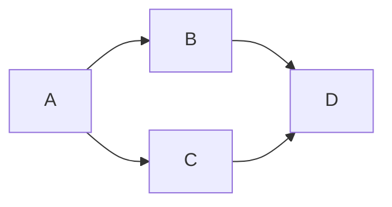
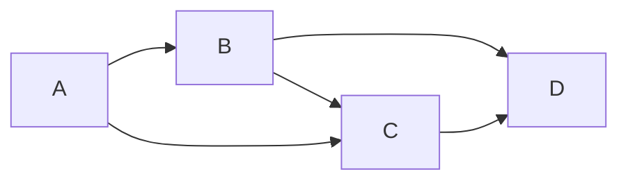

## 图的遍历

图的遍历是指从某一顶点出发，按照某种方式沿着图中的边对所有顶点访问且只访问一次。图的遍历算法求解的是图的 *连通性问题* 、*拓扑排序* 和 *求关键路径* 的基础；

> 树是的一种特殊的图，所以树的遍历实际上也可视为一种特殊的图遍历。
>
> 为避免重复访问，设置了 `_Bool visited[]` 数组记录访问；
>
> ```c
> #include <stdbool.h> //可选，不引入就用 _Bool，0替换false 1替换true (C99)
> #define MAX_VERTEX_NUM 100
> bool visited[MAX_VERTEX_NUM]; // 访问记录数组
> void visit(int v); // 访问
> ```

`FirstNeighbor(&G, x)` （获取一个顶点的第一条邻接边）和 `NextNeighbor(&G, x, y)` 下一条邻接边方法是进行图的遍历的基础：

>  ![[degree.master.c.06-图#^burgrclrn2q5:#^bnr3hcx2iz07]]

`BFS` 和 `DFS` 的区别在于：对一个顶点处理时，`BFS` 先访问该顶点的各个邻接点，而 `DFS` 则先递归处理其中一个邻接点，待返回时再访问下一个邻接点；

### BFS

广度优先遍历，类似二叉树的层序遍历，先访问 **距离** 开始的顶点最近的一组邻接边。

#### 思路

遍历检查图的每个顶点，对于顶点 $v_i$ 

- 如未被访问：遍历其邻接点 $w_1, w_2,...,w_n$ ，对于邻接点 $w_i$ ：

  - 如未被访问，访问并标记，从 $w_i$ 出发🔁重复上述动作；

  - 如已被访问, continue；

- 如已被访问, continue；

**实现思路**：

- 遍历每个顶点
  - 如未被访问过就调用 `BFS` 方法；
- `BFS` 方法：
  - 访问 并标记方法传入的顶点，并入队；
  - 如队列不为空，取头顶点，遍历该顶点的邻接点，对于每个邻接点：
    - 如未访问过就访问并标记，随后将其加入队列；
    - 如已访问过，则continue；

**实现（伪代码）**：

```c
void BFSTraverse(Graph * G){
    int v; 
    for(v = 0; v < G->vexnum; ++v){
        // 初始化已访问的初始数据
        visited[v] = true;
    }
    // 初始化队列
    InitQueue(q);
    for(v = 0; v < G->vexnum; ++v){
        if(!visited[v]) BFS(G, v, q);
    }
}
```

`BFS` 方法：

```c
void BFS(Graph * G, int v, Queue q){
    // 访问该顶点并标记为已访问
    visit(v); visited[v] = true;
    EnQueue(q, v);//将顶点v入队
    // 当队列不为空时
    while(!QueueIsEmpty(q)){
        // 取出队列中第一个顶点
        int vertex; DeQueue(q, & vertex);
        // 获取第一个邻接点
        int neighbor;
        for(neighbor = FirstNeighbor(G, vertex);
            neighbor >= 0;/*如果顶点存在邻接边*/
            /*下一此循环开始时获取下一个邻接点*/
            neighbor = NextNeighbor(G, v, neighbor)){
            // 判断该邻接点是否已访问过
            if(!visited[neighbor]){
                // 未访问过，进行访问、标记后入队
	            visit(v); visited[neighbor] = true;
                EnQueue(q, neighbor);
            }//if
        }//for
    }//while
}
```

#### 性能分析

**空间：** 需要借助一个辅助队列 *Q* 完成，最坏情况下复杂度为 *O(|V|)*；

> 空间最坏情况：
>
> 

**时间：** 

> 主要耗时在查找邻接点，与存储结构相关；

- **邻接矩阵**：查顶点还是邻接点都需循环检测矩阵中的整整一行（ *n* 个元素），因此在 `BFSTraverse` 中耗时 *O(|V|)*，在`BFS()` 方法中查找邻接点的时间复杂度为 *O(|V|)*，最坏情况下总的时间复杂度为 $O(|V|^2)$；
- **邻接表**： 在方法 `BFSTraverse` 中遍历每个顶点时，复杂度为 *O(|V|)* ，在 `BFS()` 中遍历每个顶点的邻接边总共耗时 *O(|E|)* (每条边最少会被经过一次)，加上访问 *n* 个头结点的时间，时间复杂度为 *O(|V|+|E|)*；

#### 广度优先生成树

在遍历过程中会产生一棵树，成为 *广度优先生成树* 。给定图的 *邻接矩阵* 是唯一的，产生唯一的广度优先生成树，但 *邻接表* 不是唯一的，生成的树也不唯一；


### DFS

类似树的先序遍历，尽可能 “深” 地遍历一棵树

#### 思路

> 思路与 `BFS` 在对邻接顶点的处理上有差别

遍历检查图的每个顶点，对于顶点 $v_i$ 

- 如未被访问：遍历其邻接点 $w_1, w_2,...,w_n$ ，对于邻接点 $w_i$ ：

  - 如未被访问，访问并标记，调用自身，传入 $w_i$ ；

  - 如已被访问, continue；

- 如已被访问, continue；

**实现思路**：

- 遍历每个顶点
  - 如未被访问过就调用 `DFS` 方法；
- `DFS` 方法：
  - 访问 并标记方法传入的顶点；
  - 如队列不为空，取头顶点，遍历该顶点的邻接点，对于每个邻接点：
    - 如未访问过就访问并标记，随后将其加入队列；
    - 如已访问过，则continue；

**实现（伪代码）：**

> 此处不需要再创建队列，因为采用的是递归调用，使用语言所提供的虚拟方法栈

```c
void DFSTraverse(Graph * G){
    int v;
    for(v = 0; v < G->vexnum; ++v){
        // 初始化已访问的初始数据
        visited[v] = true;
    }
    for(v = 0; v < G->vexnum; ++v){
        if(!visited[v]) DFS(G, v);
    }
}
```

`DFS` 方法：

```c
void DFS(Graph * G, int v){
    // 访问并标记
    visit(v); visited[v] = true;
    // 使用第一条邻接边初始化邻居
    int neighbor;
    for (neighbor = FirstNeighbor(G, v); 
        neighbor >= 0;
        neighbor = NextNeighbor(G, v, neighbor)){
        // 如果该顶点未被访问，则以该顶点作为起始点开始深度遍历
        if(!visited[neighbor]){
            DFS(G, neighbor);
        } //if
    } //for
}
```

`DFS` 免递归写法：

> 主要区别在调用自身进行递归时

```c
void DFS_Non_RC(Graph * G, int v){
    // 初始化栈和访问数组
    Stack s; InitStack(&s);
    for(v = 0; v < G->vexnum; ++v){
        // 初始化已访问的初始数据
        visited[v] = true;
    }
    
    // 标记
    visited[v] = true; Push(&s, v);
    int w;
    while(!StackIsEmpty(&s)){
        int neighbor, k;
        Pop(&s, &k); visit(k);
        // 使用第一条邻接边初始化邻居
        for (neighbor = FirstNeighbor(G, k); 
            neighbor >= 0;
            neighbor = NextNeighbor(G, k, neighbor)){
            // 如果该顶点未被访问，则以该顶点作为起始点开始深度遍历
            if(!visited[neighbor]){
			    visited[v] = true; Push(&s, neighbor);
            } //if
        } //for        
    }
}
```


#### 性能分析

> 同 BFS；

**空间**： 虽不借助队列，但使用了方法栈，最坏情况下使用空间 *O(|V|)* ；

> 最坏情况：度为1的树；

**时间**： 

>  与BFS一样，耗时也在寻找顶点的邻接点中；

**邻接矩阵**： 查每个顶点 *O(|V|)*，每个顶点邻接点 *O(|V|)* ， 总 $O(|V|^2)$ ；

**邻接表**： 查每个顶点 *O(|V|)*，每条边最少会被访问 *1* 次，所有顶点的邻接点加起来 *O(|E|)* ， 总 *O(|V| + |E|)* ；

#### 深度优先生成树和森林

> 与BFS不同，DFS如果在不连通的情况下，生成的是森林

对 *连通图* 调用 `DFS` 才能产生深度优先树，否则是森林；与 BFS 类似，生成树是否唯一取决于存储结构；


### 图的遍历与连通性

> 图的遍历算法可以用来判断连通性

**无向图**： 若连通，则从任一结点出发，仅需一次遍历就能访问所有顶点；若不连通，`BFSTraverse` 或 `DFSTraverse` 中调用 `BFS` 或 `DFS` 方法的次数就是图的 *连通分量* 的个数；

> ![[degree.master.c.06-图#^4zupil2zo7v4:#^r90kbxvwh0fn]]

**有向图**： 有向图分为 *强连通* 和 *非强连通* 的，它的 *连通子图* 也分为 *强连通分量* 和 *连通分量* 。对于有向图，初始点必须对每个顶点都存在路径才能一次访问整个图，所以*非强连通* 分量一次调用 `BFS` 或 `DFS` 都无法访问到该连通分量的所有顶点；


> ![[degree.master.c.06-图#^5ro2khlzxl4m:#^smgtzrxiyfzg]]


## 最小生成树

这部分直接以算法题的出现的可能性较少，但必须要会手工模拟各个算法的执行过程，还需要掌握使用既定模型解决问题的方法

> 假设要在 n 个城市之间建立通讯联络网，则连通 *n* 个城市只需要修建 *n-1* 条线路，如何在最节省经费的前提下建立这个通讯网？该问题等价于：构造网的一棵最小生成树，即：在 *e* 条带权的边中选取 *n-1* 条边（不构成回路），使“权值之和”为最小。
>
> 算法一：Prim 普里姆算法
>   归并顶点，与边数无关，适于**稠密**网
> 算法二：Kruskal 克鲁斯卡尔算法
>   归并边，适于**稀疏**网

### 含义及性质

连通图的生成树：

- 包含图的所有顶点；
- 只含尽可能少的边；
  - 砍去一条边就变成非连通图；
  - 增加一条边就形成回路；

对于一个带权连通无向图 *G=(V, E)* ，生成树不同，每棵树的权（即树中所有边上的权值之和）也可能不同。设 $R$ 为 *G* 的所有生成树的集合，若 $T$ 为 $R$ 中边的权值之和最小的那颗生成树，则 $T$ 称为 *G* 的最小数生成树[^minimumspaningtree]。

[^minimumspaningtree]: [Minimum Spanning Tree Tutorials & Notes | Algorithms | HackerEarth](https://www.hackerearth.com/practice/algorithms/graphs/minimum-spanning-tree/tutorial/)

生成树具有以下性质：

1. **树形不唯一**。$R$ 中可能有多个最小生成树。当图 *G* 的各边权值**互不相等**时，*G* 的最小生成树是**唯一**的。含权值相等的多条边，则生成树**可能不唯一**； 若无向连通图 *G* 的边数比顶点数少1，即 *G* 本身是一棵树时，则 *G* 的最小生成树就是它本身；
2. **边的权值之和唯一**。虽然最小生成树不唯一，但其对应的边的权值之和总是唯一的，而且是最小的；
3. 无向连通图**必有**最小生成树；
4. 边数为 顶点数 - *1* ；

### 构造

构造生成树有多种算法，但大多数算法都利用了最小生成树的下列性质： 

- 假设 $G=(V,E)$ 是一个带权连通无向图，*U* 是顶点集 *V* 的一个非空子集；
- 若 $(u, v)$ 是一条具有最小权的值的边，其中 $u \in U, v \in V-U$ ；

则必存在一颗包含边 $(u,v)$ 的最小生成树；

一个通用的最小生成树模板：

```c
GENERIC_MST(G){
    bool T = null;
    while (T){
        /* 
        找到一条最小代价边，
        并加入 T 后不会形成回路
        */
    }
}
```

### 复杂度

|          | Prim       | Kruskal        |
| -------- | ---------- | -------------- |
| 时间     | $O(|V|^2)$ | $O(|E|log|E|)$ |
| 适用范围 | 稠密图     | 稀疏图         |


### Prim

> 归并顶点，与边数无关，适于**稠密**网

#### 定义及手动模拟

设有连通网络 *G = (V, E)*

1. 从某顶点 $V_1$ 出发，选择与它关联的具有最小权值的边 $(V_1,V_3)$，将其顶点加入到生成树顶点集合 *U* 中 ；
2. 每一步从一个顶点在 *U* 中，而另一个顶点不在 *U* 中的各条边中：选择权值最小的边 *(u, v)* ,把它的顶点加入到 *U* 中；
3. 直到所有顶点都加入到生成树顶点集合U中为止；

**步骤**：

b. 在 $V_1$ 出发，选择权值最小的 $V_3$ ，*U* 中的集合为 $\{ V_1,V_3 \}$ ；

c. 选择一个在 *U* 中的顶点 $V_3$ ，不在U中且对于 $V_3$ 来说权值最小的 $V_6$ 加入 *U* ，此时 *U* $\{V_1,V_3,V_6\}$；

d. 选 *U* 中 $V_6$ ，选不在 *U* 中对于 $V_6$ 最小权值的 $V_4$ ，此时 *U* $\{V_1,V_3,V_6, V_4 \}$；

e. 选 *U* 中 $V_3$ ，选不在 *U* 中对于 $V_3$ 最小权值的 $V_2$ ，此时 *U* $\{V_1,V_3,V_6, V_4, V_2 \}$；

f. 选 *U* 中 $V_2$ ，选不在 *U* 中对于 $V_2$ 最小权值的 $ V_5 $ ，此时 *U* $\{V_1,V_3,V_6, V_4, V_2, V_5 \}$；


#### 伪代码

设置一个辅助数组，对当前 *V－U* 集中的每个顶点，记录和顶点集 *U* 中顶点相连接的代价最小的边；

```c
typedef struct {
     VertexType  adjvex;  // U集中的顶点序号
     VRType  lowcost;  // 边的权值
} closedge[MVNUM];
```

1. 第一次遍历时：

- 以点 *a* 开始，遍历该顶点所有邻接边的权值；
- 如红线，下一次开始时，对权值最小的 *e* 进行此操作；


2. 第二次遍历时：

- 以点 *e* 开始，遍历该顶点所有邻接边的权值；
  - 如遇到 *e* 到该顶点的权值比 *a* 的小时（如途中的 e->b, e->g）则进行覆盖；
  - 覆盖时修改`Adjvex` 数组中的名称及 `Lowcost`  数组中的数值；
- 如红线，下一次开始时，对权值最小的 *d* 进行此操作；


3. 第三次遍历时：

- 以点 *d* 开始，遍历该顶点所有邻接边的权值；


4. 遍历结束：

即可通过 `Adjvex` 数组中的名称及 `Lowcost`  数组中的数值组合成为一颗带权路径树；


**伪代码**

> `LocateVex` ： 通过传入的序号获取顶点；
>
> `closedge` ：如上图的顺序表，是存放结构体的数组，也就是上面一直说的集合 *U* ；

```c
void MiniSpanTree_Prim(AMGraph G, VertexType u) {
  	//从顶点 u(a) 出发构造网G的最小生成树
  	k = LocateVex ( G, u );
  	// 辅助数组初始化
  	for ( j=0; j<G.vexnum; ++j )
      // 为减少时间复杂度，
      // 初始化时顺便把 u(a) 的找到了
      	if (j!=k && G.arcs[k][j] < INT_MAX)
          	// 结点不是起始点的都可以寻找一下路径
          	// G.arcs[k][j] < INT_MAX 是指
          	// k 与 j 之间存在路径（权值存在）
            // 设置closedge，下文将称其为U集
        	closedge[j] = { u, G.arcs[k][j] }; 
    		// G.arcs[k][j] 是指：
    		// 获取使用邻接矩阵存储的图G
    		// 从k到j的邻接边的权值
  	closedge[k].lowcost = 0;      // 初始，U＝{u}

    // 开始遍历第一个顶点
    for (i=1; i<G.vexnum; ++i) {
		// 求出加入生成树的下一个顶点(k)        
        // 找出U集中权值最小的、未被遍历过的、U外V内的
        // closedge[]：找出权值最小的
        // closedge[].lowcost>0
        //  = 0意味着已经访问过，大于说明有权值，但未被访问
  		k = Min(closedge[] && closedge[].lowcost>0);  
        
		// 输出生成树上一条边        
  		cout << closedge[k].adjvex << G.vexs[k]; 

        // 第k顶点并入U集
  		closedge[k].lowcost = 0;    

        for (j=0; j<G.vexnum; ++j){
             //修改其它顶点的最小边
            // 如从k出发到各点的权值小于U集的权值时
            // 修改U集中的权值
            if (G.arcs[k][j] < closedge[j].lowcost){
                 closedge[j] = 
                 { G.vexs[k], G.arcs[k][j] };
            }//if
        }//for
    }//for
}

```

### Kruskal

> 归并边，适于**稀疏**网

与 Prim 算法从顶点开始拓展最小生成树不同，Kruskal算法是一种按权值的递增次序选择合适的边来构造最小生成树的办法；

#### 定义及手动模拟

手动模拟的步骤如下：

- 初始时只有 *n* 个顶点而无边的非连通图 *T={V, {} }* ，每个顶点自成一个连通分量
- 然后按照边的权值由小到大的顺序，不断选取当前未被选取过且权值最小的边：
  - 若该边依附的顶点（两端）落在 *T* 中不同的连通分量上，则将该边加入 *T* ；
  - 否则舍弃
- 依次循环上述操作，直到**所有顶点在同一连通分量上**为止；


#### 伪代码


辅助数据结构：

```c
typedef struct {
    EdgeType Edge[arcnum];
    VertexType vexset[vexnum];
} KSet ;
```

```c
void MiniSpanTree_Kruskal(AMGraph G, VertexType u){
    // 将数组Edge中的元素按权值从小到大排序
    Sort(Edge);
    // 依次查看数组Edge中的边，循环执行
    for(int i=0;i<G.arcnum;++i){
        // 依次从排序后的Edge中取出一条边
        EdgeType edge = Edge[i];
        // 从vexset中查找 v1和v2所在的连通分量vs1和vs2
        Subgraph vs1 = GetSubgraph(vexset, edge[0]), 
        vs2 = GetSubgraph(vexset, edge[1]);

        // 若 vs1 == vs2，继续下一轮循环
		if(IsOneSubgraph(vs1, vs2)) continue;
        
		// 若 vs1 != vs2，
        // 说明该边的两个顶点属于不同的连通分量            
        Visit(edge);
        //合并vs1,vs2，并覆盖vs1,vs2
        MergeSubgraph(vexset, vs1, vs2);
    }
}
```


通常在 kruskal 算法中，采用 堆 [[degree.master.c.08-查找#树型查找]] 存储边的集合，因此每次选择最小权值的边只需 $O(log|E|)$ 的时间，此外，由于生成树 *T* 中的所有边可视为一个等价类，因此每次添加新边的过程类似于求解等价类的过程，因此可以采用并查集描述 *T* ，从而构造 *T* 的时间复杂度为 $O(|E|log|E|)$ 。因此适合 **边稀疏而顶点较多** 的图。


## 最短路径

根据是否带权：

- 非带权图的最短路径；
- 带权图的最短路径：
  - 把一个顶点 $v_0$ 从图中其余任意一个顶点 $v_i$ 的一条路径（可能不止一条）所经过的边上的权值之和定义为该路径的**带权路径长度**；
  - *带权路径长度* 最短的那条路径称为 **最短路径**；

根据源点划分：

- 求从**某个源点到其余各点**的最短路径；
- **每一对顶点之间**的最短路径；

### 非带权图的单源最短路径-BFS

> 因为 `BFS`   总是按照距离从近到远来遍历途中各个顶点，所以在每次的遍历中：
>
> - 

**伪代码**：

>  `INT_MAX` 位于库 `limits.h` 中，此处用于替代 $\infty$；

```c
void BFS_MIN_Distrance(Graph G, int u){
    // d[i] 表示从 u 到 i 结点的最短路径
    for(i = 0; i < G.vexnum; ++i){
        d[i] = INT_MAX;
    }
    // 将 u 标记为已访问
    visited[u] = true; d[u] = 0;
    // 入队
    InitQueue(q); EnQueue(q, u);
    int levels = 0, levelNodes = 0, c = 1;
    // 当队列不为空时
    while(!QueueIsEmpty(q)){
        // 取出队列中第一个顶点
        int vertex; DeQueue(q, & vertex); 
        --MaxDequeTime;
        
        // 获取第一个邻接点
        int neighbor;
        for(neighbor = FirstNeighbor(G, vertex);
            neighbor >= 0;/*如果顶点存在邻接边*/
            /*下一此循环开始时获取下一个邻接点*/
            neighbor = NextNeighbor(G, v, neighbor)){
            // 判断该邻接点是否已访问过
            if(!visited[neighbor]){
                // 未访问过，进行访问、标记后入队
	            visit(v); visited[neighbor] = true;
                EnQueue(q, neighbor); ++levelNodes;
                // 路径长度 = 层数 + 1
                d[neighbor] = levels + 1;
            }//if            
        }//for
        // 当前层已经全部遍历完毕
        if(MaxDequeTime == 0){
            // 进入下一层
            ++levels;
            // 重置层结点数量记录器
            MaxDequeTime = levelNodes;
            levelNodes = 0;
        }
    }//while
}
```

### 带权图的最短路径

求解最短路径的算法依赖一个性质：**两点之间的最短路径也包含了路径上其他顶点间的最短路径**；如开头所说，按照源点划分，带权图的最短路径包括：

- 单源最短路径：Dijkstra 求解；
- 每对顶点间的最短路径：Floyd 求解；


### 单源最短路径-Dijkstra

#### 定义及手动模拟

如上所说：“**两点之间的最短路径也包含了路径上其他顶点间的最短路径**” ，因此想找 $v_0$ 到 $v_i$ 的最短路径，可以先找到 $v_0$ 到 $v_{i-1}$ 的最短路径，再在 $v_0 \to v_{i-1}$  中找出到 $v_i$ 的最短路径；

**手动模拟**：

在 Dijkstra 算法的手动模拟中，我们先设置两个集合：

- *S* 中存放已找到最短路径的顶点，初始时，集合 *S* 中只有一个顶点，即源点 $v_0$；
- *T* 中存放当前还未找到最短路径的顶点；

> S与T必定互补！

主要过程：

- 初始化：计算从源点 $v_0$ 到 *T* 中各顶点 $v_k$ 的当前长度；
- 选择：在集合 *T* 中选取当前长度最短的一条最短路径 $(v_0,v_k)$ ，将 $v_k$ 加入到顶点集合 *S* 中；
- 更新：对T中其余各条路径进行调整：
  - ❗下文中 $(v_0,...,u)$ 是指从顶点 $v_0$ 出发经过 *...* 个路径最终到达 *u* 的路径的权值；
  - 😴若在图中存在弧 $(u,v_k)$，且 $(v_0,...,u) + (u,v_k)<(v_0,...,v_k)$ , 则以路径 $(v_0,...,u,u_k)$ 代替 $(v0,...,v_k)$。
        反复进行第2第3步，直至求出源点到其余各顶点的最短路径长度；
  - 😋人话：当遍历到 *u* 点时，知道 $v_0$ 到 *u* 点的距离 $(v_0,...,u)$ ，如果：
    - $v_0 \to u$ 的距离 **+**   $u \to v_k$ 的距离  **<**   $v0 \to ... \to v_k$ ( `...` 表示之前遍历过的最短距离点) 的距离；
    - 那就进行更新，用  $u \to v_0 \to v_k$ 再到 $v_k$ 的路径 **替换**  $v0 \to ... \to v_k$ ；


- `初始化` 找到 *1* 到各点的距离（即下表的初始），`dist[i]` 中存放距离，`path[i]` 中存放最短距离的上一个顶点；
- `1` ：选取上一步中距离最短的顶点 *2* ，将其加入 *S*，记着 $v_1 \to ... \to v_2 = 10$ ，然后开始遍历与 $v_2$ 的邻接点：
  - `1. 1` $v_2 \to v_3 = 50$  ；则 $v_1 \to ... \to v_3 = 10 + v_2 \to v_3 = 60 < \infty \text{（同列上一行）}$  ，将 *60* 覆盖到 `dist[3]` 的位置，点 *2* 覆盖到；
- `2` ： 选取上一步中距离最短的顶点 *4* ，将其加入 *S*， $v_1 \to ... \to v_4 = 30$ ，开始遍历：
  - `2.1` $v_4 \to v_3 = 20$ ；则 $v_1 \to ... \to v_4 = 30 + v_4 \to v_3 = 50 < 60\}$ ，将 *50* 覆盖到 `dist[3]` 的位置；
  - `2.2` $v_4 \to v_5 = 60$ ；则 $v_1 \to ... \to v_4 = 30 + v_4 \to v_5 = 90 < 100\}$，将 *90* 覆盖到 `dist[5]` 的位置；

- `3` ：取 *3* ，加入 *S*，$v_1 \to ... \to v_3 = 50$ ：
  - `3.1` $v_3 \to v_5 = 10$ ；则 $v_1 \to ... \to v_3 = 50 + v_3 \to v_5 = 60 < 90\}$ ，将 *60* 覆盖到 `dist[5]` 的位置；

- `4` ：取 *5* ，加入 *S* ，$v_1 \to ... \to v_5 = 60$：

- `结束`：*T* 为空，结束，此时 `dist[]` 即为 $v_1$ 到各点的最短距离；

> ❗注意：
>
> - 下表中 **加粗** 为发生覆盖的值，*斜体* 为当前行集合T中的最小值，两种标记不互斥；
> - 表格为空的地方意味着已经选过了，*T* 中不存在该点；
>
> 设表头 *u* 后的数值为 *i* ，则表头 i 表达的含义是：`{dist[2],path[2]}`，即 {距离, 距离最短的上一个结点序号}

| 迭代 | S           | T         | **u** | 2         | 3             | 4         | 5             |
| ---- | ----------- | --------- | ----- | --------- | ------------- | --------- | ------------- |
| 初始 | {1}         | {2,4,3,5} | -     | {*10*, 1} | {$\infty$, 0} | {30, 1}   | {100, 1}      |
| 1    | {1,2}       | {4,3,5}   | 2     |           | {**60**, 2}   | {*30*, 1} | {100, 1}      |
| 2    | {1,2,4}     | {3,5}     | 4     |           | {***50***, 4} |           | {**90**, 4}   |
| 3    | {1,2,4,3}   | {5}       | 3     |           |               |           | {***60***, 3} |
| 4    | {1,2,4,3,5} | {}        | 5     |           |               |           |               |
| 结果 | {1,2,4,3,5} | {}        | N/A   | {10, 1}   | {50, 4}       | {30, 1}   | {60, 3}       |


#### 伪代码

数据结构：

主：邻接矩阵 `G[n][n]` (或者邻接表)
辅：

- 数组 `S[n]`：记录相应顶点是否已被确定最短距离；
- 数组 `D[n]` ：记录源点到相应顶点路径长度；
- 数组 `Path[n]`：记录相应顶点的前驱顶点；

辅助数据结构初始化为：

|        | *v* = 0 | *v* = 1 | *v* = 2 | *v* = 3 | *v* = 4 | *v* = 5 |
| ------ | ------- | ------- | ------- | ------- | ------- | ------- |
| *S*    | true    | false   | false   | false   | false   | false   |
| *D*    | 0       | ∞       | 10      | ∞       | 30      | 100     |
| *Path* | − 1     | −1      | 0       | − 1     | 0       | 0       |

1. 初始化

(1) 将源点 $v_0$ 加到 *S* 中，即 $S[v_0] = true$；

(2) 将 $v_0$ 到各个终点的最短路径长度初始化为权值，即：
$$
D[i] = G.arcs[v_0][v_i],(v_i \in V − S)
$$
(3) 如果 $v_0$ 和顶点 $v_i$ 之间有弧，则将vi的前驱置为 $v_0$，即 $Path[i] = v_0$ ，否则 $Path[i] = −1$。


2. 选择下一条最短路径的终点$v_k$，使 

$$
D[k] = Min \{ D[i] \big| v_i \in V − S \}
$$

(1) 将 $vk$ 加到 *S* 中，即 $S[vk] = true$。

(2) 更新从 $v_0$ 出发到集合 $V − S$ 上任一顶点的最短路径的长度，同时更改 $v_i$ 的前驱为 $v_k$：
若 $S[i]=false$ 且 $D[k]+G.arcs[k][i]<D[i]$，则 $D[i]=D[k]+ G.arcs[k][i]; Path [i]=k;$ ；

(3) 🔁 重复②～④ *n − 1* 次，即可按照路径长度的递增顺序，逐个求得从 $v_0$ 到图上其余各顶点的最短路径；

#### 特点

> Dijkstra 算法基于贪心策略；

**复杂度**： 使用 *邻接矩阵* 表示时，时间复杂度 $O(|V|^2)$ 。使用 *带权的邻接表* 表示时，虽然修改 `dist[]` 的时间可以减少，但由于 `dist[]` 中选择最小的分量的时间不变，时间复杂仍为 $O(|V|^2)$ ；

**适用范围**：

- 人们可能只希望找到源点到某个特定顶点的最短路径，但这个问题和求解源点到其他所有顶点的最短路径一样复杂，时间复杂度也为 $O(|V|^2)$ ；
- 同样适合求解 **有向有回路** 的图；

- ❗边上带有 *负权值* 时，Dijkstra  算法并不适用。 

> 若允许边上带有负权值：
>
> - `初始化` 在遍历到该边前，上一组进入集合 *S* 的顶点及最短路径已经固定；
>
> - `1` ：选择 *T* 中的顶点 *2* 加入 *S*，无路径，continue;
> - `2` ：选择 *T* 中顶点 *1* ，“突然发现” 此时 $v_0 \to v_1 = 7 , v_1 \to v_2 = -5 \to v_0 \to v_2 = 2 < 5$ 可更新：
>   - 此时问题来了， 但当前从 *0* 到 *2* (0->1->2)的值只需要 *2*，小于直接从 *0* 到 *2*，如果不更新会造成结果错误；
>   - 🤔能不能更新？ 应该更，但更不了🤷‍♂️：
>     - 算法在设计时就限定选取 *u* 后立即加入 *S*，然后只能选择到集合 *T* 中的顶点进行修改，*S* 中的元素已经无法变更；
>     - 此时 *2* 已加入 *S*，所以程序根本 “发现” 不了这个顶点，也就无法选取到 *(1,2)* 这条边，也就是说下表 <u>划线部分</u> 是不可能发生的；
>
> | 迭代 | S       | T     | **u** | 1      | 2                 |
> | ---- | ------- | ----- | ----- | ------ | ----------------- |
> | 初始 | {0}     | {1,2} | -     | {7, 0} | {*5*, 0}          |
> | 1    | {0,2}   | {1}   | 2     |        |                   |
> | 2    | {0,1,2} | {}    | 1     |        | <u>{**2**, 1}</u> |
>
> 

### 每对顶点间的最短路径-Floyd

#### 定义及手动模拟

**基本思想**：

> 如上所说：“**两点之间的最短路径也包含了路径上其他顶点间的最短路径**” ，因此想找 $v_0$ 到 $v_i$ 的最短路径，可以先找到 $v_0$ 到 $v_{i-1}$ 的最短路径，再在 $v_0 \to v_{i-1}$  中找出到 $v_i$ 的最短路径；

- 若 $<v_i,v_j>$ 存在，则存在路径 $\{v_i,v_j\}$  // 路径中不含其它顶点
- 若 $<vi,v1>,<v1,vj>$ 存在，则存在路径 ${v_i,v_1,v_j}$  // 路径中所含顶点序号不大于1
- 若 $\{v_i,...,v_2\}, \{v_2,...,v_j\}$ 存在，则存在一条路径 $\{v_i,..., v_2, ..., v_j\}$ // 路径中所含顶点序号不大于2

> 依次类推，则 $v_i$ 至 $v_j$ 的最短路径应是上述这些路径中，路径长度最小者（一共经过n次比较）。

根据上述求解过程，图中的所有顶点对 $v_i$ 和 $v_j$ 间的最短路径长度对应一个 *n* 阶方阵 *D* 。在上述 *n+1* 步中，*D* 的值不断变化，对应一个 *n* 阶方阵序列：
$$
D^{(-1)},D^{(0)},D^{(1)},...,D^{(k)},...,D^{(n-1)}
$$
其中，
$D^{(-1)}[i][j]$ 表示从 $v_i$ 到 $v_j$ 的弧的长度，；
$D^{(-1)}[i][j] = G.arcs[i][j]$
$D^{(k)}[i][j]$ 表示从 $v_i$ 到 $v_j$ 的中间顶点的序号不大于 *k* 的最短路径长度。
$D^{(k)}[i][j] = \min\{ D^{(k-1)}[i][j], D^{(k-1)}[i][k]+D^{(k-1)}[k][j] \}$ 

下面使用一个实例介绍：

> 方阵名称会变换，此处变换为 $A^{k}$ 


- $A^{-1}$ ：初始化阶段，

> $A^{(k)}[i][j]$ ：表示从顶点 $v_i$ 到 $v_j$  、中间顶点的**序号**不大于 *k* 的最短路径长度，每一次迭代即从 $v_i \to ... \to v_j$ 中多考虑一个顶点；若多考虑一个顶点后得到的路径比

- $A^0$ ：第一轮将 $V_0$ 作为中间顶点，对于所有顶点对 $\{i,j\}$ ，如果有 $A^{-1}[i][j]>A^{-1}[i][0] + A^{-1}[0][j]$ ，则将 $A^{-1}[i][j]$ 更新为 $A^{-1}[i][0] + A^{-1}[0][j]$ ；如表格 $A^{-1}$ 中：有 $\infty=A^{-1}[2][1] > A^{-1}[2][0] + A^{-1}[0][1]=11$ ，则更新 $A^{0}[2][1]=11$ ；

> $A^{-1}[2][1]=\infty$ ：没有直接从 $V_2 \to V_1$ 的路径；
>
> $A^{-1}[2][0]=5$ ：从 $V_2 \to V_0$ 的距离为 *5* ；
>
> $A^{-1}[0][1]=6$ ：从 $V_0 \to V_1$ 的距离为 *5* ；
>
> 更新 $A^{-1}[2][1]=11$ 意味着从 $V_2 \to V_1$ 的路径可以是：$V_2 \to V_0 \to V_1 = 11$ ；

- $A^1$：第二轮将 $V_1$ 作为中间顶点，有 $13=A^{0}[0][2]>A^{0}[0][1] + A^{0}[1][2]=10$ 更新 $A^{1}[0][2]=10$ ；
- $A^2$：第三轮将 $V_2$ 作为中间顶点，有 $10=A^{1}[1][0]>A^{1}[1][2] + A^{1}[2][0]=9$ 更新 $A^{2}[1][0]=9$ ；

> 结束，$A^2$ 保存的结果即是任意顶点对的最短路径长度；

| $A^{i}$ | -1    |          |       | 0     |               |       | 1     |       |               | 2            |       |       |
| ------- | ----- | -------- | ----- | ----- | ------------- | ----- | ----- | ----- | ------------- | ------------ | ----- | ----- |
| $V_i$   | $V_0$ | $V_1$    | $V_2$ | $V_0$ | $V_1$         | $V_2$ | $V_0$ | $V_1$ | $V_2$         | $V_0$        | $V_1$ | $V_2$ |
| $V_0$   | 0     | 6        | 13    | 0     | 6             | 13    | 0     | 6     | <u>**10**</u> | 0            | 6     | 10    |
| $V_1$   | 10    | 0        | 4     | 10    | 0             | 4     | 10    | 0     | 4             | <u>**9**</u> | 0     | 4     |
| $V_2$   | 5     | $\infty$ | 0     | 5     | <u>**11**</u> | 0     | 5     | 11    | 0             | 5            | 11    | 0     |


#### 伪代码

```c
//基于邻接矩阵的图的多源最短路径Floyd算法  
void Floyd(AMGraph G){
   for(i=0; i<G.vexnum; i++) //初始化
     for(j=0; j<G.vexnum; j++){
        D[i][j] = G.arcs[i][j];
          if(D[i][j]<MaxInt) path[i][j] = i;
          else path[i][j] = -1;
     }
   for(k=0; k<G.vexnum; k++) //进行n次迭代                 
     for(i=0; i<G.vexnum; i++)
        for(j=0; j<G.vexnum; j++)
          if(D[i][k]+D[k][j] < D[i][j]){
              D[i][j] = D[i][k] + D[k][j];
              path[i][j] = path[k][j];           
          }    
}
```

#### 特点

**复杂度**： Floyd 算法的时间复杂度为 $O(|V|^3)$ 。不过由于代码紧凑，隐含的系数很小，对于中等规模的输入来说仍是相当有效的；

**适用范围：**

- Floyd 算法允许带负权值的边，但不允许包含带负权值的边组成的回路；
- Floyd 同样适用于带权无向图，因为带权无向图可视为权值相同往返二重边的有向图；

> 其实也可以用单源最短路径解决每队顶点之间的距离，对每个顶点使用 Dijkstra，复杂度也为 $O(|V|^3)=O(|V|)*O(|V|^2)$


## 拓扑排序

### 有向无环图和AOV 网

若一个 *有向图* 中不存在 *环* ，则成为 **有向无环图** ，简称 **DAG** 图；是描述含有公共子表达式的有效工具：

分别使用 *二叉树* 和 *有向无环图* 描述表达式：
$$
((a+b)*(b*(c+d))+(c+d)*e)*((c+d)*e)
$$
使用 *有向无环图* 可以节省空间，因其 “共享” 了公共的子表达式 $(c+d),(c+d)*e$


进一步地，用 *DAG* 图表示一个工程，其顶点表示活动，用有向边 $<V_i,V_j>$ 表示活动 $V_i$ 必须优于活动 $V_j$ 进行这样的一种关系，则将这种有向图称为 **顶点表示活动的网络**，记为 **AOV网** ：

- 活动 $V_i$ 是活动 $V_j$ 的直接前驱，活动 $V_j$ 是活动 $V_i$ 的直接后继；
- 前驱和后继关系具有传递性，且任何活动都不能以它自己作为自己的前驱或后继


### 概念及手动模拟

> 假设以有向图表示一个工程的施工图或程序的数据流图，则图中不允许出现回路。检查有向图中**是否存在回路**的方法之一，是对有向图进行拓扑排序。

#### 概念

**拓扑有序序列**

对有向图，按照其给出的次序关系，将图中顶点排成一个线性序列，对于有向图中没有限定次序关系的顶点，则可以人为加上任意的次序关系。由此所得顶点的线性序列称之为**拓扑有序序列**。



可求得 *拓扑有序数列* ： `A B C D` 或 `A C B D` ；

反之，对于下列有向图，不能求得它的拓扑有序序列。因为图中存在一个回路 {B, C, D}



**如何进行拓扑排序？**

1. 从有向图中选取一个没有前驱的顶点，并输出之；

2. 从有向图中删去此顶点以及所有以它为尾的弧；

  🔁重复上述两步，直至图空，或者图不空但找不到无前驱的顶点为止。

> ❗ 在算法中需要用定量的描述替代定性的概念：
>
>  没有前驱的顶点 -> 入度为**零**的顶点；
>
>  删除顶点及以它为尾(以其为起点)的弧 -> 弧头顶点的入度减1；

#### 手动模拟

>  在图论中，由一个有向无环图的顶点组成的序列，当且仅当满足以下条件时，称为该图的一个拓扑排序：
>
> - 每个顶点出现且只出现一次；
> - 若顶点 *A* 在序列中排在顶点 *B* 的前面，则在图中不存在从顶点 *B* 到顶点 *A* 是路径；

**过程：**


- `1`：选择没有直接前驱（入度=0）的结点 *1* 进行输出，并且删除其所有 *出度* ，操作后就是上图箭头“输出1”指向的图，状态是表格中的`loop1`；
- `2`：选择 *2*，删 *出度*；
⏩继续遍历直至图为空... 状态见表格：

> 表格为空的地方说明该顶点已消失

| 结点号   | 输出       | 1    | 2    | 3    | 4    | 5    |
| -------- | ---------- | ---- | ---- | ---- | ---- | ---- |
| 初始入度 | 1          | 0    | 1    | 2    | 2    | 2    |
| loop1    | 2          |      | 0    | 2    | 1    | 2    |
| loop2    | 4          |      |      | 1    | 0    | 2    |
| loop3    | 3          |      |      | 0    |      | 1    |
| loop4    | 5          |      |      |      |      | 0    |
| loop5    | 图空，结束 |      |      |      |      |      |


### 伪代码

```c
_Bool TopLogicalSort(Graph G, int * inDegree, int * out){
    // 初始化存储入度为0的顶点
	InitStack(S);
    // 遍历每个顶点
    int i;
	for(i=0; i<G.vexnum; i++){
        // 如果某个顶点的入度为0
        if(inDegree[i] == 0){
            // 入读为0的顶点入栈
            Push(S, i);
        }//if
    }
    int count = 0; // 记录当前已输出的顶点数；
    while(!StackIsEmpty(S)){
        // 取出栈顶元素，其入度为0
        Pop(S,i);
        /* 输出该元素到排序序列，并记录当前已输出的顶点数 */
        out[count++] = i;
        // 开始遍历删除 i 的出度
        int neighbor, adjvex;
        ArcNode neighborNode;
        
        // 将所有 i 指向的顶点的入度减 1
        for(neighbor = FirstNeighbor(G, i); 
            neighbor >= 0;
            neighbor = neighborNode->nextarc){
            // 根据下标获取顶点结构体
            neighborNode = G.vertices[neighbor];
            adjvex = neighborNode.adjvex;            
            // neighborNode.adjvex 
            // 为边链表结点上的邻接点域，
            // 也就是被 i 所指向的结点的序号
			
            // 如果该结点被减 1 后的入度为 0 ，则入栈
            if(!--inDegree[adjvex]){
                Push(S,adjvex);
            }
        }//for
    }//while
    // 如果排序后的结点数小于实际节点数
    // 说明图中有回路
    if(count<G.vexnum) return 0;
    return 1;
}
```

> `FirstNeighbor(G,i)` 方法对于有向图，调用时会返回`G.vertices[i].firstarc` （即邻接表中边链表的第一个结点）
>
> 🤔为什么 “排序后的结点数小于实际节点数” 可以说明图中有回路？
>
> 倘若有回路（存在从 *i* 出发最后可以回到 *i* 的顶点），可以发现到 `loop3` 时已无法再继续，因为此时没有入度为 *0* 的顶点；
>
> 
>
> |       | i    | 1     | 2     | 3    | 4    | 5    |
> | ----- | ---- | ----- | ----- | ---- | ---- | ---- |
> | 初始  |      | **0** | 1     | 2    | 1    | 1    |
> | loop1 | 1    |       | **0** | 2    | 1    | 1    |
> | loop2 | 2    |       |       | 1    | 1    | 1    |
> | loop3 | ❗    |       |       |      |      |      |
>
> 此处隐含一个性质（如果好奇为什么，就看看，很抽象，不必理解）：
>
> 拓扑排序算法中，依靠删除入度为 *0* 的点的 *出度* 逐层得到排序，但有环的图中，至少有一组点中：至少包含一个 *入度 > 1* 的点，*>1* 是因为若是连通的，则至少有一个环外的点指向该环的该点。进行拓扑排序时，也会从该点开始，删除该店的 *1* 条入度后，该点入度仍 *>0* ，且环内每个点的入度均 *>0* ；此时根本无法找到入度为 *0* 的点；

### 特点

由于输出每个顶点的同时还有删除以它为起点的边，故采用不同存储结构的时间复杂度不一样：

- *邻接表* ：$O(|V|+|E|)$ ；
- *邻接矩阵* ：$O(|V|^2)$ ；

> 实际上，采用DFS也可以完成拓扑排序；

**逆拓扑排序**

与拓扑排序相反，选取顶点的时候选取 *出度* 为 *0* 的顶点并输出；

❗**使用时应注意以下问题**

- 入度为 *0* 的顶点，即没有前驱活动的或前驱活动都已经完成的顶点，工程可以从这个顶点所代表的活动开始或继续；
- 若一个顶点有**多个直接后继**，则拓扑排序结果通常**不唯一**；但若每个顶点已经排在了一个线性有序的序列中，每个顶点都有**唯一的直接前驱后继**关系，则拓扑排序结果**唯一**；
- 由于 *AOV* 网中各顶点地位平等，编号是人为的，因此可以按拓扑排序的结果重新编号，生成的 *AOV* 网的新的邻接存储矩阵，这个邻接矩阵可以是三角矩阵； 但对于一般的图来说，若其邻接矩阵是三角矩阵，则存在拓扑序列；反之则不一定成立；


## 关键路径

### 快速复习

假设以有向网表示一个施工流图，弧上的权值表示完成该项子工程所需时间。
问：哪些子工程项是“关键工程”？即：哪些子工程项将影响整个工程的完成期限的？

**有关术语**

**源点**：工程的开始点；

**汇点**：工程的结束点；

**事件**（顶点）：某时刻发生的情况；

**活动**（有向边）：其权值定义为活动进行所需要的时间。方向表示起始结点事件先发生，而终止结点事件才能发生。如：事件 *a* 发生后 *b* 才能发生；

**关键路径**：从源点到汇点最长的一条路径，或者全部由关键活动构成的路径。对应下图 的<font style=background:blue>蓝色路径</font>；

“**关键活动**” ：该弧上的权值增加 将使有向图上的最长路径的长度增加。如图中<font style=background:blue>蓝色路径</font>中的 $V_a\to V_b$，如果权值增加，则会使最长路径的长度增加；

>  即，最早开始时间 = 最迟开始时间 的活动

整个工程完成的**时间**：从有向图的源点到汇点的最长路径 ；如图中的权值之和 $6+1+7+4 = 18$ ；


**公式**

1. “事件(顶点)”的 **最早发生时间**  $ve(i)$  ：
   $ve(i)$  = 从源点到顶点 *i* 的**最长路径**长度；

如：
$$
v_e(\text{源点}) = 0 \\
ve(i) = \max\{ ve(k) + w_{k,i} \} \\
<v_k, v_i>\in T, i\in[1,n-1]
$$

2. “事件(顶点)” 的 **最迟发生时间**  $vl(i) $ ：
    $vl(i)$  = 从顶点 *i* 到 *汇点* 的**最短路径**长度。
$$
vl(\text{汇点}) = ve(\text{汇点}); \\
   vl(i) = \min\{ vl(k) - w_{i, k} \} \\
<v_i, v_k> \in S,i \in [0,n-2]
$$

例如：设有活动 $ai=<v_j, v_k>$：
    则 对第 *i* 项活动而言：

   - 其最早开始时间 $e(i) = ve(j)$；
   - 最迟开始时间 $l(i) = vl(k) - w_{j,k}$；

### 概念

> 🔎在阅读概念后完成手动模拟

在带权有向图中，以顶点表示事件，以有向边表示活动，以边上的权值表示完成该活动的开销（如完成活动所需的时间），称之为 **用边表示活动的网络** ，简称 **AOE** 网。*AOE* 网和 *AOV* 网都是有向无环图，不同之处在于它们的边和顶点所代表的含义是不同的， *AOE* 网中的边有权值；而 *AOV* 网中的边有权值；而 *AOV* 网中的边无权值，仅表示顶点之间的前后关系；

*AOE* 网具有以下两个性质：

- 只有在某顶点所代表的**事件发生后**，从**该顶点**出发的各有向边所代表的**活动才能开始**；
- 只有在**进入某顶点的所有**有向边所代表的活动都已**结束**时，**该顶点**所代表的事件**才能发生**；

在 *AOE* 网中仅有一个入度为 *0* 的顶点，称为 *开始顶点(源点)* ，它代表着整个工程的开始；网中也仅存在一个出度为 *0* 的顶点，称为（汇点）；

在 *AOE* 网中，有些活动是可以**并行**进行的。 从源点到汇点的有向路径可能有多条，并且这些路径长度可能不同。但只有当各个路径上的活动都已完成时，整个工程才算结束。 因此，从源点到汇点的所有路径中，具有最大路径长度的路径称为 **关键路径** ，把关键路径上的活动称为 **关键活动**；

完成整个工程的最短时间就是 **关键路径长度**，即关键路径上各活动花费开销的总和。 这因为 *关键活动* 影响了整个工程的时间。因此只要找到了 *关键活动*，就找到了 *关键路径*，也就能得出最短完成时间。

#### 1. 事件 $v_k$ 的最早发生时间 $ve(k)$[^vevl]；

它是指从源点 $v_1$ 到顶点 $v_k$ 的 *最长路径长度* 。事件 $v_k$ 的最早发生时间决定了所有从 $v_k$ 开始的活动能够开工的 *最早时间* 。可以使用下面公式递推计算：
$$
ve(\text{源点}) = 0 \\
ve(k) = \max\{ve(j)+Weight(v_i,v_j)\} \\
$$

> $v_k$ 为 $v_j$ 的直接后继，$Weight(v_j,v_k)$ 表示 $<v_j,v_k>$ 上的权值；

计算 `ve()` 值时，按从前往后的顺序进行，可以在拓扑排序的基础上计算：

- 初始时，令 $ve[1...n]=0$ ；
- 输出一个入度为 *0* 的顶点 $v_j$ 时，计算它所有直接后继顶点 $v_k$ 的最早发生时间:
  - 计算直接后继顶点的过程中，使用 $ve[k]$ 保存最大权值，即：
  - 若 $ve[j]+Weight(v_j,v_k)>ve[k]$ 则 $ve[k]=ve[j]+Weight(v_j,v_k)$ ；


#### 2. 事件 $v_k$ 的最迟发生时间 $vl()$[^vevl]

它是指在不推迟整个工程完成的前提下，即保证它的后继事件 $v_m$ 在其最迟发生的时间能够发生时，该事件最迟必须发生的时间。可用下面的递推公式计算：
$$
vl(\text{汇点})=ve(\text{汇点}) \\
vl(k) = \min\{vl(m) - Weight(v_k,v_m)\}
$$

> $v_k$ 为 $v_m$ 的任意前驱，$Weight(v_k,v_m)$ 表示 $<v_k,v_m>$ 上的权值；
>
> 🤔为什么要选最小？
>
> 完成 `ve()` 的计算后，在汇点开始，往前减去权值可以得到多个 `ve()` ，但我们要计算的是最迟开始时间，这意味着需要选一个最早（数值上最小）的才能保证在这个时间开始可以保证其后继时间能按时发生。其余不最早的事件则会有一个空窗期，也就是下面的 *时间余量* ；

❗注意：在计算 $vl(k)$ 时，需要按从后往前的顺序进行，可以在逆拓扑排序的基础上计算。

因此，使用一个栈记录拓扑序列，这样出栈的序列就是 *逆拓扑有序序列* 。过程如下：

- 初始时，令 $vl[1...n]=ve[n]$ ；
- 栈顶顶点 $v_m$ 出栈，计算其所有直接前驱顶点 $v_k$ 的最迟发生时间：
  - 计算直接后继顶点的过程中，使用 $vl[k]$ 保存最小权值，即：
  - 若 $vl[m]+Weight(v_k,v_m)<vl[k]$ 则 $vl[k]=vl[m]+Weight(v_k,v_m)$ ；


[^vevl]:e -> earliest ；l -> latest


#### 3. 活动 $a_i$ 的最早开始时间 $e(i)$

它是指该活动弧的起点所代表的事件的 *最早发生时间* 。若边 $<v_k,v_j>$ 表示活动 $a_i$ ，则有 $e(i)=ve(k)$；

#### 4. 活动 $a_i$ 的最迟开始时间 $l(i)$ 

它是指该活动弧的终点所代表的事件的 *最迟发生时间* 与该活动所需时间只差 。若边 $<v_k,v_j>$ 表示活动 $a_i$ ，则有 $l(i)=vl(k) - Weight(v_k,v_j)$；

#### 5. 时间余量  $d(i) = l(i)-e(i)$

一个活动 $a_i$ 的最迟开始时间 $l(i)$ 和其最早开始时间 $e(i)$ 的差额 $d(i) = l(i)-e(i)$ 就是活动完成的 **时间余量** ，即是不增加完成整个工程所需的总时间的情况下，活动 $a_i$ 可以拖延的时间。若一个活动的时间余量为零，则说明该活动必须要如期完成，否则就会拖延整个工程的进度，所以称 $l(i)-e(i)=0$ 即 $l(i)=e(i)$ 的活动是 **关键活动** ；

求 *关键路径* 的算法如下：

- 从源点出发，令 $ve(\text{源点})=0$ ，按拓扑有序求其余顶点的最早发生时间 $ve()$；
- 从汇点出发，令 $vl(\text{汇点})=ve(\text{汇点})$ ，按逆拓扑有序求其余顶点的最迟发生时间 $ve()$；
- 根据个顶点的 $ve()$ 指求所有弧的 *最早开始时间*  $e()$；
- 根据个顶点的 $vl()$ 指求所有弧的 *最迟开始时间*  $l()$；
- 求 *AOE* 网中所有活动的差额 $d()$ ，找出所有 $d()=0$ 的活动构成关键路径；

### 手动模拟

拓扑有序序列：

> 不唯一，如 $\{V_1,V_2,V_3...\}$ 也是可以的

$$
\{V_1,V_3,V_2,V_4,V_5,V_6\}
$$


1. 求 `ve()` ：
`初始` : $ve(1)=0$ ，拓扑排序输出顶点的同时进行 `ve()` 计算：
$$
ve(3)=2,ve(2)=3,ve(4)=Max\{ve(2)+2,ve(3)+4\}=\max\{5,6\}=6 \\
   ve(5)=6,ve(6)=Max\{ve(5)+1,ve(4)+2,ve(3)+3\}=\max\{7,8,5\} =8
$$

2. 求 `vl()` ：
`初始`：$vl(6)=ve(6)=8$ ，在逆拓扑排序出栈过程中进行 `vl()` 计算：

$$
vl(5) = 7,vl(4)=6 \\ 
\because \exist V_3 \to V_4, V_3 \to V_6 ,\ V_3\text{存在多个直接后继} \\
\therefore vl(3)=\min\{vl(4)-4,vl(6)-3\}=\min\{2,5\}=2 \\
vl(2)=\min \{vl(5)-3,vl(4)-2\}=\min\{4,4\}=4 \\
vl(1)=0
$$

3. 弧的最早开始时间 `e()` 等于该弧的起点的顶点的 `ve()` ，求得结果如下表；
4. 弧的最迟开始时间 `l()` 等于该弧的终点的顶点的 `vl()` 减去该弧的持续时间 ，求得结果如下表；

5. 根据 $l(i)-e(i)=0$ ，得到关键路径为 $(V_1,V_3,V_4,V_6)$ 

<center>
    <h4>
        ve vl 表
    </h4>
</center>

| $v_i$   | 1    | 2    | 3    | 4    | 5    | 6    |
| ------- | ---- | ---- | ---- | ---- | ---- | ---- |
| $ve(i)$ | 0    | 3    | 2    | 6    | 6    | 8    |
| $vl(i)$ | 0    | 4    | 2    | 6    | 7    | 8    |

<center>
    <h4>
        弧最早最迟开始时间及余量表
    </h4>
</center>

| $a_i$       | 1    | 2    | 3    | 4    | 5    | 6    | 7    | 8    |
| ----------- | ---- | ---- | ---- | ---- | ---- | ---- | ---- | ---- |
| $e(i)$      | 0    | 0    | 3    | 3    | 2    | 2    | 6    | 6    |
| $l(i)$      | 1    | 0    | 4    | 4    | 2    | 5    | 6    | 7    |
| $l(i)-e(i)$ | 1    | 0    | 1    | 1    | 0    | 3    | 0    | 1    |

### 特点

❗对于关键路径需要注意：

- 关键路径上的都是关键活动，它们共同决定了整个工程的工期，因此可以通过加快活动速度来缩短整个工期。但不能任意“缩短”对关键活动的估算，因为一旦缩短到一定程度，该关键活动就会变成非关键活动，需要重新计算；
- 如网中的关键路径**不唯一**。只提高其中一条关键路径上的关键活动速度并不能缩短整个工程的工期，只有加快那些包括在关键路径上的关键活动才能缩短。


## 总结

### 邻接矩阵

- 对角线以上/下全为0，意味着这 $V_i$ 到 $V_j$ 的路径唯一且有方向，是有向无环图，可拓扑排序；
