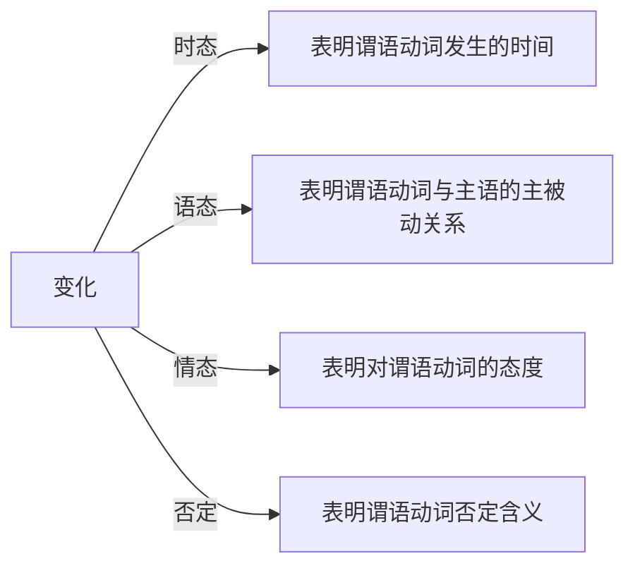
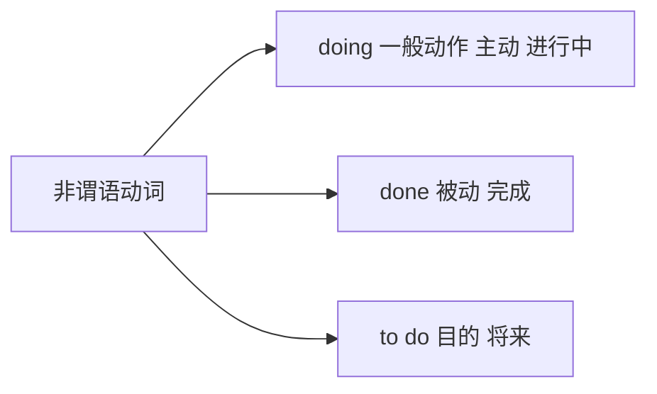

# 简单句找主干

## 简单句主干

### 通过谓语动词快速找到主干

简单句 = 主干 + 修饰
👆
读懂句子第一步：找主干

主干 = 主语 + 谓语动词

### 谓语动词的变化

#### 标志词

1. 找be： am / is / are / was / were 
2. 找 have have / had / has 
3. 找情态动词  can may should must will
4. 找 n’t

### 一个简单句中只有一个谓语动词

- 谓语动词长什么样？ 1. 原型 2. 变化（三态一否）
- 所有其他的动词：非谓语动词

## 三态一否

### 时态

| 时态                           | 过去 | 现在 | 将来 | 过去将来 |
| ------------------------------ | ---- | ---- | ---- | -------- |
| 现在                           | ed   |      | will | would    |
| **be** 进行 **ing**            |      |      |      |          |
| **have** 完成 **done**         |      |      |      |          |
| **have been** 完成进行 **ing** |      |      |      |          |

## 速查

1. 找be： am / is / are / was / were 
2. 找 have have / had / has 
3. 找情态动词  can may should must will
4. 找 n’t

## 作业

- Andrew’s years of experience **made** him the best person  for the job.

安德鲁几年的经历让他称为最适合该岗位的人。

- According to brain-scan experiments, the demands of so much decision-making quickly **become** too much for us.

根据脑扫描试验，我们有太多快速做决定的需求。

- The Eisenhower Executive Office Building (EEOB) **commands** a unique position in both the national history and the architectural heritage of the United States.

EEOB 在美国国家历史和农业中 ？ 一个独特的地位。

- By the late 1970s, neurologists **had switched** to thinking of them as just “mental noise”.

在1970年后，neurologists 已经开始认为这些是“精神噪音”。

- The number of women on corporate boards **has been** steadily increasing without government interference.

合作板上女性的数字在没有政府的干预下稳定增长。

- Sadly, the spirit of inquiry once at home on campus **has been replaced**  by the use of the humanities and social sciences as vehicles for  publicizing “progressive,” or left-liberal propaganda. 

悲伤地， 调查的精神 ？ 被 社会科学所宣传的进步或左翼宣传 取代了。

- A teams of researchers working together in the laboratory **would submit**  the results to a journal.

一个研究团队在实验室一起工作，将会提交结果到杂志。

