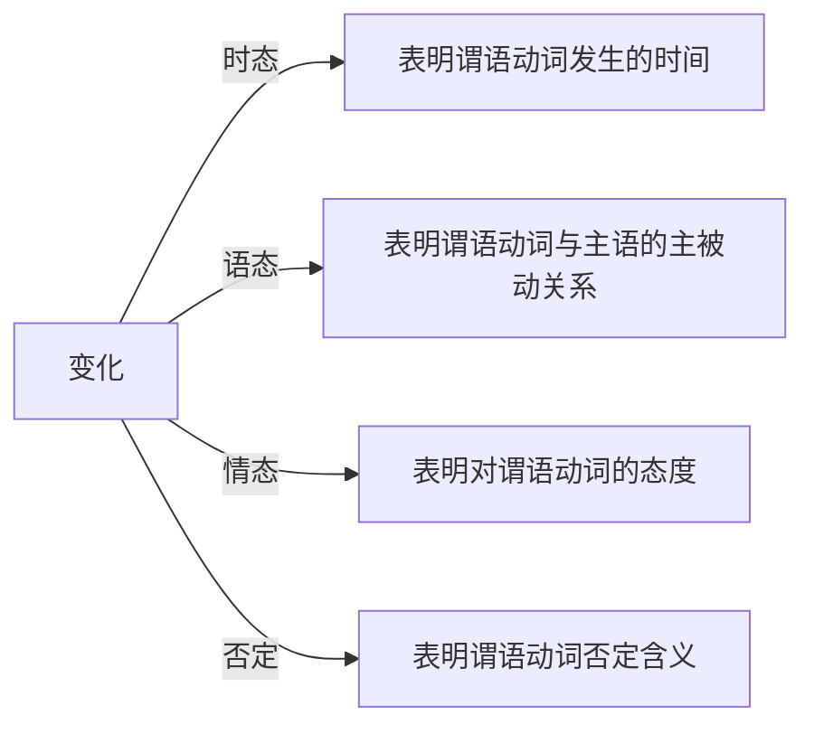
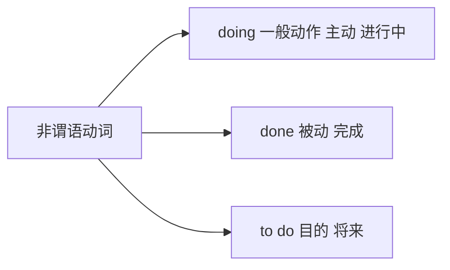

# 简单句找主干

## 简单句主干

### 通过谓语动词快速找到主干

简单句 = 主干 + 修饰
👆
读懂句子第一步：找主干

主干 = 主语 + 谓语动词

### 谓语动词的变化

#### 标志词

1. 找be： am / is / are / was / were 
2. 找 have have / had / has 
3. 找情态动词  can may should must will
4. 找 n’t

### 一个简单句中只有一个谓语动词

- 谓语动词长什么样？ 1. 原型 2. 变化（三态一否）
- 所有其他的动词：非谓语动词

^7sc8m6reqimo

## 三态一否

### 时态

时态是动作发生的时间和状态

| 时态                           | 过去 | 现在 | 将来 | 过去将来 |
| ------------------------------ | ---- | ---- | ---- | -------- |
| 一般现在                       | ed   |      | will | would    |
| **be** 进行 **ing**            |      |      |      |          |
| **have** 完成 **done**         |      |      |      |          |
| **have been** 完成进行 **ing** |      |      |      |          |

### 情态

>  **情态动词**+**动词原型**
>
> You **must** **pass** the exam!

| **表情绪**  **或态度** | **现在时**       | **过去时** |
| ---------------------- | ---------------- | ---------- |
| 必须                   | must / (have to) |            |
| 应该                   | shall            | should     |
| 能够/可能              | can              | could      |
| 愿意                   | will             | would      |
| 可能                   | may              | might      |

### 语态

#### 被动结构

> 谓语动词的变化：**被动语态**

be+done（by）

- be: 变时态、变单复数
- done 表动作

示例：

- 他每天被打。	He **is beaten** every day.
- 他昨天被打了。	He **was beaten** yesterday.
- 他明天将要被打。	He **will be beaten** tomorrow.
- 他正在被打。	He **is being beaten** now.
- 他已经被打了。	He **has been beaten**.

学会分辨主动还是被动

|      | 过去      | 现在| 将来 |
| ---- | ------------- | -------------- | ------------ |
| 一般 | was/were done | am/are/is done | will be done |
| 进行 | was/were being done | am/are/is being done |  |
| 完成 | had been done | have/has been done |              |

#### 否定

> 谓语动词的否定

- am not…/ is not… ( =**isn’t**…)/ are not… ( =**aren’t**…)
- will not do… = (**won’t** do…)
- should not do = (**shouldn’t** do)
- can not do(=**can’t** do)
- do not do= (**don’t** do)
- did not do= (**didn’t** do)

#### 强调

**do/does/did + v.**(原型）确实做某事

But science does provide us with the best available guide to the future. 

[英语一2005 Text 2]

但科学**的确**给我们**提供了**通向未来的最佳道路。 

## 速查

1. 找be： am / is / are / was / were 
2. 找 have have / had / has 
3. 找情态动词  can may should must will
4. 找 n’t

 ^206sqywvw787

## 测试

### 时态

找出位于动词，辨析发生时间

#### 一般现在时 动词原型

[1] The most obvious example is late-stage cancer care. (2003,阅读) 

    
答案

    is

[2] Examples of this type of change are the disappearance of the frontier in the latter part of the nineteenth century in the United States. (1991, 阅读) 

    are

[3] Today it makes almost no difference. (2000, 阅读) 

    makes

#### 现在进行时 *be doing*

[1] Schools are modifying their programs... (1994, 阅读) 

    are modifing

[2] The American Society of Newspaper Editors is trying to answer this painful question. (2001,阅读) 

    is trying

[3] On the contrary, the price of communications is coming down fast. (2001, 阅读)

    is coming

#### 一般将来时 *will do*（多用）*be going to do*

[1] We will have a less civil society. (2004, 阅读) 

    will have

[2] Who’s going to pay for the rest of the bill? (2003, 阅读)

    's going to pay

#### 一般过去时 *动词+ed*

[1] …this city was one of the largest human settlements in the world. (2014, 阅读) 

    was

[2] Last year, Japan experienced 2,125 incidents of school violence… (2000, 阅读) 

    experienced

[3] In 1950, the US spent $12.7 billion on health care. (2003, 阅读)

    spent

#### 现在完成时 *have ed(过去分词)*

[1] Amateurs have continued to pursue local studies in the old way. (2001, 阅读) 

    have continued

[2] For the most part, the response has been favorable… (2011, 阅读) 

    has been

[3] Most leading retailers have already tried e-commerce, with limited success, and expansion abroad. (2010, 新题型) 

    have already

[4] Time, …, has given them legitimacy. (2014, 阅读)

    has given

#### 过去完成时 *had ed(过去分词)*

[1] The game had ended in disturbance. (1992, 阅读) 

    had ended

[2] Journalistic tastes had changed long before Cardus’s death. (2010, 阅读) 

    had changed

[3] By the late 1970s, neurologists had switched to thinking of them as just “mental noise”. (2005, 阅读)

    had switched

#### 现在完成进行时 *have been doing*

>  **一直都在做某事**

[1] That kind of electronic spying has been going on for decades. (2003, 阅读) 

    has been going on

[2] Bankers have been blaming themselves for their troubles in public. (2010, 阅读) 

    have been blaming

### 情态

Scientists could adopt middle school classes and present their own research. 

[英语一2003 Text 2] 

    

    could adopt        
    

    科学家可以采用中学课程并提出自己的研究成果。

This loss of mental focus can potentially have a damaging impact on our professional, social, and personal well-being. 

[英语一2014完形] 

    

        can ... have
    

    这种精神集中的缺失可能会对我们的职业、社会和个人健康产生破坏性的影响。

Now something similar could be happening in the oceans. 

[英语一2006 Text 3] 

    

        could be happening
    

    现在，类似的事情可能会在海洋中发生。

### 语态

#### 找出谓语动词

1.To highlight these brands, the British government will be running “Shopping is GREAT” campaign.

    will be runing

2.But the great universal of male mortality is being changed. (2000, 阅读) 

    is being changed

3.The truth will not be known for years. (2010, 阅读) 

    will not be known

#### 分清主动还是被动

Our subway trains are controlled by tireless robot-drivers. 

[英语一2002 Text 2] 

    谓语动词：被控制

我们的地铁由不知疲倦的机器人驾驶员控制。

The study of law has been recognized for centuries as a basic intellectual discipline in European universities. 

[英语一2007 翻译] 

    

    谓语动词：被认为        
    

几个世纪以来，法律研究被公认为欧洲大学中的基础知识学科。

To limit the number of telescopes on Mauna Kea, old ones will be removed at the end of their lifetimes and their sites returned to a natural state. 

[英语一2017 Text 2] 

    

    谓语动词：将被拆除
    

为了限制莫纳克亚山上的望远镜数量，旧的望远镜将在其使用寿命结束时被拆除，并且其场地将恢复为自然状态。

With the Church's teachings and ways of thinking being eclipsed by the Renaissance, the gap between the Medieval and modern periods had been bridged. 

[英语一2020翻译] 

    

    谓语动词：已经被弥合        
    

随着文艺复兴使得教堂的教育以及思考方式的差异变得黯然失色，中世纪和现代之间的差距已经被弥合。

#### 强调

Nevertheless, the word “amateur” does carry a connotation that the person concerned is not fully integrated into the scientific community. 

[英语一2001 Text 1] 

    

        does carry
    

    然而，“业余人员”一词**的确****包含着**这样的意义：此人并非科学界的一员。

## 作业

- Andrew’s years of experience **made** him the best person  for the job.

安德鲁几年的经历让他称为最适合该岗位的人。

- According to brain-scan experiments, the demands of so much decision-making quickly **become** too much for us.

根据脑扫描试验，我们有太多快速做决定的需求。

- The Eisenhower Executive Office Building (EEOB) **commands** a unique position in both the national history and the architectural heritage of the United States.

EEOB 在美国国家历史和农业中 ？ 一个独特的地位。

- By the late 1970s, neurologists **had switched** to thinking of them as just “mental noise”.

在1970年后，neurologists 已经开始认为这些是“精神噪音”。

- The number of women on corporate boards **has been** steadily increasing without government interference.

合作板上女性的数字在没有政府的干预下稳定增长。

- Sadly, the spirit of inquiry once at home on campus **has been replaced**  by the use of the humanities and social sciences as vehicles for  publicizing “progressive,” or left-liberal propaganda. 

悲伤地， 调查的精神 ？ 被 社会科学所宣传的进步或左翼宣传 取代了。

- A teams of researchers working together in the laboratory **would submit**  the results to a journal.

一个研究团队在实验室一起工作，将会提交结果到杂志。

