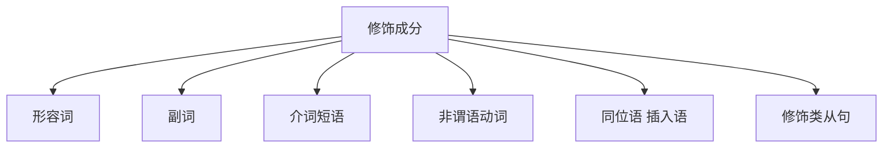

# 并列句

## 并列结构

### 两种情况

1. 并列**句子**；

There’re enough people to fill the jobs at McDonalds and other places  where you don’t need to have much skill.  

2. 并列**句子成分**；

It’s that gap in between, and that’s where the problem is.

### 三种关系

- 平行关系：and, both...and..., not only...but also..., as well as  
- 转折关系：but, while, yet, whereas（然而、但是） 
- 选择关系：or, either...or...,neither...nor...（或者；既不......也不）

## 考查方式

下面句子的两个and分别连接了哪些成分？ 

The building has housed some of the nation’s most significant diplomats  and politicians and has been the scene of many historic events.

### 解题思路

$$
A + 【连词】+ B
$$

**关键**：A 与 B 形式一致；

**破解方法**：发现连词，先看后，再定前；

## 修饰词

>  学习任务： 
>
> 1. 了解修饰有哪些形式 
> 2. 学会切分不同的修饰

按形式区分，修饰可以分为：

介词破题方法 

1. 在介词前用“/”断开；
2. 顺着读，读不通则倒译补的；

## 作业

### 讲义

#### p27 真题例句

The price of / communications **is coming** down fast.

沟通成本	正在	下降。

Examples of / this type of / change **are** the disappearance of / the frontier / in the *latter* part of / the nineteenth century in the United States.

**主干**：例子 是 。

这种类型的改变的例子	是	19世纪后	美国边疆的消失。

Children / at this age / **lose** these privilege.

**主干**：孩子 丧失 特权。

在这个年龄段的	孩子	丢失了	特权。

Computers / with in-built chips / **will become** our workmates.

拥有内置芯片的	计算机	将会成为我们的工作伙伴。

#### p27 课堂练习

Last year, Japan experienced 2,125 incidents of / school violence.

**主干**：日本 发生 事件。

去年，	日本发生了2,125起	校园暴力事件。

The differences in / scores **are** due to the education *and* other environment disadvantage of / the banks.

**主干**：分数的不同 是因为 ... 和 ...

分数的不同	是因为 教育 和 其他银行不利的环境。

#### p27 考试链接

What **are** the norms of / your environment?

你环境的规范是什么？

The move to renewables **is** picking up momentum around the world: They now account for / more than half of / new power sources going on line.

全球开始使用可再生能源：他们认为 现在超过一半的新能源开始投入使用。

