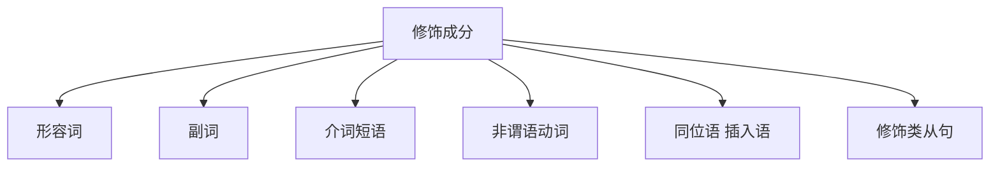

# 并列句

## 并列结构

### 两种情况

1. 并列**句子成分**；

There’re enough people to fill the jobs at McDonalds and other places  where you don’t need to have much skill.  

**主干**：

There’re enough people to fill the jobs at <地点> where you don't need to have much skill. 

其中：`地点` 中含有并列结构的句子成分：

`McDonalds` **and** `other places`

2. 并列**句子**；

**It’s that gap in between**, and **that’s where the problem is.**

中间的间隙是问题所在。

### 三种关系

- 平行关系：and, both...and..., not only...but also..., as well as  
- 转折关系：but, while, yet, whereas（然而、但是） 
- 选择关系：or, either...or...,neither...nor...（或者；既不......也不）

## 考查方式

下面句子的两个and分别连接了哪些成分？ 

The building has housed some of the nation’s most significant diplomats  and politicians and has been the scene of many historic events.(2018英语一)

根据特征进行区分，`has housed` 和 `has been` 是并列的，<u>diplomats and politicians</u> 是并列的。所以并列结构为：

has housed some of the nation’s most significant <u>diplomats and politicians</u> 	**and** 	has been the scene of many historic events.

### 解题思路

    

            A + 【连词】+ B
    

**关键**：A 与 B 形式一致；

**破解方法**：发现连词，先看后，再定前；

有 `,` 直接分开的：

The networked computer is an amazing device, the first media machine that serves as the <u>*mode of production*</u>, <u>*means of distribution*</u>, <u>*site of reception and place of praise and critique*</u>. 

(2012英语一)

# 修饰

1.了解修饰有哪些形式

2.学会切分不同的修饰

The decision <u>of the New York Philharmonic</u> <u>to hire Alan Gilbert as its next music director</u> has been the talk <u>of the classical-music world ever since the sudden announcement of his appointment in 2009</u>.

[英语一2011 Text 1] 

实际上，<u>画横线</u>的句子都是<u>修饰</u>；

## 修饰的形式

按功能区分，修饰可以分为两种：

- 修饰、限定名次的：**定语**；
- 表示动作、句子状态的：**状语**；

按形式区分：

- 形容词；
- 副词
- 介词短语
- 非谓语动词
- 同位语 / 插入语
- 修饰类从句

### 形容词

常见的形容词后缀

-**ive**, -**ic**, -al, -**ous**, -**ful**, -**less**, -**ary**, -**able**, -**ing**, -**ed**

“…的”修饰名词

### 副词

副词常以**ly**为后缀

**“**…地”，修饰动词、形容词、句子**…**

### 介词

介词：介于词与词之间

government of the people, by the people, for the people

**in / on / at / of / from / with / since …**

最容易搞混的三个介词 **in on at** 

表示时间：

| 介词 | 意思     | 示例      |
| ---- | -------- | --------- |
| at   | 时间点   | at 8:00   |
| on   | 某一天   | on Monday |
| in   | 一段时间 | in 1998   |

表示地点：

| 介词 | 意思       | 示例             |
| ---- | ---------- | ---------------- |
| at   | 点         | look at the sth. |
| on   | 线 / 面    | on the floor     |
| in   | 体（空间） | in the classroom |

Peter Parker, who was born **________** 1998, woke up **________** 8:00 **______** Monday.  the classroom, he looks ___ the spider ___ the floor.

    

        Peter Parker, who was born in 1998, woke up at 8:00 on Monday. In the classroom, he looks at the spider on the floor.
    

**表示反面、反对含义的介词**

against 反

without 离开，不再，没有，去掉

off 没有

#### 介词破题方法

1. 在介词前用“/” 断开

2. 顺着读，读不通则 倒译 补“的”

Neville Cardus is now known solely as a writer of essays on the game of cricket.

解读步骤：

- 读到 `of` ，断开；
  - 第一个 `of` ，译作：短文
  - 第二个 `of` ，译作：:cricket:运动的 
  - 后无介词，翻过来：:cricket:运动的短文
- 介词阅读完成，回到主句：
  - 组合：:cricket:运动的短文作家
  - 于主句其他成分组合：

人们只知道小N是一名板球运动的短文作家。

### 非谓语动词

谓语动词：

![[degree.master.eng.lesson.grammer.01简单句#一个简单句中只有一个谓语动词:#^7sc8m6reqimo]]

非谓语动词：

`doing`	`done`	`to do`

非谓语动词作

- **定语**，修饰名词；

> doing 名词 doing
>
> **doing**： A **barking** dog never bite. 
>
> to do ：He is a good choice **to date with**, but not a good man **to get married with.** 

- **状语**，修饰句子；

> doing 句子 doing
>
> **doing:** He opened the door, greeting his guests. 
>
> **done:** Dressed in white, the bride looks beautiful tonight. 
>
> **to do:** To enjoy a grander sight, you must climb to a greater height. 

#### 作定语

1. 在**doing/to do/ done**前用“/”断开；
2. 一步找到位：**doing/to do/ done +** (介词）+ 名词性成分；

Rats and other animals can identify friends **to cooperate with** and **enemies to avoid.** 

老鼠和其他动物能辨别出谁是要合作的朋友，以及谁是要躲避的敌人。

The magazine cover showing an attractive mother holding a cute baby is hardly the only Madonna-and-child image on news stands this week. (2011英语一)

	

        showing an attractive mother holding a cute baby 
    
    

#### 作状语

作状语，修饰句子

Millions of mothers have gone to work, **transforming basic family economics.** (2007英语一)

数以百万计的母亲开始工作，**这**改变了基本的家庭经济。

If that happens, passionate consumers would try to persuade others **to boycott products**, **putting the reputation of the target company at risk**. 

#### 变化

1. 否定：在非谓语动词前加**not**；

`not doing` `not done` `not to do`

> **To be** or **not to be**, that is the question. 

2. 时态

During the 2016 presidential campaign, nearly a quarter of web content shared by Twitter users in the politically critical state of Michigan was fake news, according to the University of Oxford. And a survey conducted for BuzzFeed News found 44 percent of Facebook users rarely or never trust news from the media giant.(2018英语一)

据牛津大学，在2016年总统选举期间，在政治重要的密歇根州中	将近四分之一被Twitter用户分享的内容	是假新闻。并且，一个为 BuzzFeed News 进行的调查发现	44%的 Facebook 用户很少或从未相信来自这家媒体巨头的新闻。

    
Google And DeepL

    <h4>
        Google
    </h4>
    

            根据牛津大学的数据，在 2016 年总统竞选期间，在政治关键的密歇根州，Twitter 用户分享的近四分之一的网络内容是假新闻。 BuzzFeed News 的一项调查发现，44% 的 Facebook 用户很少或从不相信这家媒体巨头的新闻。
    

<h4>DeepL
    </h4>
    

            根据牛津大学的数据，在2016年总统竞选期间，在政治上至关重要的密歇根州，Twitter用户分享的近四分之一的网络内容是假新闻。而为BuzzFeed News进行的一项调查发现，44%的Facebook用户很少或从不相信来自这家媒体巨头的新闻。
    

## 总结

课堂总结 **·** 长难句阅读方法

1.读懂句子的第一步：**找主干**

​     利用标志词找到**谓语动词**

2.用**括号（）**圈出并列、同位语、插入语

​     用**斜杠** **/**  断开**非谓语动词**、**介词**

​     用**箭头 ↪** 表示**修饰**

The longest bull run in a century of art-market history ended on a dramatic note with a sale of 56 works by Damien Hirst, “Beautiful Inside My Head Forever”, at Sotheby’s in London on September 15th 2008.

    
Google And DeepL

    <h4>
        Google
    </h4>
    

        2008 年 9 月 15 日，达米恩·赫斯特 (Damien Hirst) 的 56 件作品“永远美丽在我的脑海中”在伦敦苏富比拍卖行以戏剧性的方式结束了艺术市场历史上最长的牛市行情。
    

    <h4>
        DeepL
    </h4>
    

        2008年9月15日，伦敦苏富比拍卖行拍卖了达米安-赫斯特的56件作品 "Beautiful Inside My Head Forever"，艺术市场史上一个世纪以来最长的牛市在戏剧性的气氛中结束。
    

# 练习

### 识别并列成分

In most of the homeless gardens of New York City the actual cultivation of plants is unfeasible, yet even so the compositions often seem to represent attempts to call forth the spirit of plant and animal life, if only symbolically, through a clumplike arrangement of materials, an introduction of colors, small pools of water, and a frequent presence of petals or leaves as well as of stuffed animals. 

（2013英语一）

词汇：

- unfeasible：不可行的
- symbolically：象征性地

    在纽约市大多数无家之园中种植花草树木并不可行，然而尽管如此，这些作品往往体现了一种唤起植物精神与动物生命的尝试，哪怕只是象征性地借助树丛的布置、色彩的运用，以及小水池、常见的花瓣、落叶和毛绒玩具。

## 介词 

### 倒译补的

Besides generating income, the presence of other marketers makes the site seem objective, gives companies opportunities to learn valuable information about the appeal of other companies’ marketing, and may help expand user traffic for all companies concerned.       

    

            其他营销商的投放除了可以带来收入，也能使该网站看起来客观公正，使企业有机会了解其 他公司市场营销的独到之处，还能有助于扩大所有相关企业的用户流量。 
    

介词破题方法 

1. 在介词前用“/”断开；
2. 顺着读，读不通则倒译补的；

## 作业

### 讲义

#### p27 真题例句

The price of / communications **is coming** down fast.

沟通成本	正在	下降。

Examples of / this type of / change **are** the disappearance of / the frontier / in the *latter* part of / the nineteenth century in the United States.

**主干**：例子 是 。

这种类型的改变的例子	是	19世纪后	美国边疆的消失。

Children / at this age / **lose** these privilege.

**主干**：孩子 丧失 特权。

在这个年龄段的	孩子	丢失了	特权。

Computers / with in-built chips / **will become** our workmates.

拥有内置芯片的	计算机	将会成为我们的工作伙伴。

#### p27 课堂练习

Last year, Japan experienced 2,125 incidents of / school violence.

**主干**：日本 发生 事件。

去年，	日本发生了2,125起	校园暴力事件。

The differences in / scores **are** due to the education *and* other environment disadvantage of / the banks.

**主干**：分数的不同 是因为 ... 和 ...

分数的不同	是因为 教育 和 其他银行不利的环境。

#### p27 考试链接

What **are** the norms of / your environment?

你环境的规范是什么？

The move to renewables **is** picking up momentum around the world: They now account for / more than half of / new power sources going on line.

全球开始使用可再生能源：他们认为 现在超过一半的新能源开始投入使用。

