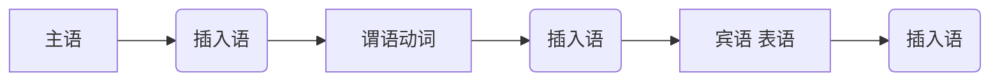

## 同位语

<u>一个名词</u>对另一个名词进行解释或补充说明。

> <u>一个名词</u> 也可以是： 名词词组、名词性从句；

Last month, Howard Schmidt, <u>the nation’s cyber-czar,</u> offered the federal government a proposal to make the Web a safer place — a “voluntary trusted identity” system.

该<u>同位语</u>从句译文：美国政府网络安全协调员（这一职务也被媒体称为‘网络沙皇’）
 ^ernngqhoz881

## 插入语

待插入语的句子结构为：

主语谓语之间：

That guy, **however**, is a gay.

谓语和宾语表语之间：

Gays are, **to be honest**, usually friendly.

最后：

So he becomes my friend, **of course**.

常见插入语：

    
well I think What’s more

well 

I think 我认为

I hope 我希望

You see 你清楚

What’s more 更有甚者

What’s worse 更糟的是

sure enough 果然

worse still 更糟糕的是

strange to say 说也奇怪

needless to say 不用说

most important of all最为重要的是

### 处理方法

1. 辨认插入语：

逗号、括号、破折号

​         **，  ，**
​      **——   ——** 
​         **（ ）** 

2. 阅读中遇到插入语👉 忽略不看，或用括号隔开

Children respond differently to the same style of parenting. A calm, rule-following child might respond better to a different sort of parenting than, _____ , a younger one. (2020英语二)

[A] for example
[B] in addition
[C] at once
[D] by accident

    选 A ，忽略掉插入语后可以知道这里是比较关系，同级，后面是举例。

3. 翻译中遇到插入语👉往句首扔

Britain’s towns, <u>it is true</u>, are not prevented from applying. 

确实，英国的小镇并没有被排除在申请资格之外。

**两个逗号之间一定是插入语嘛？**

>  ——不一定 不要误伤

两个逗号之间可能是：

1. 插入语→ 直接去掉

2. ▢，▢，▢ and ▢

3. 时间、地点等状语

And since the mid-1970s, CEO pay for large publicly traded American corporations has, by varying estimates, gone up by about 500%. 

自20世纪70年代中期以来，美国大型上市公司首席执行官的薪酬约上涨了500%。
