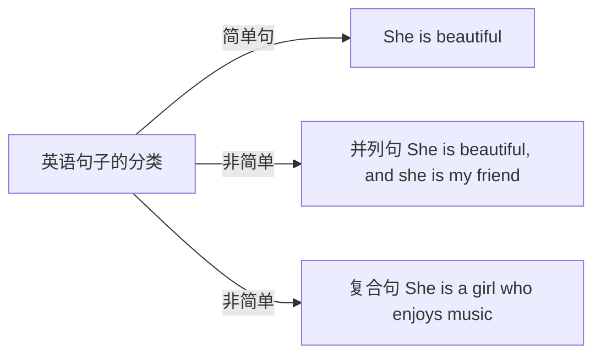

# 语法

## 介绍

首先需要明白语法是什么，学习的意义，怎么考，学习的方法，学习目的等。

**是什么？** 单词是肌肉，语法就像骨架。

**考什么？** 阅读、翻译：英译中、写作

**目的** 看得懂英文句子

**分类**

## 简单句

简单句 = 主干 + 修饰

读懂句子第一步，找主干

简单句详情[[degree.master.eng.lesson.grammer.01简单句]]

速查

![[degree.master.eng.lesson.grammer.01简单句#速查:#^206sqywvw787]]

## 并列结构

[[degree.master.eng.lesson.grammer.02并列结构]]

## 同位语

[[degree.master.eng.lesson.grammer.03同位语]]

## 从句

[[degree.master.eng.lesson.grammer.04从句]]