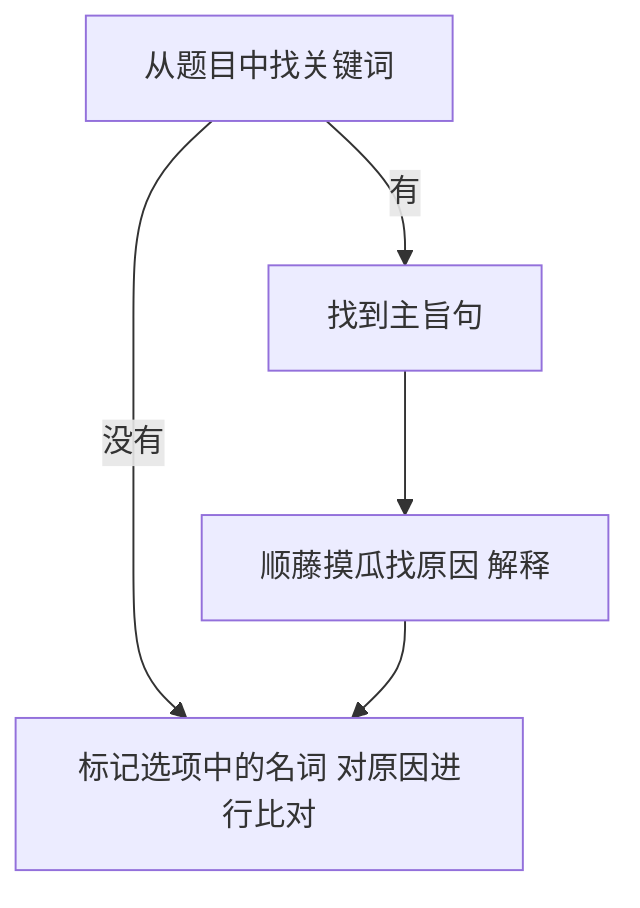

# 阅读

## 细节题


### 划关键词

**题目**的大写、数字、名词（难替换）、动词的时态；选项的名词去定位，比对选项和出处句有何不同）


方法：

（1）    可以用名词和动词的时态来定位。名词可以关注首字母，用首字母去快速地定位

> **确保定位句包含题目要求的所有关键词**，特别重视题目里的程度词（**most, more, primary, sometimes, usually**）、时间词（**previous, current, traditional**）

（2）    关注名词，比对定位句和选项的名词;


万用做题路线：




### 找定位句

```mermaid
```

- 顺序原则：定大致的段落；
- 关键词：定具体的句子；
- 辅助重读和略读技巧（重读段落首句、转折句、人物观点句、研究结果句）；

**（4）因果关系题的定位**

**做题步骤：**

先找到题目的话题在哪里，找因果关系词或者找下一个句子（对上文的解释说明）。

**因果关系词**

因为+句子：because, as, since, for, in that（因为）, now that（既然）， given that（鉴于）

因为+名词：because of, due to, owing to, given (prep. 鉴于)

A（因）导致B（果）：cause, make, produce, induce, trigger

lead to, contribute to, give rise to, result in, account for, 

A（果）源于B（因）：derive from, originate from, result from

A归因给B：we can attribute A（果） to B（因）；A（果） can be attributed to B（因）

### 读定位句

- 比名词
- 划主干
- 判态度
- 定代词

#### 段落首句论点句（重读论点，略读例子）

例子的表现形式：数字；大写；for example

数字的作用是对上文的论点的证明。倾向于对论点性强的句子进行命题，不太会对包含数字的句子进行命题。所以略读包含数字的句子。

#### 转折句

转折关系：（重点是转折词后面的内容）

但是but, 

然而however, yet, still

相反rather, instead, on the contrary, 

不幸的是 unfortunately, sadly

让步关系：（重点是逗号后面主句部分）

尽管：although, though, while, whereas …（从句）, …（主句）

 

#### 人物观点句（人物介绍略读，人物观点重读）

观点词：XX argue（主张），claim（宣称），note（指出），point out（指出），assume（假定假设），assert（断言），reckon（认为），suspect（猜想）that …

 

#### 研究结果句（重读结果，略读过程）


**研究结论词**：

reveal（揭示）, illustrate（阐明）, shed light on（阐明）, demonstrate（证明）, indicate（暗示说明）, imply（暗示）, suggest（暗示）, it turns out that（结果是）

 

**研究过程词**：

调查（investigate / examine）开展（conduct / carry out）

实验（experiment / trial）追踪（track / follow）

实验参与者（participant / volunteer / subject）

设计（design / devise）测试（test）衡量（measure）分析（analyze）

评估（assess）对比（compare）对比组（counterpart）

变量（variable / factor）小组（group）

让某人做某事（assign / instruct）

监测（monitor）样本（sample）收集（gather）记录（document）

### 比对选项

- 从词汇的角度
  - 无中生有 // 偷换概念 // 和原文相反

- 从技巧的角度
  - 以偏概全 // 重合度太高


## 推理题

题目：

(1)  It can be learned / inferred / suggested / implied from paragraph xx that __________.

(2)  Which of the following is true according to paragraph xx?

**特点**：定位句是**一个段落的多句话**。倾向于对段落里最重要的句子，即主题句进行命题

**共同点**：找4个选项的出处，比对。不同点：

### 做题步骤：

（1）    审题，判断推理题

（2）    找到段落的主题句。一般是首句（论点句），排除数字、大写（例子句），如果第二句有转折句，以转折句为主。

（3）    比对选项

正确选项：和段落的主题句是同义替换的；

错误选项：出处来自例子句（大写、数字），选项本身包含数字、例子；

（4）    逐个检查

找到其他3个错误选项的出处，比对不同（无/偷/反；偏）

>  注意：如果题目问的是，从两段可以得知什么信息，正确选项往往需要能体现**两个段落的共同的主题**，如果仅仅是某一段提到的内容，则错误概率比较高。


**例题一**

①Perhaps willfully, it may be easier to think about such lengthy timescales than about the more immediate future. ②The potential evolution of today’s technology, and its social consequences, is dazzlingly complicated（复杂的，-）, and it’s perhaps best left to science fiction writers and futurologists to explore the many possibilities we can envisage. ③That’s one reason why we have launched *Arc*, a new publication dedicated to the near future.

33. Which of the following is true according to Paragraph 5?

[A] The interest in science fiction is on the rise.（无中生有）

[B] *Arc* helps limit the scope of futurological studies.（选项包含大写字母，某个例子）

[C] Technology offers solutions（+） to social problem.

[D] Our immediate future is hard to conceive.

<details>
    <summary>答案</summary>
    <p>
        D(符合首句的同义替换)
    </p>
</details>


做题步骤：

（1）审题，判断推理题

（2）找到段落的主题句。是首句（论点句），因为这个段落没有转折。

（3）划主干：Perhaps willfully, it may be easier // to think about such lengthy timescales // than about the more immediate future.

（4） 比对名词。定位句的名词“lengthy timescales”和 “immediate future”

（5）    比对选项

正确选项：和段落的主题句是同义替换的

错误选项：出处来自例子句（大写、数字），选项本身包含数字、例子，排除B

（6）    逐个检查


## 态度题


1. 划关键词 两个对象 xx 人 对 xx 事情的态度；


2. 用关键词定位：
   1. 如果提问的是**作者的观点**，**独白处**即作者的观点（如果没有特别说明是某人说的话，即作者的观点）
   2. 如果提问 **作者** 对 **某人观点** 的态度，**先找到某人观点，观点可以不读，继续往下看作者的评论**。

3. 判断态度

- 只有，仅仅：

only mere  merely solely

- 太 ...

too excessive over-dressed

- 鲁莽的

reckless regrettably


#### 态度


中立的：

impartial 中立的

indifferent 无所谓

证明的：


负面的：


干扰词：


## 检查

| **正确做法** | **自我检查**                                                 |
| ------------ | ------------------------------------------------------------ |
| 定位准       | ²   遵从顺序原则了吗？  ²   关键词划全了吗？  ²   定位句包含题目要求的所有关键词了吗？ |
| 抓重点       | ²   转折词、研究结果词、研究过程词、人物观点词都背熟了吗？  ²   在数据的句子上纠结了吗？ |
| 划主干       | ²   划主干了吗？知道句子的主谓宾是什么吗？                   |
| 判态度       | ²   定位句有形容词或者副词可以看出作者的态度吗？             |
| 比名词       | ²   名词的特点知道吗？  看后缀：ty, ment, ion, ness, ship,  ance, ence  看位置：冠词后面有名词       介词后面有名词      动词后面有名词      物主形容词、所有格后面有名词  ²   划出定位句的名词，特别是主干上的名词了吗？  ²   划出选项的名词了吗？每一个都划了吗？  ²   比对名词了之后，有比对其他成分吗？ |
| 定代词       | ²   定位句里有代词，知道代词指代什么吗？  ²   注意代词的单复数了吗？ |
| 找逻辑       | ²   当在两个选项之间犹豫时，是否有关注哪个选项才是文章多个句子强调的主题？ |
| 排除法       | ²   有警惕长得非常像的选项吗？  ²   有警惕数字和大写的选项吗？  ²   有警惕以偏概全的选项吗？  ²   有警惕绝对化字眼的选项吗？ |
| 背单词       | ²   题目、定位句、选项的生词都会了吗？                       |

 

| 步骤     |                                                              |
| -------- | ------------------------------------------------------------ |
| 划关键词 | （1）     大写、数字、名词（关注首字母）、动词（时态）  （2）     重视程度词（most, more, primary）  频率词（usually,  often, sometimes）  时间词（previous,  original, current）  （3）     利用用词的感情色彩定位  （4）     用选项的名词去定位 |
| 找定位句 | （1）     顺序原则：定大致的段落  （2）     关键词：定具体的句子  （3）     辅助重读和略读技巧（重读段落首句、转折句、人物观点句、研究结果句） |
| 读定位句 | （1）     比名词  （2）     划主干  （3）     判态度  （4）     定代词（当定位句有代词时，明确其指代） |
| 比对选项 | （1）从词汇的角度  无中生有 // 偷换概念 // 和原文相反  （2）从技巧的角度  以偏概全 // 重合度太高 |
