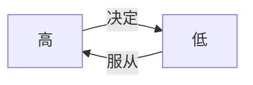

# 人

## 选择题

### 人的本质

人的本质是社会关系的总和；

人的**本质属性**： 社会属性；

### 人生观

- 人生目的： 人为什么而活着；（决定 / 核心）

- 人生态度： 人怎样活着；

- 人生价值： 什么样的人生才会有价值；

### 正确的人生观

1. 正确的人生目的：服务人民、奉献社会（人民是历史的创造者）；

2. 正确评价人生价值：

^yka9xf17ox09

**标准：** 

- 实践符合历史规律；（历史标准/根本尺度）

- 劳动：服务人民、奉献社会\[正确的人生目的\]；(现实标准)

**方法：**

- 能力有大小与贡献需尽力相统一；（平凡中的伟大）

- 物质贡献和精神贡献相统一；（职业；艺术...）

- 完善自身和贡献社会相统一；（通用）
 ^shtc24ve4rok

**条件：**

- 自身

- 客观

- 能力

**幸福：**

总体性（总体幸福）、奋斗是幸福；

苦乐：矛盾，可相互转化；

4. 错误的人生观

享乐主义：活着就为了享乐；

极端个人主义：一切为自己；

拜金主义：只为得到钱；

## 分析题

### 正确评价人生价值（评价）

**标准：**

**方法：**

![[degree.master.zz.ss.01#^yka9xf17ox09:#^shtc24ve4rok]]

### 人生价值（好人好事）

- 人生价值内包含了自我价值和社会价值；

- 自我价值是索取；社会价值是风险；

- 自我价值是社会价值的前提， 社会价值是自我价值的保障；

> 社会价值是人价值的一部分

### 个人与社会的辩证关系

- 个人与社会辩证统一，不可分割，社会需要是个人需要的前提基础和保障；

- 社会需要是对个人需要的凝练与升华，长远性的，根本性和全局性的需要的反映；

- 社会尊重个人正当需求，但个人需求与社会需求相冲突时，个人需求服从于社会需求；

^jnstxc6eg5aa
# 理想信念

## 选择题

### 理想是什么

**内涵：** 有实现可能性；

**特征：** 理想超越性、实践性、时代性；

**分类：** 

- 层次： 一般 / 崇高

- 主体： 个人 / 社会

- 性质： 科学 / 盲目

### 信念

**内涵：** 是实现理想的动力；

**特征：** 执着性、支撑性、多样性；

**分类：** 

- 层次：高 / 低

- **最高**层次的信念：信仰（科学 / 非科学）

## 分析题

1. 理想和信念的关系

- 理想和信念相互依存；
- 理想是信念所指的对象；
- 信念是理想实现的保障；

2. 理想和信念的重要性

- 昭示奋斗目的 ；
- 激发前进动力；
- 提高精神境界；
- 提供精神支柱；

3. 理想和现实的关系

- 理想现实是对立的，属于“应然”（理想）和“实然”（现实）对立；
- 理想现实是统一的，二者相互包含，在一定条件下，理想能转化为未来的现实；
- 怎么做：
  - 不能否认理想和现实；
  - 正视实现理想的长期性、艰巨性和曲折性；
  - 艰苦奋斗；

4. 个人理想和社会理想的统一：

![[degree.master.zz.ss.01#个人与社会的辩证关系:#^jnstxc6eg5aa]]

个人与社会辩证关系中的“利益”、“需求”、“需要” -> “理想”；

> 🤔那个人xx与社会xx的统一？
>
> 也是将模板中的 “利益”、“需求”、“需要”  -> 换成 xx

补充：

- 立志当高远，**志**的含义：
  - 未来目标：（中特共同理想、共产主义远大理想）；
  - 顽强意志；

示例：

- 好人、做好事的过程坚定理想 -> `1`、`2` ；
- 实践 -> `3`；
- 崇高、长远、根本性的目标 格局打开 -> `4` ；

练习：

> 知识点。使用文章示例作为依据；

- 社会理想与个人理想辩证统一、不可分割，社会理想是个人理想的前提基础和保障：
  - 鹦哥岭的大学生们以关爱森林、带领百姓致富为个人理想，<u>实现了个人理想和社会理想的有机结合</u>，最终既实现了个人理想，又实现了社会理想；
- 社会理想 对个人理想的凝练与升华，长远性的，根本性和全局性理想的反映：
  - 鹦哥岭的大学生们甘于寂寞、乐于奉献，专心科研、传播先进理念，<u>具有崇高的个人理想，与社会理想相统一</u>。

- 社会尊重个人正当理想，但个人理想与社会理想需求相冲突时，个人理想服从于社会理想：
  - 鹦哥岭的大学生们没有随大流，放弃了大城市的优越生活，来到了更需要他们的鹦哥岭工作，体现了个人理想对社会理想的服从；

- “理想很丰满，现实很骨感” 体现了理想和现实的关系：

  - 理想和现实是对立的，属于“应然”和“实然”对立。城市里的大学生理想是在舒适的实验室里做研究但现实中需要到条件艰苦的环境中做研究，是对立的；

  - 理想和现实是统一的，两者相互包含，在一定条件下，理想能转化为未来的现实。鹦哥岭的大学生们虽然面对的是现实中艰苦的环境，沉重的任务，但他们坚定理想信念，在日复一日地努力下，最终带领乡亲们脱贫致富，改变了现实，实现了个人理想。

- 所以，我们要正确认识理想和现实，不能盲目否认理想和现实，充分发挥能动性

  - 正视实现理想的长期性、艰巨性和曲折性，理想的实现是长期的，在不断实践的过程中完成对客观现实的物质性改变。
  - 过程中也会遇到困难，需要我们艰苦奋斗，在实践中提升认知，认知指导实践。

# 中国精神

> 都是选择题考点

## 以爱国主义为核心的民族精神

**内涵（全选）**

创造（四大发明）、奋斗（通用）、团结（愚公移山）、梦想（目标）；

### 爱国主义（核心）

> ❗历史的、具体的、道德 + 法律 + 政治原则

#### **内涵**

- 爱河山（载体）：
  - 维护祖国统一；

- 爱同胞（试金石）：
  - 维护民族团结；

- 爱文化（灵魂）：
  - 爱文化

- 爱国家（基本要求）：
  - 社会主义与爱国、爱党相一致（本质）；
  - 立足民族（中国）/ 面向世界；

**组合**：

- 着力点 / 落脚点：维护祖国统一、维护民族团结、爱文化；

- 本质：社会主义与爱国、爱党相一致（本质）；

## 以改革创新为核心的时代精神

> 只考 改革创新

1. 改革创新：

   - 最紧迫：破除体制机制障碍；

   - 最关键：自主创新能力；

2. 
